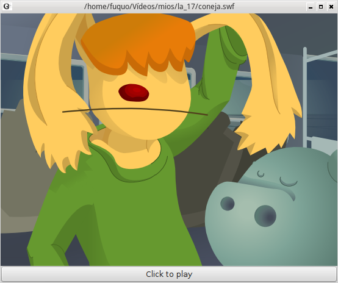

.. _swf:

########################
    Swf2svg
########################

Convert **SWF** in **SVG** and can edit in inkscape with
`svg2sif <svg2sif>`__

Example
-------

Animation reproduced in gnash:

  

Mattered in Inkscape afterwards to export it with
`SWFTools <https://github.com/mgatelabs/swftools-core>`__

.. figure:: swf_dat/Swf_import_inkscape.png

Yes it degrade them export in first black export in PDF, matter the PDF
and afterwards go back to export in SIF.

License
-------

Author: Michael Fuller

License MIT
