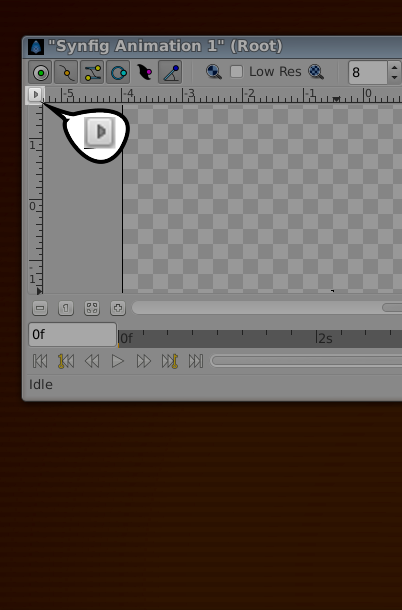
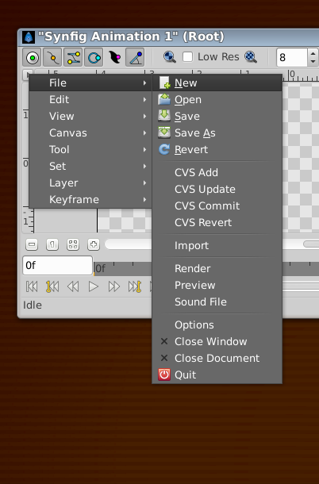

.. _canvas_caret:

#################
Canvas Menu Caret
#################

Whereas most graphics apps have a set of menus at the top of the screen, the top of the `MDI <http://en.wikipedia.org/wiki/Multiple_document_interface>`_ window, or the top of the drawing window, Synfig has a Caret. A sideways one. It is located in the upper left hand corner of the |Canvas_Window|, and looks like this:

Beneath this button are all the |menus| you would expect, from which you can access most of Synfig Studio's features:

In v.1.0.2 it may appear as a blank button in the top left.