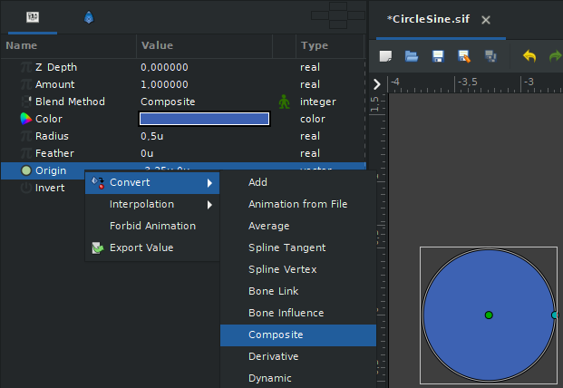
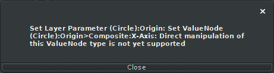

.. _converter_overview:

########################
Overview
########################

Each layer in Synfig consists of a bunch of different parameters we call :ref:`valuenode`, it's a node that returns a value at current time.
Those nodes vary from very simple ones that just returns a static value of their type (Integer, Real, Color, etc.) or they can be quite complex and return values based on various formulas (Dynamic, Random, Spline Vertex) and everything in-between.
The list of all converters you can find in the index to your left just below this Overview section.

All ValueNodes can be nested, meaning you can attach an output from one VlaueNode to another one then another one and so on until you get the desired result.

To convert a parameter, right-click on it -> Convert -> Choose converter you want to apply:

On this screenshot we're converting Origin parameter of a :ref:`layer_circle` to Composite in order to get access to its X and Y as separate values (you will understand why, just keep reading).

To remove converters, right-click on a parameter and hit Disconnect.

Now, let's say we want to make an animation of a circle travelling from left to right side of the screen in sine-like pattern.
To accomplish this, we need X to represent time (linear shift) and Y to represent amplitude. For that, we need to apply following converters to circle's origin parameter:

* Origin -> Composite (so we have access to X and Y components separately)

  * X -> Linear (represents time)
  
    * Set Offset to -3.25 to place circle to left side of the screen, set Rate to whatever you like, it controls how fast time moves forward, I set it to 1.3 so the circle will end up in the opposite part of the screen after 5 seconds

  * Y -> Sine (represents amplitude)

    * Angle -> Linear

      * Set Offset and Rate to your liking, I set Offset to 0 and Rate to 180 so period wouldn't take too long

  * Set Amplitude to 1.5 so the circle wouldn't leave visible part of canvas

And that's it. If you play/preview the animation you will get something like this:

Here's the source file (created in Synfig 1.4.5):

:download:`CircleSine.sif <overview/CircleSine.sif>`

This example is, of course, not very useful, but it should illustrate the conception of converters pretty well.
Basically, you can mix multiple converters to implement different formulas, make automatic animations, help you with rigging and so on.

Types
----------------

In Synfig, each ValueNode has a base type. We have the following types: angle, bool, canvas, color, gradient, integer, real, time and vector.
Some converters support all types (ex. Time Loop, Switch), others support some (ex. Add, Random), some only specific types (ex. Stripes, Radial Composite).
What types a particular converter can be applied to you can find on its page.

What is inverse manipulation?
----------------
After a converter has been applied to a ValueNode, you will lose the ability to manipulate that node through GUI handles.
You can see it in our little example above, if you try to drag circle's origin you'll get this error:

The reason for that is due to an arbitrary complexity of a formula you could have applied to a parameter.
Synfig doesn't know what ValueNode it must manipulate to provide a result user would expect.
To battle this, some converters have "Inverse Manipulation" attribute that allows you to leave a specific sub-ValueNode of a converter to allow GUI to manipulate parameter through a handle even after a converter has been applied.
You will find information whether converter allows inverse manipulation or not and what node must be left untouched on a page for that specific converter you're interested in.

Conclusion
----------------

Converters can be tricky to understand, especially if you didn't pay attention in math class (like many of us).
But it is a great instrument if you need to automate various animation tasks, so I'd say, it's worth learning.
And of course, if you got stuck, feel free to ask a question on our forums: https://forums.synfig.org/

Here is some cool stuff for you to check out further:

* `Parabolic shot <https://wiki.synfig.org/Parabolic_Shot>`_ — example of using converters to create automatic animation (to do: transfer from old wiki)
* `Particle template <https://wiki.synfig.org/Particles_V2.0>`_ — example of converters used to implement new functionality (to do: transfer from old wiki)
* `3D shenanigans <https://forums.synfig.org/t/airplane-in-3d/1960>`_ — converters used to make semi-3D models
* `User templates <https://forums.synfig.org/c/assets-and-templates/42>`_ — various templates created by Synfig users