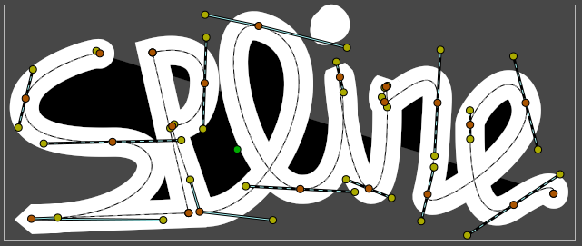

.. _glossary_spline:

########################
    Spline
########################

| Splines are vector shapes made up of `Bezier
  curves <https://en.wikipedia.org/wiki/B%C3%A9zier_curve>`__ joined
  together by
  `vertexes <https://en.wikipedia.org/wiki/Vertex_%28geometry%29>`__.
| Splines are the most commonly used objects in any normal animation
  done with Synfig, and can be made using the |Spline_Tool| and many other Tools.

   A spline of “Spline”. Can see orange vertex and yellow tangent
   |Handle|

On the |WorkArea| you can manipulate the ``Spline`` shape
by both handles (vertex or tangent) and directly from the spline segment
(the curve).

.. _glossary_spline  See Also:

See Also
--------

-  |Spline_Tool| page for more information.
-  The |Draw_Tool| has an option to ``Extend`` a spline.
-  The ``How Do I`` page's Artwork\_Composition
   ([Doc:How\_Do\_I#Artwork\_Composition]) section has some entries
   about spline stuff.

Project for illustration : 
:download:`Spline_of_spline.sifz <spline_dat/Spline_of_spline.sifz>`

.. |Spline_Tool| replace:: :ref:`Spline Tool <tool_spline>`
.. |WorkArea| replace:: :ref:`WorkArea <canvas_workarea>`
.. |Handle| replace:: :ref:`Handle <handles>`
.. |Draw_Tool| replace:: :ref:`Draw Tool <tool_draw>`