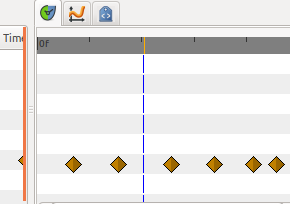

.. _glossary_time_cursor:

###########################
    Time Cursor
###########################
The time cursor show you, in the |Timetrack_Panel| and
|Graphs_Panel| panels, at which frame you currently are at.
It is represented by a vertical line and moves with your pointer as you
drag along the |Timebar|.

  

.. |Timetrack_Panel| replace:: :ref:`Timetrack Panel <panel_timetrack>`
.. |Graphs_Panel| replace:: :ref:`Graphs Panel <panel_graphs>`
.. |Timebar| replace:: :ref:`Timebar <ui>`