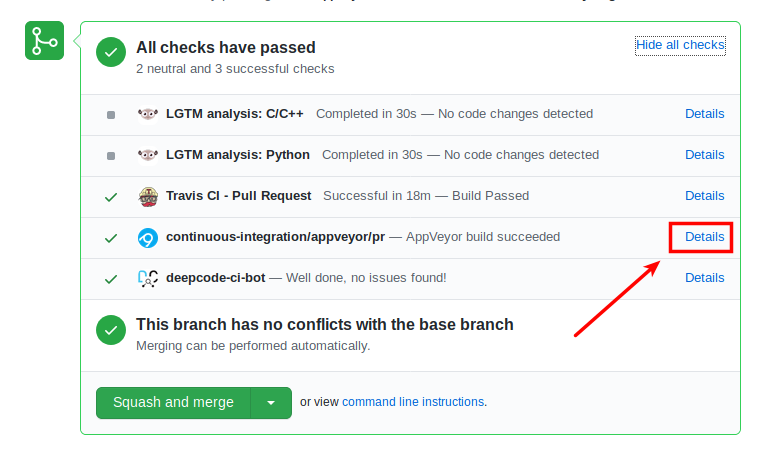

.. _testing_prs:

########################################
How to test changes in Pull Requests
########################################

1. Go to `list of Pull Requests <https://github.com/synfig/synfig/pulls>`_ and click any of them. For example, this one - https://github.com/synfig/synfig/pull/1737

2. Scroll down to the area showing checks (click on “Show all checks” if they are hidden).

    
3. Click on the “Details” link on the opposite side of “continuous-integration/appveyor/pr”.

4.Now you need to choose “Environment: MSYSTEM=MINGW64” for x64 Windows or “Environment: MSYSTEM=MINGW32” for x32.

.. image:: ./testing_prs_dat/screenshot_003.png
    :width: 550px
    :align: center

5. And then switch to the “Artifacts” tab.

6. Click on “SynfigStudio-…” filename to download.

Now you can unpack the downloaded file and run Synfig, which includes all modifications introduced in this particular PR. This is a portable version, so no need to install it.
