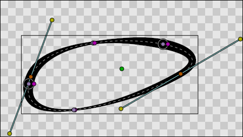
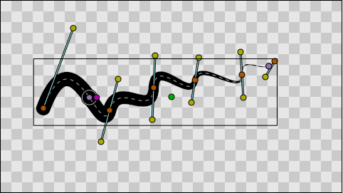
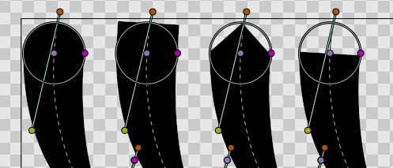
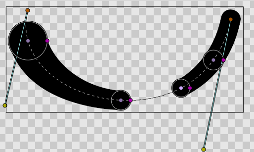
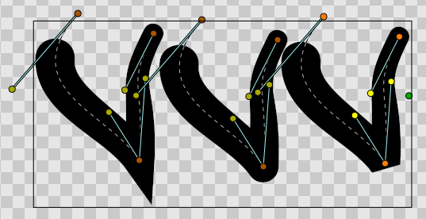
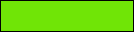

.. _layer_advanced_outline:

########################
 Advanced Outline Layer
########################

   

.. _layer_advanced_outline  About Advanced Outline Layers:

About Advanced Outline Layers
-----------------------------

To create an Advanced Outline Layer use the Spline Tool and check
``Create Advanced Outline`` in the |Tool_Options_Panel|. Once you finish the definition of the
geometry of your outline and after pressing the ``Make Spline`` button
(or selecting another tool or state) you create the Advanced Outline
Layer with the |New_Layer_Defaults_Brush_Colors|
``Outline Color``.

Depending on the options you choose in the |Tool_Options_Panel| other like |Star_Tool| or
|Circle_Tool| can also create Advanced Outline Layers.

Using the |Canvas_Layer_Menu| ``Make Advanced Outline``,
``Make Outline`` or ``Make Region`` commands you can also create those
layers.

.. _layer_advanced_outline  Differences with Outline Layer: Outline width:

Differences with Outline Layer: Outline width
~~~~~~~~~~~~~~~~~~~~~~~~~~~~~~~~~~~~~~~~~~~~~

The **width** |Handle| defines the outline width at a
particular place.

In the regular |Outline_Layer|, each width Handle is
connected to the vertex that defines the outline shape at that place.
That means that the user needs to insert a new vertex on the
|Spline| every time he wants to change the outline width in
some place. This behaviour can cause problems when the shape of the
outline is very simple but the width varies a lot.

Practice shows that most of the time the user wants to specify the width
independently from the placement of |Spline| vertices. Such
functionality is available in the Advanced Outline layer, which Handles
its width in a different way: the width Handles are freely moved around
the Spline and define its width at any point.

.. _layer_advanced_outline  Features:

Features
--------

Advanced Outline introduces some features to the regular outline, as
shown in this `Advanced outline
demo <http://www.youtube.com/watch?v=boM_ZC9VZ54>`__ video. They are
listed with examples below:

No need to place a vertex to change the width.

The width is controlled just by two points, while the Spline is constructed of many vertices. 

   
Different types of tips: Rounded, Squared, Peak, Flat. 

Segmented outline. 

Three global cusps types: Sharp, Rounded, Bevel.

.. figure:: advanced_outline_dat/Smoothness_control.png 
   :alt: Smoothness_control.png

Control of smoothness from linear (0.0) to smooth (1.0).

.. _layer_advanced_outline  Parameters of Advanced Outline Layers:

Parameters of Advanced Outline Layers
-------------------------------------

The parameters of the Advanced Outline Layers are:

+----------------------------------------------------------------------------------------------------------+-------------------------+-------------------+
| **Name**                                                                                                 | **Value**               | **Type**          |
+----------------------------------------------------------------------------------------------------------+-------------------------+-------------------+
| |Type_real_icon.png|  |Z_Depth_Parameter|                                                                | 0.000000                | real              |
+----------------------------------------------------------------------------------------------------------+-------------------------+-------------------+
| |Type_real_icon.png| |Amount_Parameter|                                                                  | 1.000000                | real              |
+----------------------------------------------------------------------------------------------------------+-------------------------+-------------------+
| |Type_integer_icon.png| |Blend_Method|                                                                   | Composite               | integer           |
+----------------------------------------------------------------------------------------------------------+-------------------------+-------------------+
| |Type_color_icon.png| |Colors_Dialog|                                                                    | |p_color_green.png|     | color             |
+----------------------------------------------------------------------------------------------------------+-------------------------+-------------------+
| |Type_vector_icon.png| |Origin_Parameter|                                                                | 0.000000u,0.000000u     | vector            |
+----------------------------------------------------------------------------------------------------------+-------------------------+-------------------+
| |Type_bool_icon.png| |Invert_Parameter|                                                                  | |p_checkbox_off.png|    | bool              |
+----------------------------------------------------------------------------------------------------------+-------------------------+-------------------+
| |Type_bool_icon.png| |Antialiasing_Parameter|                                                            | |p_checkbox_off.png|    | bool              |
+----------------------------------------------------------------------------------------------------------+-------------------------+-------------------+
| |Type_real_icon.png| |Feather_Parameter|                                                                 | 0.000000pt              | real              |
+----------------------------------------------------------------------------------------------------------+-------------------------+-------------------+
| |Type_integer_icon.png| |Feather_Parameter_Type_of_Feather|                                              | Fast Gaussian Blur      | integer           |
+----------------------------------------------------------------------------------------------------------+-------------------------+-------------------+
| |Type_integer_icon.png| |Winding_Style_Parameter|                                                        | Non Zero                | integer           |
+----------------------------------------------------------------------------------------------------------+-------------------------+-------------------+
| |Type_list_icon.png| Vertices                                                                            | List                    | list (Spline)     |                                                                            
+----------------------------------------------------------------------------------------------------------+-------------------------+-------------------+
| |Type_real_icon.png| |Outline_Layer_Outline_width|                                                       | 2.000000pt              | real              |
+----------------------------------------------------------------------------------------------------------+-------------------------+-------------------+
| |Type_real_icon.png| |Outline_Layer_Expand|                                                              | 0.000000pt              | real              |
+----------------------------------------------------------------------------------------------------------+-------------------------+-------------------+
| |Type_integer_icon.png| |Advanced_Outline_Layer#Tip_type_at_start_.2F_end|                               | Rounded Stop            | integer           |
+----------------------------------------------------------------------------------------------------------+-------------------------+-------------------+
| |Type_integer_icon.png| |Advanced_Outline_Layer#Tip_type_at_start_.2F_end|                               | Rounded Stop            | integer           |
+----------------------------------------------------------------------------------------------------------+-------------------------+-------------------+
| |Type_integer_icon.png| |Advanced_Outline_Layer_Cusps_Type|                                              | Sharp                   | integer           |
+----------------------------------------------------------------------------------------------------------+-------------------------+-------------------+
| |Type_real_icon.png| |Advanced_Outline_Layer_Smoothness|                                                 | 0.500000                | real              |
+----------------------------------------------------------------------------------------------------------+-------------------------+-------------------+
| |Type_bool_icon.png| |Advanced_Outline_Layer_Homogeneous|                                                | |p_checkbox_off.png|    | bool              |
+----------------------------------------------------------------------------------------------------------+-------------------------+-------------------+
| |Type_list_icon.png| |Advanced_Outline_Layer_Width_Point_List|                                           | List                    | list(WPList)      |
+----------------------------------------------------------------------------------------------------------+-------------------------+-------------------+
| |Type_bool_icon.png| |Advanced_Outline_Layer_Fast|                                                       | |p_checkbox_off.png|    | bool              |
|                                                                                                          |                         |                   |
|                                                                                                          |                         |                   |
|                                                                                                          |                         |                   |
+----------------------------------------------------------------------------------------------------------+-------------------------+-------------------+
| |Type_bool_icon.png| |Advanced_Outline_Layer_Dashed_Outline|                                             | |p_checkbox_off.png|    | bool              |
|                                                                                                          |                         |                   |
|                                                                                                          |                         |                   |
|                                                                                                          |                         |                   |
+----------------------------------------------------------------------------------------------------------+-------------------------+-------------------+
| |Type_list_icon.png| Dash Item List                                                                      | List                    | list(WPList)      |
+----------------------------------------------------------------------------------------------------------+-------------------------+-------------------+
| |Type_real_icon.png| Dash Items Offset                                                                   | 0.000000u               | real              |
+----------------------------------------------------------------------------------------------------------+-------------------------+-------------------+

.. _layer_advanced_outline  Specific parameters for Advanced Outline Layer:

Specific parameters for Advanced Outline Layer
----------------------------------------------

This section lists only the parameters specific to the Advanced Outline
Layer. For documentation about the other parameters, refer to |Outline_Layer|.

-  Tip Type at Start
-  Tip Type at End
-  Cusps Type
-  Smoothness
-  Width Point List

.. _layer_advanced_outline  Tip Type at Start / End:

Tip Type at Start / End
~~~~~~~~~~~~~~~~~~~~~~~

As with width points, the end and start of the unlooped Advanced
Outlines has a type of tip defined. The user can choose between the same
types of tips as for a width point. When the first/last width point has
its before/after interpolation type set to Interpolate the start/end of
the outline is rendered using the Tip type at start/end parameter.

Those parameters don't have any effect if the Spline is looped or the
first/last width point has its before/after interpolation type set to
anything but Interpolate. In that case, the segment between the
start/end width point and the start/end of the Spline is not rendered.

The types of tips are the same as the width point tip types except that
it doesn't offer the Interpolate type because it would not make sense:

Parameters:

+------------+---------------------------------------------------------+
| Tip Type   | Example                                                 |
+============+=========================================================+
| Rounded    | .. figure:: advanced_outline_dat/                       |
|            |               Avanced-Outline-Layer-TipType-Rounded.png |
|            |    :alt: Avanced-Outline-Layer-TipType-Rounded.png      |
+------------+---------------------------------------------------------+
| Squared    | .. figure:: advanced_outline_dat/                       |
|            |               Avanced-Outline-Layer-TipType-Squared.png |
|            |    :alt: Avanced-Outline-Layer-TipType-Squared.png      |
+------------+---------------------------------------------------------+
| Peak       | .. figure:: advanced_outline_dat/                       |
|            |             Avanced-Outline-Layer-TipType-Peak.png      |
|            |    :alt: Avanced-Outline-Layer-TipType-Peak.png         |
+------------+---------------------------------------------------------+
| Flat       | .. figure:: advanced_outline_dat/                       |
|            |               Avanced-Outline-Layer-TipType-Flat.png    |
|            |    :alt: Avanced-Outline-Layer-TipType-Flat.png         |
+------------+---------------------------------------------------------+

.. _layer_advanced_outline  Cusp Type:

Cusp Type
~~~~~~~~~

There are three types of cusps in the Advanced Outline:

Parameters:

+-------------+------------------------------------------------------+
| Cusp Type   | Example                                              |
+=============+======================================================+
| Sharp       | .. figure:: advanced_outline_dat/                    |
|             |               Avanced-Outline-Layer-Cups-Sharp.png   |
|             |    :alt: Avanced-Outline-Layer-Cups-Sharp.png        |
+-------------+------------------------------------------------------+
| Rounded     | .. figure:: advanced_outline_dat/                    |
|             |             Avanced-Outline-Layer-Cups-Rounded.png   |
|             |    :alt: Avanced-Outline-Layer-Cups-Rounded.png      |
+-------------+------------------------------------------------------+
| Bevel       | .. figure:: advanced_outline_dat/                    | 
|             |             Avanced-Outline-Layer-Cups-Bevel.png     |
|             |    :alt: Avanced-Outline-Layer-Cups-Bevel.png        |
+-------------+------------------------------------------------------+

The type of cusp is controlled for the entire layer so currently it is
not possible to control the type of corner individually. Maybe in future
versions it will be possible.

.. _layer_advanced_outline  Smoothness:

Smoothness
~~~~~~~~~~

The Smoothness controls how the width is calculated between widthpoints.
The width at a position p is a function of the surrounding width points.
When smoothness is **zero** interpolation is lineal, when smoothness is
**1.0** interpolation is given by a 5th degree smooth Spline.

.. _layer_advanced_outline  Homogeneous:

Homogeneous
~~~~~~~~~~~

Enabling ``Homogeneous`` changes the way the position of the :ref:`widthpoint <layer_outline  Outline width>` change according modification of the outline.

-  When false, the “Position” parameter for a width point is equally
   distributed **among the vertices**. For example, in a spline with
   five vertices, “Position” values of 0, 0.25, 0.5, 0.75, and 1
   correspond to the first, second, third, fourth, and fifth vertex,
   respectively, regardless of how close or far apart those vertices
   are. Between vertices, the “Position” parameter is based on spline
   length.
-  When true, the “Position” parameter increases smoothly from the start
   to the end of the spline **based on the length of the entire
   spline**. This means a “Position” of 0.5 will always correspond to
   the halfway point of the spline, not to a particular vertex.

.. _layer_advanced_outline  Width Point List:

Width Point List
~~~~~~~~~~~~~~~~

Each Advanced Outline has a list of parameters that represent the
information for each width item. They are called Width Points and
consist of four sub-parameters:

-  **Position** (Real number): represents the position of the width
   point along the Spline. Although it is allowed to be any real number,
   its meaning is only from **0.0** to **1.0**. 0.0 corresponds to the
   start of the Spline (first Spline point on the Spline list) and 1.0
   to the last Spline point. For looped Splines 0.0 and 1.0 are equal.
   The position is represented by the light purple Handle that always
   lies on the Spline. The point on the spline corresponding to a
   particular “Position” value is affected by the “Homogeneous”
   parameter, explained above.
-  **Width** (Real number): It is the width multiplicator of the global
   Width parameter of the Advanced Outline Layer on the position given
   by the Position parameter. The final width is calculated multiplying
   the global Advanced Outline's Width (W) by the Width of the
   widthpoint (w) and adding the Expand parameter (E). Calculated width
   = W\*w+E
-  **Tip Side Before/After**: Those two sub-parameters controls how the
   width is interpolated before and after the current widthpoint. The
   sub-parameter can have four values:

   -  **Interpolate**: Between the previous/following width point, the
      width is calculated by interpolation based on smoothness value.
   -  **Rounded**: There is a rounded tip that points to the width point
      before or after. If the previous/following width point is
      ``Interpolate`` on its posterior/previous side it considers that
      the width of the widthpoint in question is zero just before/after
      it. If the previous/posterior width point is other than
      ``Interpolate`` then the segment between those two width points is
      empty. See examples to understand it fully.
   -  **Squared**: Same as Rounded but using square tip.
   -  **Peak**: Same as Rounded but using peak tip.
   -  **Flat**: Same as Rounded but using flat tip.

The Width Point list has one internal non-animatable parameter called
``loop``. You can reach it by right clicking the Width Point List
parameter. If the Width Point list is unlooped, then any width point
that has a Position outside the range of [0,1] is clamped to (brought
within) that range. For example: a Position = 1.35 is clamped to 1.0
then the Width Point List is unlooped. Otherwise, if the Width Point
List is looped and a width point has a Position of 1.3, its modulus
based on the range [0,1] is used, so it is turned to a position of 0.3.

.. _layer_advanced_outline  Fast:

Fast
~~~~

...TODO WriteME.about...

.. _layer_advanced_outline  Dashed Outline:

Dashed Outline
~~~~~~~~~~~~~~

...TODO WriteME.about...

.. _layer_advanced_outline  Working with the Avdanced Outline:

Working with the Avdanced Outline
---------------------------------

.. _layer_advanced_outline  Creation of the Advanced Outline:

Creation of the Advanced Outline
~~~~~~~~~~~~~~~~~~~~~~~~~~~~~~~~

You can create Advanced Outlines by various ways:

-  With the |Draw_Tool| (check *Create Advanced Outline*
   in the tool options).
-  With the |Spline_Tool| (check *Create Advanced
   Outline* in the tool options).
-  Using a |Layers_Geometry| (check *Create Advanced
   Outline* in the tool options).
-  With the menu "<Insert> → <Layer> → Geometry → Advanced Outline".

.. _layer_advanced_outline  Change the width of the Width Points:

Change the width of the Width Points
~~~~~~~~~~~~~~~~~~~~~~~~~~~~~~~~~~~~

Initially the width Handles are hidden. You can make them visible by
pressing (``Alt+5``) or clicking on the width toggle button. It is
possible to change the width using the |Width_Tool| using
the same procedure as for regular outlines. If you want more control
over the width you can modify the width Handles with the |Transform_Tool| (``Alt+A``). More fine tunning is possible by
expanding the width point sub-parameter and entering a specific value
for the Width sub-parameter. In that case negative values are allowed to
produce nice effects.

.. _layer_advanced_outline  Change the position of the Width Points:

Change the position of the Width Points
~~~~~~~~~~~~~~~~~~~~~~~~~~~~~~~~~~~~~~~

When you make the width Handles of the width points visible/invisible,
the position Handles also become visible/invisible. This way, the user
has a single way to hide/show the position and width Handles.

.. note::
   This may change in the future

The position Handles of the width points can be modified using the
|Transform_Tool| (``Alt+A``) and clicking and
dragging the position Handle. You will notice that Handles are tied to
the Spline so once clicked and dragged they can be placed at any way on
the Spline. Notice that if you have a width point position Handle at
position 0.2 and you click and drag at position 0.9 it may happen that
you obtain a value of -0.1 because you dragged it in one step and the
Width Point List may be looped. If you want to avoid those problems do
the movement in small steps to indicate the correct path to follow when
calculating the new position.

.. _layer_advanced_outline  Adding or removing width points:

Adding or removing width points
~~~~~~~~~~~~~~~~~~~~~~~~~~~~~~~

To add a new width point you have to right click on the width point
position Handle (purple Handle) to get the context menu. Then select
``Add Item (smart)`` here to create more width points entries. The width
points are created this way:

In the general case, the new widthpoint is created between the width
point you click on and the “previous” width point. Depending on the loop
status of the Spline, the “previous” width point can be the start of the
Spline (unlooped) or the last widthpoint (looped). The worst case is
when there is only one width point on the Width Point List. If you add
one new item it will lie over the existing one.

The newly added width point will have the interpolated width at the
position where it is created.

.. _layer_advanced_outline  Specific actions for Width Points:

Specific actions for Width Points
~~~~~~~~~~~~~~~~~~~~~~~~~~~~~~~~~

Some needed actions have been added to width points as well as
functionality for existing actions for items of the List type
parameters. You can reach the list of available actions by right
clicking on the width point position or directly on the width point item
of the Width Point List. Here are some descriptions of the available
actions:

-  Convert: Width Points are composite Value Nodes so its natural format
   is Composite (you can access its components). But you can convert it
   to other formats. See Convert for details.
-  Disconnect: This will disconnect the width point item from the
   Composite type Value Node. That means that there won't be any Handle
   to show and that any of its values can be modified. Maybe it is
   useful for some types of workflows. To restore its Composite status,
   choose Convert->Composite.
-  Insert/ Remove Item Smart: This will add or remove a width point. If
   Remove is used in animation mode, it will also set the current width
   point as OFF instead of effectively removing it from the Width Point
   List. Opposite for the Insert Item Smart.
-  Mark Active Point as ON/OFF: You can set width points off to make it
   not count for width control while the width point is off. When the
   width point is half on to off or viceversa, the used width point
   should be the interpolation between the on and off status. But it
   doesn't work properly at the moment. On / Off values are not
   interpolated but fully on or fully off. This has to be corrected.
-  Export: See |Export|.
-  Loop: When set as looped, as mentioned before, it allows the width
   point positions loop around the range [0,1].
-  Rotate Order: Doesn't do anything.
-  Set Side Before/After to: Interpolate, Rounded, Squared, Peak, Flat.
   Those are shortcuts to do the same as going directly to the
   sub-parameter and choosing the appropriate Tip Type. Maybe it should
   be renamed to “Set Tip Before/After”.
-  Set Width to default/zero: those actions have been added for two
   reasons. It is very common to want to set the width of a width point
   to zero. Despite the possibility of use the User Preference of
   Restrict Radius to First Quadrant, this way it is acceded quickly
   from the same usual menu. Also when a width point position Handle and
   a width point width Handle are on top of each other (width = 0) it is
   hard to modify the width or the position without trouble. To solve
   this the position Handle has preference over the width Handle in case
   of coincidence. So access the width Handle it is needed to have a
   quick action to set it to its default value (1.0).

.. |Type_real_icon.png| image:: images/Type_real_icon.png
   :width: 16px

.. |Type_color_icon.png| image:: images/Type_color_icon.png
   :width: 16px

.. |p_checkbox_off.png| image:: images/p_checkbox_off.png

.. |Tool_Options_Panel| replace:: :ref:`Tool Options Panel <panel_tool_options>`
.. |New_Layer_Defaults_Brush_Colors| replace:: :ref:`New Layer Defaults: Brush Color <new_layer_defaults Brush Colors>`
.. |Star_Tool| replace:: :ref:`Star Tool <tool_star>`
.. |Circle_Tool| replace:: :ref:`Circle Tool <tool_circle>`
.. |Canvas_Layer_Menu| replace:: :ref:`Canvas Layer Menu <canvas_layer_menu>`
.. |Handle| replace:: :ref:`Handle <handles>`
.. |Outline_Layer| replace:: :ref:`Outline Layer <layer_outline>`
.. |Spline| replace:: :ref:`Spline <https://en.wikipedia.org/wiki/Spline_(mathematics)>__`
.. |Z_Depth_Parameter| replace:: :ref:`Z Depth Parameter <parameters_zdepth>`
.. |Amount_Parameter| replace:: :ref:`Opacity <opacity>`
.. |Blend_Method| replace:: :ref:`Blend Method <parameters_blend_method>`
.. |Colors_Dialog| replace:: :ref:`Color <colors_dialog>`
.. |Origin_Parameter| replace:: :ref:`Origin <parameters_origin>`
.. |Invert_Parameter| replace:: :ref:`Invert Parameter <parameters_invert>`
.. |Antialiasing_Parameter| replace:: :ref:`Antialiasing Parameter <parameters_anitialiasing>`
.. |Feather_Parameter| replace:: :ref:`Feather Parameter <parameters_feather>`
.. |Feather_Parameter_Type_of_Feather| replace:: :ref:`Feather Parameter: Type of Feather <parameters_feather Type of Feather>`
.. |Winding_Style_Parameter| replace:: :ref:`Winding Style Parameter <parameters_winding_style>`
.. |Outline_Layer_Outline_width| replace:: :ref:`Outline Layer: Outline Width <layer_outline  Outline width>`
.. |Outline_Layer_Expand| replace:: :ref:`Outline Layer: Expand <layer_outline Expand>`
.. |Advanced_Outline_Layer#Tip_type_at_start_.2F_end| replace:: :ref:`Tip type at start/end <layer_advanced_outline  Tip Type at Start / End>`
.. |Advanced_Outline_Layer_Cusps_Type| replace:: :ref:`Cusps Type <layer_advanced_outline  Cusp Type>`
.. |Advanced_Outline_Layer_Smoothness| replace:: :ref:`Smoothness <layer_advanced_outline  Smoothness>`
.. |Advanced_Outline_Layer_Homogeneous| replace:: :ref:`Homogeneous <layer_advanced_outline  Homogeneous>`
.. |Advanced_Outline_Layer_Width_Point_List| replace:: :ref:`Width Point List <layer_advanced_outline  Width Point List>`
.. |Advanced_Outline_Layer_Fast| replace:: :ref:`Fast <layer_advanced_outline  Fast>`
.. |Advanced_Outline_Layer_Dashed_Outline| replace:: :ref:`Dashed Outline <layer_advanced_outline  Dashed Outline>`
.. |Draw_Tool| replace:: :ref:`Draw Tool <tool_draw>`
.. |Spline_Tool| replace:: :ref:`Spline Tool <tool_spline>`
.. |Layers_Geometry| replace:: :ref:`Layer <layers>`
.. |Width_Tool| replace:: :ref:`Width Tool <tool_width>`
.. |Transform_Tool| replace:: :ref:`Transform Tool <tool_transform>`
.. |Export| replace:: :ref:`Export <export>`
