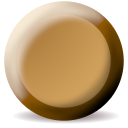
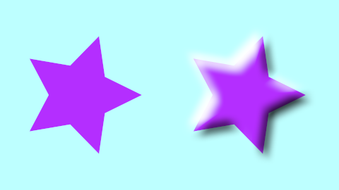
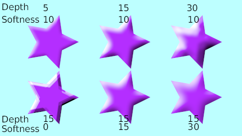
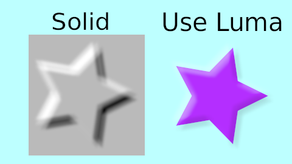
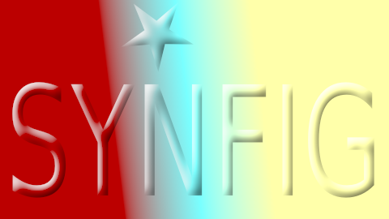

.. _layer_bevel:

########################
    Bevel Layer
########################

.. _layer_bevel  About Bevel Layer:

About Bevel Layer
-----------------

Bevel layer is used to create a highlight and shadow over a shape. It
pretends to give some volume to the shape by adding a dark area on the
opposite place of the light direction and a light area on the light
direction side.

.. _layer_bevel  Parameters of Bevel Layer:

Parameters of Bevel Layer
-------------------------

The parameters of the Bevel Layers are:

+----------------------------------------------------------------------+------------------------+-------------+
| Name                                                                 | Value                  | Type        |
+----------------------------------------------------------------------+------------------------+-------------+
| |Real_icon.png| |Z_Depth_Parameter|                                  | 0.000000               | real        |
+----------------------------------------------------------------------+------------------------+-------------+
|  |Real\_icon.png| |Amount_Parameter|                                 | 1.000000               | real        |
+----------------------------------------------------------------------+------------------------+-------------+
|  |Integer\_icon.png| |Blend_Method|                                  | Composite              | integer     |
+----------------------------------------------------------------------+------------------------+-------------+
|  |Integer\_icon.png| |Blur_Layer|                                    | Fast Gaussian Blur     | integer     |
+----------------------------------------------------------------------+------------------------+-------------+
|  |Color\_icon.png| :ref:`Hi-Color <colors_dialog>`                   |                        | color       |
+----------------------------------------------------------------------+------------------------+-------------+
|  |Color\_icon.png| :ref:`Lo-Color <colors_dialog>`                   |                        | color       |
+----------------------------------------------------------------------+------------------------+-------------+
|  |Angle\_icon.png| |Light_Angle|                                     | 135.00°                | angle       |
+----------------------------------------------------------------------+------------------------+-------------+
|  |Real\_icon.png|  |Depth_of_Bevel|                                  | 12.000000pt            | real        |
+----------------------------------------------------------------------+------------------------+-------------+
|  |Real\_icon.png|  |Softeness_Parameter|                             | 6.000000pt             | real        |
+----------------------------------------------------------------------+------------------------+-------------+
|  |Bool\_icon.png|  |Use_Luma_Parameter|                              |                        | bool        |
+----------------------------------------------------------------------+------------------------+-------------+
|  |Bool\_icon.png| |Solid_Parameter|                                  |                        | bool        |
+----------------------------------------------------------------------+------------------------+-------------+
+----------------------------------------------------------------------+------------------------+-------------+

.. _layer_bevel  Specific Parameters for Bevel Layers:

Specific Parameters for Bevel Layers
------------------------------------

Only particular parameters of the Bevel Layer are described here. The
other parameters are common for other layers and are explained
separately.

The Bevel Layer produces two effects over the context of the layer that
are based on the Alpha channel of each pixel of the context. Imagine
that the Bevel Layer traces light rays from the light source. When the
ray line finds a transition from transparent to solid it creates a light
region (Hi-color). When the ray finds a transition from solid to
transparent it creates a shadow region (Lo-color). The Light Angle
parameter determines the source of the light. The Depth of Bevel
determines how wide is the region of light or shadow created and the
Softness parameter produces a feathered light or shadow region instead
of a sharp one. The feather type is determined by the Type parameter and
can be one of the known |Blur_Layer_Types|.

.. _layer_bevel  Light Angle:

Light Angle
~~~~~~~~~~~

Modifying the light angle changes the regions that are high lighted and
darkened. It is an angle parameter and it is defined from the X positive
axis counter clock wise.

.. _layer_bevel  Depth of Bevel:

Depth of Bevel
~~~~~~~~~~~~~~

The Depth of Bevel parameter determines the width or expansion of the
bevel on both sides (dark and light side). The bigger the parameter is
the softer the produced bevel is.

.. _layer_bevel  Softness:

Softness
~~~~~~~~

Softness parameter controls how feathered is the bevel. Its type of
feather is controlled by the Type parameter.

.. _layer_bevel  Use Luma:

Use Luma
~~~~~~~~

Please write me.

.. _layer_bevel  Solid:

Solid
~~~~~

Please write me.

.. _layer_bevel  Samples:

Samples
-------

Here you can find some visual examples of hos does the parameters affect
to the bevel. Unless specified, all parameters are the default ones:

The Blend Method has been set to Onto in the following image

:download:`Bevel-sample1.sifz <bevel_dat/Bevel-sample1.sifz>`

Here you can see a sample usage of Solid and Use Luma parameters:

:download:`Bevel-sample2.sifz <bevel_dat/Bevel-sample2.sifz>`

One usage of Solid parameter combined with Hard Light Blend Method in
the resulting bevel over the gradient.

:download:`Bevel-solid-hardlight.sifz <bevel_dat/Bevel-solid-hardlight.sifz>`
   

.. |Real_icon.png| image:: images/Type_real_icon.png
   :width: 16px
.. |Integer_icon.png| image:: images/Type_integer_icon.png
   :width: 16px
.. |Color_icon.png| image:: images/Type_color_icon.png
   :width: 16px
.. |Angle_icon.png| image:: images/Type_angle_icon.png
   :width: 16px
.. |Bool_icon.png| image:: images/Type_bool_icon.png
   :width: 16px

.. |Z_Depth_Parameter| replace:: :ref:`Z Depth Parameter <parameters_zdepth>`
.. |Amount_Parameter| replace:: :ref:`Opacity <opacity>`
.. |Blend_Method| replace:: :ref:`Blend Method <parameters_blend_method>`
.. |Blur_Layer| replace:: :ref:`Blur Type <layer_blur>`
.. |Use_Luma_Parameter| replace:: :ref:`Luma <layer_bevel  Use Luma>`
.. |Solid_Parameter| replace:: :ref:`Solid <layer_bevel  Solid>`
.. |Blur_Layer_Types| replace:: :ref:`Blur Layer: Types <layer_blur Type>`
.. |Light_Angle| replace:: :ref:`Light Angle <layer_bevel  Light Angle>`
.. |Depth_of_Bevel| replace:: :ref:`Depth Of Bevel <layer_bevel  Depth of Bevel>`
.. |Softeness_Parameter| replace:: :ref:`Softness <layer_bevel Softness>`
