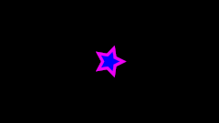
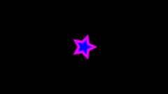

.. _layer_blur:

########################
    Blur Layer
########################

.. figure:: blur_dat/Layer_blur_blur_icon.png
   :alt: Layer_blur_blur_icon.png
   :width: 64px

About Blur Layer
----------------

Blur is a graphical effect that aims to imitate an unfocused image. In a
photography context blur can occur when the `focal
point <http://en.wikipedia.org/wiki/Focus_%28optics%29>`__ of the lens
is not at the right position of the target of the photograph. Also blur
can have other origins. Blurs can happen as the result of a poor
exposure during its recording (too long exposure time for a large
movement of the object or a high movement of the recorder). Also
blurring occurs when you use a very wide
`aperture <http://en.wikipedia.org/wiki/Aperture#In_photography>`__
(f4). In that case the objects that are out of focus are very blurred
compared to the situation where the aperture is fully closed (f22).

In a graphical context, blurs are effects that imitate those situations
(with more or less success).

Parameters of the Blur Layer
----------------------------

The parameters of the ``Blur Layer`` are:

+---------------------------------------------------------+-------------------------+------------------------------------------------+
| **Name**                                                | **Value**               | **Type**                                       |
+---------------------------------------------------------+-------------------------+------------------------------------------------+
| |Type_real_icon.png| `Z Depth <Z_Depth_Parameter>`__    | 0.000000                | real                                           |
+---------------------------------------------------------+-------------------------+------------------------------------------------+
| |Type_real_icon.png| `Amount <Amount_Parameter>`__      | 1.000000                | real                                           |
+---------------------------------------------------------+-------------------------+------------------------------------------------+
| |Type_integer_icon.png| `Blend Method <Blend_Method>`__ | Composite               | integer                                        |
+---------------------------------------------------------+-------------------------+------------------------------------------------+
| |Type_vector_icon.png| `Size <#Size>`__                 | 6.000000pt,6.000000pt   | vector                                         |
+---------------------------------------------------------+-------------------------+------------------------------------------------+
| |Type_integer_icon.png| `Type <#Types>`__               | Fast Gaussian Blur      | integer                                        |
+---------------------------------------------------------+-------------------------+------------------------------------------------+

.. |Type_real_icon.png| image:: images/Type_real_icon.png
   :width: 16px
.. |Type_integer_icon.png| image:: images/Type_integer_icon.png
   :width: 16px
.. |Type_vector_icon.png| image:: images/Type_vector_icon.png
   :width: 16px
   
Size
~~~~

The ``Size`` parameter controls the size of the blur. Depending on that
value the blur can have different effects. Note that rendering time
quickly increases as you increase the size parameter, so be careful.

This parameter is a compound value of two real numbers, x and y. Each of
them indicates the size of the blur along that direction.

Type
~~~~

There are 5 types of blur:

-  `Fast Gaussian Blur <#Fast_Gaussian>`__
-  `Box Blur <#Box>`__ (See
   `1 <http://en.wikipedia.org/wiki/Box_blur>`__)
-  `Cross Hatch Blur <#Cross_Hatch>`__
-  `Disc Blur <#Disc>`__
-  `Gaussian Blur <#Gaussian>`__ (See
   `2 <http://en.wikipedia.org/wiki/Gaussian_blur>`__)

Samples
-------
Star animation
~~~~~~~~~~~~~~

If you wonder how the animations were made (`sample
file <Media:blur.sifz>`__):

-  a `Star Layer <Star_Layer>`__ is positioned at the center of the
   Frame, with an `Outline Layer <Outline_Layer>`__ of width 0.05u
-  the animations have 120 frames, and the `Size <#Size>`__ parameter of
   the blur goes from 0u,0u to 1u,1u
-  the `rendering <Render_dialog>`__ settings are set to Quality 9 and
   Anti-Aliasing 1

Fast Gaussian :
 |Fast Gaussian|

Box :
 |Box|

Cross Hatch :
 |Cross Hatch|

Disc :
 |Disc|

Gaussian :
 |Gaussian|

Fast Gaussian
~~~~~~~~~~~~~

=== Fast Gaussian Blur ===
{| border = "1" 
| '''Fast Gaussian Blur''' 
|-
| {{l|Image:blur_dat/BlursFastGaussian.png}}
| {{l|Image:blur_dat/Blurs2FastGaussian.png}}
|}

=== Box ===
{| border = "1" 
| '''Box Blur''' 
|-
| {{l|Image:blur_dat/BlurBox.png}}
| {{l|Image:blur_dat/Blurs2Box.png}}
|}

=== Cross Hatch ===
{| border = "1" 
| '''Cross Hatch Blur''' 
|-
| {{l|Image:blur_dat/BlurCrossHatch.png}}
| {{l|Image:blur_dat/Blurs2CrossHatch.png}}
|}

=== Disc ===
{| border = "1" 
| '''Disc Blur''' 
|-
| {{l|Image:blur_dat/BlurDisc.png}}
| {{l|Image:blur_dat/Blurs2Disc.png}}
|}

=== Gaussian ===
{| border = "1" 
| '''Gaussian Blur''' 
|-
| {{l|Image:blur_dat/BlurGaussian.png}}
| {{l|Image:blur_dat/Blurs2Gaussian.png}}
|}

=== Fast Gaussian Blur over all the layers ===
{| border = "1" 
| '''Fast Gaussian Blur over all the layers''' 
|-
| {{l|Image:blur_dat/Blur.png}}
|}

== See also == 

* {{l|Radial Blur Layer}} with a radial control of the size of the blur.

* {{l|Motion Blur Layer}} a type of blur that aims to simulate a motion blur (the one that happens when the object's movement is too fast for the exposure time). It is controlled by a single parameter called "Aperture".
