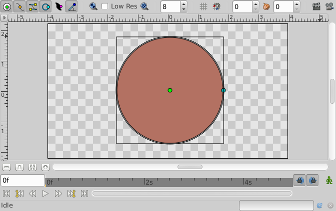

.. _layer_circle:

########################
    Circle Layer
########################
.. figure:: circle_dat/Layer_geometry_circle_icon.png
   :alt: Layer_geometry_circle_icon.png
   :width: 64px

.. _layer_circle  About Circle Layers:

About Circle Layers
-------------------

Circle layers are used to represent circles =). A circle is the flat
region defined by the inner area of a circle. A circle is a flat line on
which all the points are at the same distance from the center or Origin.
The distance to the center is called ``Radius``.

To create a ``Circle Layer`` you would use the |Circle_Tool|. Make a first left mouse button click where the
Origin should go and hold-drag from the center to define the Radius when
you release the left mouse button. The circle will be created with the
current foreground Color.

.. _layer_circle  Parameters of the Circle Layers:

Parameters of the Circle Layers
-------------------------------

The parameters of the Circle layers are:

+-----------------------------------------------------------+---------------------------+-------------+
| **Name**                                                  | **Value**                 | **Type**    |
+-----------------------------------------------------------+---------------------------+-------------+
| |Type_real_icon.png| |Z_Depth_Parameter|                  | 0.000000                  | real        |
+-----------------------------------------------------------+---------------------------+-------------+
| |Type_real_icon.png| |Amount_Parameter|                   | 1.000000                  | real        |
+-----------------------------------------------------------+---------------------------+-------------+
| |Type_integer_icon.png| |Blend_Method|                    | Composite                 | integer     |
+-----------------------------------------------------------+---------------------------+-------------+
| |Type_integer_icon.png| |Blur_Layer|                      | Fast Gaussian Blur        | integer     |
+-----------------------------------------------------------+---------------------------+-------------+
| |Type_color_icon.png| |Colors_Dialog|                     | |p_color_green.png|       | color       |
+-----------------------------------------------------------+---------------------------+-------------+
| |Type_real_icon.png| Radius                               | 59.999998pt               | real        |
+-----------------------------------------------------------+---------------------------+-------------+
| |Type_real_icon.png| Feather                              | 0.000000pt                | real        |
+-----------------------------------------------------------+---------------------------+-------------+
| |Type_vector_icon.png| Origin                             | 0.000000pt,0.000000pt     | vector      |
+-----------------------------------------------------------+---------------------------+-------------+
| |Type_bool_icon.png| Invert                               | |p_checkbox_off.png|      |bool         |
+-----------------------------------------------------------+---------------------------+-------------+
| |Type_integer_icon.png| Fallof                            |Linear                     |integer      |
+-----------------------------------------------------------+---------------------------+-------------+

A simple ``Circle Layer`` in action:

.. _layer_circle  Specific parameters for Circle Layers:

Specific parameters for Circle Layers
-------------------------------------

Some of the parameters of Circle Layers are common parameter that are
shared for several types of Layers. Click on the links to see their
definitions. Only the particular parameters for the Circle Layers are
described here.

.. _layer_circle  Radius:

Radius
~~~~~~

As mentioned before is is the radius of the geometric circle or
circumference. It is modified dragging the cyan handle at the edge of
the circumference. Although you rotate it it always becomes horizontal.

.. _layer_circle  Origin:

Origin
~~~~~~

It is a parameter type |Vector_Parameter| that defines the
center of the circle/circumference. Just edit its x,y coordinates or
drag the green handle to change this value.

.. |Type_real_icon.png| image:: images/Type_real_icon.png
   :width: 16px
.. |Type_integer_icon.png| image:: images/Type_integer_icon.png
   :width: 16px
.. |Type_color_icon.png| image:: images/Type_color_icon.png
   :width: 16px
.. |Type_vector_icon.png| image:: images/Type_vector_icon.png
   :width: 16px
.. |Type_bool_icon.png| image:: images/Type_bool_icon.png
   :width: 16px
.. |p_color_green.png| image:: images/p_color_green.png  
.. |p_checkbox_off.png| image:: images/p_checkbox_off.png 

.. |Circle_Tool| replace:: :ref:`Circle Tool <tool_circle>`
.. |Z_Depth_Parameter| replace:: :ref:`Z Depth Parameter <parameters_zdepth>`
.. |Amount_Parameter| replace:: :ref:`Opacity <opacity>`
.. |Blend_Method| replace:: :ref:`Blend Method <parameters_blend_method>`
.. |Blur_Layer| replace:: :ref:`Blur <layer_blur>`
.. |Colors_Dialog| replace:: :ref:`Color <colors_dialog>`
.. |Vector_Parameter| replace:: Vector