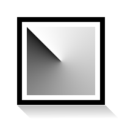

.. _layer_conical_gradient:

###########################
    Conical Gradient Layer
###########################

About Conical Gradient Layer
----------------------------

The `Conical Gradient Layer <Conical_Gradient_Layer>`__ gives the
sensation of looking down at the tip of a cone, which appears to be
illuminated with the background color from a direction determined by the
direction of the drawn line.

Conical (asymmetric) is similar to Conical (symmetric) except that the
“cone” appears to have a ridge where the line is drawn.

Parameters of Conical Gradient Layer
------------------------------------

The parameters of the ``Conical Gradient Layers`` are:

+------------------------------------------------------------------------+---------------------------+--------------+
| **Name**                                                               | **Value**                 | **Type**     |
+------------------------------------------------------------------------+---------------------------+--------------+
|     |Real\_icon.png| `Z Depth <Z_Depth_Parameter>`__                   |   0.000000                |   real       |
+------------------------------------------------------------------------+---------------------------+--------------+
|     |Real\_icon.png| `Amount <Amount_Parameter>`__                     |   1.000000                |   real       |
+------------------------------------------------------------------------+---------------------------+--------------+
|     |Integer\_icon.png| `Blend Method <Blend_Method>`__                |   Composite               |   integer    |
+------------------------------------------------------------------------+---------------------------+--------------+
|     |gradient\_icon.png| `Gradient <Gradient_Editor_Dialog>`__         |   |p_gradient.png|        |   gradient   |
+------------------------------------------------------------------------+---------------------------+--------------+
|     |Vector\_icon.png|\ Center                                         |   0.000000pt,0.000000pt   |   vector     |
+------------------------------------------------------------------------+---------------------------+--------------+
|     |Angle\_icon.png| Light Angle                                      |   0.00°                   |   angle      |
+------------------------------------------------------------------------+---------------------------+--------------+
|     |Bool\_icon.png| Symmetric                                         |   |p_checkbox_off.png|    |   bool       |
+------------------------------------------------------------------------+---------------------------+--------------+

.. |Real_icon.png| image:: images/Type_real_icon.png
   :width: 16px
.. |Integer_icon.png| image:: images/Type_integer_icon.png 
   :width: 16px
.. |gradient_icon.png| image:: images/Type_gradient_icon.png
   :width: 16px
.. |Vector_icon.png| image:: images/Type_vector_icon.png
   :width: 16px
.. |Angle_icon.png| image:: images/Type_angle_icon.png
   :width: 16px
.. |Bool_icon.png| image:: images/Type_bool_icon.png
   :width: 16px
.. |p_checkbox_off.png| image:: images/p_checkbox_off.png
.. |p_gradient.png| image:: images/p_gradient.png

