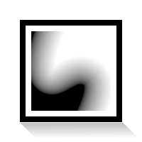
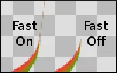

.. _layer_curve_gradient:

###########################
    Curve Gradient Layer
###########################

About Curve Gradient Layer
--------------------------

As you already guessed, a Curve Gradient is a gradient that follows a
curve. One side of the curve will be filled with the color at the
beginning of the current gradient (see the `Gradient Editor
Dialog <Gradient_Editor_Dialog>`__), and the other side will be filled
by the color at the end of the gradient. In other words, the gradient
will fully cover your canvas (as the other gradients do), and you'll
have to play with the `Blend Method <Blend_Method>`__ if you want to
bind it to a specific shape.

There are two ways to display a gradient: the default one (fast), and an
improved one that can remove any render artifacts you have with the
first one. To switch from one method to the other, check/uncheck the
``Fast`` `Parameter <Parameter>`__ from the `Parameters
Panel <Parameters_Panel>`__.

Parameters of Curve Gradient Layer
----------------------------------

The parameters of the ``Curve Gradient Layer`` are:

+--------------------------------------------------------------------+---------------------------+--------------+
| **Name**                                                           | **Value**                 | **Type**     |
+--------------------------------------------------------------------+---------------------------+--------------+
|     |Real\_icon.png| `Z Depth <Z_Depth_Parameter>`__               |   0.000000                |   real       |
+--------------------------------------------------------------------+---------------------------+--------------+
|     |Real\_icon.png| `Amount <Amount_Parameter>`__                 |   1.000000                |   real       |
+--------------------------------------------------------------------+---------------------------+--------------+
|     |Integer\_icon.png| `Blend Method <Blend_Method>`__            |   Composite               |   integer    |
+--------------------------------------------------------------------+---------------------------+--------------+
|     |Vector\_icon.png| `Origin <Origin_Parameter>`__               |   0.000000pt,0.000000pt   |   vector     |
+--------------------------------------------------------------------+---------------------------+--------------+
|     |Real\_icon.png| Width                                         |   5.500000pt              |   real       |
+--------------------------------------------------------------------+---------------------------+--------------+
|     |List\_icon.png| Vertices                                      |   List                    |   spline     |
+--------------------------------------------------------------------+---------------------------+--------------+
|     |Gradient\_icon.png| `Gradient <Gradient_Editor_Dialog>`__     |   |p_gradient.png|        |   gradient   |
|                                                                    |                           |              |
|                                                                    |                           |              |
|                                                                    |                           |              |
+--------------------------------------------------------------------+---------------------------+--------------+
|     |Bool\_icon.png| Loop                                          |  |p_checkbox_off.png|     |   bool       |
|                                                                    |                           |              |
|                                                                    |                           |              |
|                                                                    |                           |              |
+--------------------------------------------------------------------+---------------------------+--------------+
|     |Bool\_icon.png| ZigZag                                        |  |p_checkbox_off.png|     |   bool       |
|                                                                    |                           |              |
|                                                                    |                           |              |
|                                                                    |                           |              |
+--------------------------------------------------------------------+---------------------------+--------------+
|     |Bool\_icon.png| Perpendicular                                 |  |p_checkbox_off.png|     |   bool       |
|                                                                    |                           |              |
|                                                                    |                           |              |
|                                                                    |                           |              |
+--------------------------------------------------------------------+---------------------------+--------------+
|     |Bool\_icon.png| `Fast <Curve_Gradient_Layer#Fast_Option>`__   |  |p_checkbox_off.png|     |   bool       |
|                                                                    |                           |              |
|                                                                    |                           |              |
|                                                                    |                           |              |
+--------------------------------------------------------------------+---------------------------+--------------+

Creating a Curve Gradient
-------------------------

There are several ways to create a gradient that follows a curve.

-  With the `Spline Tool <Spline_Tool>`__, check ``Gradient`` in the
   `Tool\_Options\_Panel <Tool_Options_Panel>`__. It will create a
   gradient that follows the curve you draw.

-  In the `New Layer Menu <Canvas_Layer_Menu#New_Layer_Menu>`__ (from
   the `Canvas Menu Caret <Canvas_Menu_Caret>`__ or with a right click
   on a layer in the `Layers Panel <Layers_Panel>`__), select *Gradients
   > Curve Gradient*. It will create a gradient with a default shape. On
   the `Parameters Panel <Parameters_Panel>`__, right click on
   ``Vertices``, and select *Convert > Spline*, so you can edit the
   shape of the gradient.

-  To make a Curve Gradient follow an **existing** shape, place the
   ``Curve Gradient Layer`` above the layer containing the shape in the
   `Layers Panel <Layers_Panel>`__. Select those two layers, then on the
   Parameters Panel, right-click on ``Vertices`` (greyed) and select
   ``Link``.

-  Alternately, to make a Curve Gradient follow an existing Spline shape
   (`Outline <Outline_Layer>`__, `Region <Region_Layer>`__, or other
   Curve Gradient), select the shape you want it to follow, right-click
   its Vertices Parameter in the `Parameters Panel <Parameters_Panel>`__
   and chose `Export <Export>`__ from the menu. Type a name in the
   dialog that pops up. Then select the ``Curve Gradient Layer`` where
   you want to use this exported shape. Open the `Library
   Panel <Library_Panel>`__, find the shape you just exported and select
   it. Then right-click on the Vertices parameter of the exported Layer
   where you want to use the shape and select ``Connect`` from the menu.

Spreading the gradient
----------------------

Your Curve Gradient is now created, but it may not look at all like a
gradient. Instead it may looks like each side of the curve was filled
with a solid color. That's because the width of the gradient is too
small. Make sure that the ``Curve Gradient Layer`` is selected, and in
the `Parameters Panel <Parameters_Panel>`__, increase the ``Width``
value. Your gradient will appear.

An easier way to increase the gradient size is to use the Width
`Handles <Handle>`__. In the `Canvas Menu <Canvas_Menu_Caret>`__ select
*View > Show/Hide Handles > Show Width Handles*. The Width Handles
appear in purple on the Canvas. Grab one of them to adjust the width.
Each Width Handle can be adjusted independently. The width of the
gradient will follow the width of the Spline at each point, so it's
possible to have the gradient very wide in some places and less wide in
others.

Fast Option
-----------

Within the `Parameters Panel <Parameters_Panel>`__ of the
``Curve Gradient Layer`` is a ``Fast`` option. I'm unsure exactly what
speed up it produces, but it does cause a visual artifact when the
gradient is constrained with transparency as show in the `Gradient
Editor Dialog <Gradient_Editor_Dialog>`__ page, and curve vertices are
set to width = 0.

The ``Fast`` option can be turned **Off** in the curve gradient layer's
`Parameters Panel <Parameters_Panel>`__.

.. |Real_icon.png| image:: images/Type_real_icon.png
   :width: 16px
.. |Integer_icon.png| image:: images/Type_integer_icon.png
   :width: 16px
.. |Vector_icon.png| image:: images/Type_vector_icon.png
   :width: 16px
.. |List_icon.png| image:: images/Type_list_icon.png
   :width: 16px
.. |Gradient_icon.png| image:: images/Type_gradient_icon.png
   :width: 16px
.. |Bool_icon.png| image:: images/Type_bool_icon.png
   :width: 16px
.. |p_checkbox_off.png| image:: images/p_checkbox_off.png
.. |p_gradient.png| image:: images/p_gradient.png
