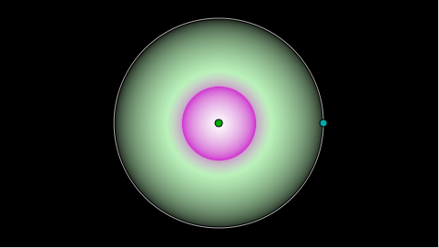
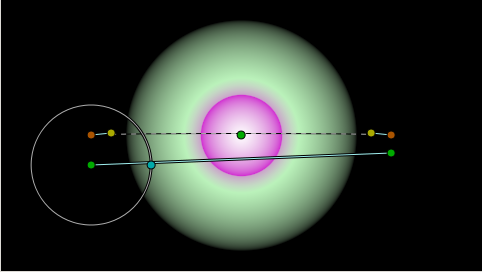
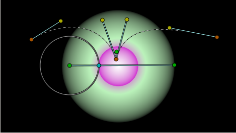
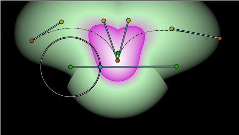
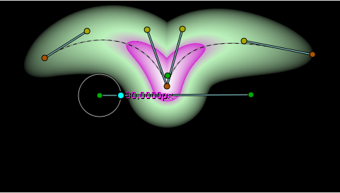
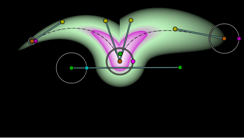
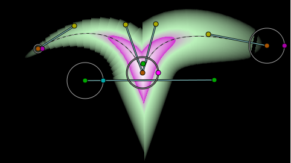
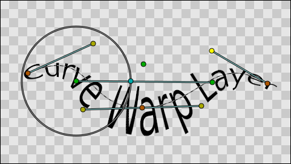
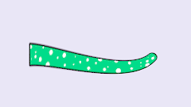

.. _layer_curve_warp:

########################
    Curve Warp Layer
########################

.. _layer_curve_warp  About Curve Warp Layer:

About Curve Warp Layer
----------------------

Curve Warp Layers maps the context where it is applied from a straight
line to a curved bezier shape. Each point on the source context can be
defined by two perpendicular coordinates values based on the position
and the length of the source straight line. Those coordinates are like
the X and Y coordinates of a scaled and rotated 2D coordinate system.

Then each pair of coordinates is mapped onto the curve considering that
the distance from the start point of the curve (the X coordinate) and
the perpendicular distance to the straight line (the Y coordinate) are
now the length of the spline from the first splinepoint and the
perpendicular distance to the curve on that point.

.. _layer_curve_warp  Parameters of Curve Warp Layer:

Parameters of Curve Warp Layer
------------------------------

The parameters of the Curve Warp Layer are:

+--------------------------------------+-----------------------------+------------+
| Name                                 | Value                       | Type       |
+--------------------------------------+-----------------------------+------------+
|     |Vector\_icon.png| Origin        |   0.000000pt,0.000000pt     |   vector   |
+--------------------------------------+-----------------------------+------------+
|     |Real\_icon.png| Width           |   5.500000pt                |   real     |
+--------------------------------------+-----------------------------+------------+
|     |Vector\_icon.png| Start Point   |   -150.0000pt,-30.00000pt   |   vector   |
+--------------------------------------+-----------------------------+------------+
|     |Vector\_icon.png| End Point     |   150.00000pt,-18.00000pt   |   vector   |
+--------------------------------------+-----------------------------+------------+
|     |List\_icon.png| Vertices        |   List                      |   Spline   |
+--------------------------------------+-----------------------------+------------+
|     |Bool\_icon.png| Fast            |                             |   bool     |
+--------------------------------------+-----------------------------+------------+

.. _layer_curve_warp  Using a Curve Warp:

Using a Curve Warp
------------------

Curve Warp layer is inside the Distortion sub menu of the New Layer
menu. There is no tool to create this type of layer.

Let's show how to use a Curve Warp layer and what's the effect it
produces by a direct example.

I first create one radial gradient at the center of the screen. I
modified the default gradient to give me that result.

Then we create a Warp Layer over that radial gradient layer.

When you first create the Warp Layer you obtain a almost straight
horizontal line defined by two points (below) and a slightly moved
spline curve near it (above). I've disabled the curve warp layer on the
screen shot to allow to see clearly the handles of the curve warp layer.
The straight line defines the source coordinate system where for the
context. The Spline defines the curve that is going to be used to map
the context along the curve. Let's edit the curve warp components by
placing the straight line along the green area of the gradient and
inserting another splinepoint on the curve and tweaking the position of
the tangents and vertexes.

``Let's enable the curve warp layer to see the effect.``

As you can now understand, the context is read based on the straight
line position and mapped along the spline from the first to the last
vertex. Due to the curvature of the spline, there are points from the
source that are mapped on the same place, and so some kind of render
artifact is produced. It can be view like a feature if some kind of
special effect is wanted to be achieved.

There is one radial handle over the first point of the straight line. It
has two missions:

-  First, it defines the perpendicular width of the mapped result.
-  Second, it is placed on the start point of the straight line.

If we decrease the width the effect is that the whole warp is stretched
in the perpendicular direction of the line and the curve.

It defines the global width but it is possible to use the local width of
the splinepoints to modify the width along the spline. Enable the
visibiity of the width handles and modify them.

.. _layer_curve_warp  Fast Option:

Fast Option
-----------

The above screen shots were taken using the Fast option disabled. When
enabled, calculations are made in a rough mode what produces more
artifacts but it renders faster.

.. _layer_curve_warp  Other examples:

Other examples
--------------

Curve warp layer are ideal for curved texts...

Tails, tentacles...

:download:`Tail.sifz <curve_warp_dat/Tail.sifz>`

.. |Vector_icon.png| image:: images/Type_vector_icon.png
   :width: 16px
.. |Real_icon.png| image:: images/Type_real_icon.png
   :width: 16px
.. |List_icon.png| image:: images/Type_list_icon.png
   :width: 16px
.. |Bool_icon.png| image:: images/Type_bool_icon.png
   :width: 16px
.. |Tail.sifz| image:: Tail.sifz

