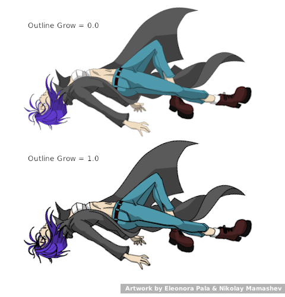

.. _layer_group:

########################
    Group Layer
########################

.. _layer_group  About Group Layer:

About Group Layer
-----------------

The ``Group Layer`` is a special layer that can hold other layers. It is
generated via the |Group| command accessed via the context
menu in the `Layers Panel <Layers Panel>`__ or through the in the |Canvas_Menu_Caret|.

As well as grouping a set of layers, it can also apply transformations
to the contained layers like translation, scaling, and even modify their
time offset.

A ``Group Layer`` can also be created through the `New Layer Menu <Category:Layer_Menu#New_Layer_Menu>`__, using ``New Layer -> Other -> Group Layer``.

.. _layer_group  Parameters of Group Layer:

Parameters of Group Layer
-------------------------

The parameters of the ``Group Layer`` are:

+----------------------------------------------------------------------------------------+---------------------------------------+--------------------+
| **Name**                                                                               | **Value**                             | **Type**           |
+----------------------------------------------------------------------------------------+---------------------------------------+--------------------+
|     |Type\_real\_icon.png| |Z_Depth_Parameter|                                         |   0.000000                            |   real             |
+----------------------------------------------------------------------------------------+---------------------------------------+--------------------+
|     |Type\_real\_icon.png| |Amount_Parameter|                                          |   1.000000                            |   real             |
+----------------------------------------------------------------------------------------+---------------------------------------+--------------------+
|     |type\_integer\_icon.png| |Blend_Method|                                           |   Composite                           |   integer          |
+----------------------------------------------------------------------------------------+---------------------------------------+--------------------+
|     |Type\_vector\_icon.png| |Origin_Parameter|                                        |   0.000000u,0.000000u                 |   vector           |
+----------------------------------------------------------------------------------------+---------------------------------------+--------------------+
|     |Group_Layer_Transformation_Parameter|                                             |   0.000000, 0.000000, 0.00°, 60, 60   |   transformation   |
+----------------------------------------------------------------------------------------+---------------------------------------+--------------------+
|     |Type\_canvas\_icon\_0.63.06.png| |Group_Layer_Canvas_Parameter|                   |                                       |   canvas           |
+----------------------------------------------------------------------------------------+---------------------------------------+--------------------+
|     |Type\_real\_icon.png| |Group_Layer_Speed|                                         |   1.000000                            |   real             |
+----------------------------------------------------------------------------------------+---------------------------------------+--------------------+
|     |Type\_real\_icon.png| |Zoom_Parameter|                                            |   0.000000                            |   real             |
+----------------------------------------------------------------------------------------+---------------------------------------+--------------------+
|     |Type\_time\_icon.png| |Time_Offset_Parameter|                                     |   Of                                  |   time             |
+----------------------------------------------------------------------------------------+---------------------------------------+--------------------+
|     |Type\_bool\_icon.png| |Lock_Selection|                                            | |p_checkbox_off.png|                  |   bool (Static)    |
|                                                                                        |                                       |                    |
|                                                                                        |                                       |                    |
|                                                                                        |                                       |                    |
+----------------------------------------------------------------------------------------+---------------------------------------+--------------------+
|     |Type\_vector\_icon.png| |Focus_Point|                                             |   0.000000u,0.000000u                 |   vector           |
+----------------------------------------------------------------------------------------+---------------------------------------+--------------------+
|     |Type\_real\_icon.png| |Group_Layer_Outline_Grow_Parameter|                        |   0.000000                            |   real             |
+----------------------------------------------------------------------------------------+---------------------------------------+--------------------+
|     |Type\_bool\_icon.png| |Group_Layer_Z_Depth_Range_Enabled|                         | |p_checkbox_off.png|                  |   bool             |
|                                                                                        |                                       |                    |
|                                                                                        |                                       |                    |
|                                                                                        |                                       |                    |
+----------------------------------------------------------------------------------------+---------------------------------------+--------------------+
|     |Type\_real\_icon.png| |Group_Layer_Z_Depth_Range_Position|                        |   0.000000                            |   real             |
+----------------------------------------------------------------------------------------+---------------------------------------+--------------------+
|     |Type\_real\_icon.png| |Group_Layer_Z_Depth_Range_Depth|                           |   1.000000                            |   real             |
+----------------------------------------------------------------------------------------+---------------------------------------+--------------------+
|     |Type\_real\_icon.png| |Group_Layer_Z_Depth_Range_Transition|                      |   0.000000                            |   real             |
+----------------------------------------------------------------------------------------+---------------------------------------+--------------------+

.. _layer_group  Transformation Parameter:

Transformation Parameter
~~~~~~~~~~~~~~~~~~~~~~~~

The ``Transformation`` parameter is a composite parameter, it holds an
Offset, a rotation Angle, a Skew Angle and a Scale value for the group.
The ``Transformation`` parameter is already |Convert_Composite| when the |Group_Layer|
is created and so directly exposes the Offset Parameter,
Rotation Parameter, Skew Parameter and
Scale Parameter subparameters.

See also |Group_Transformation_Widget|

.. _layer_group  Canvas Parameter:

Canvas Parameter
~~~~~~~~~~~~~~~~

.. figure:: images/Type_canvas_icon_0.63.06.png
   :alt: Type_canvas_icon_0.63.06.png
   :width: 64px

This is “Group” by default if the ``Group Layer`` was created by
grouping other layers, or ``No Image Selected`` if it was created from
the |New_Layer_Menu|. This parameter lets you select
another canvas.

The Canvas parameter presents a drop-down menu of the exported canvases,
plus an extra entry called “Other...”. Selecting “Other...” presents the
user with a text entry box asking for the name of the canvas to use. The
name typed should have the following format (where [ ] indicates an
optional part, ( ) is for grouping, and \* means “0 or more times”):

   [[filename]#][:]id(:id)*

In its simplest form, this is just an *id*, ie. the exported name of one
of the child canvases of the current canvas.

Other possibilities are:

-  if a '#' is present, the part before the '#' is interpreted as the
   filename of an external .sif file to use.
-  if the '#' is the first character of the string (ie. the filename is
   blank) then the '#' is ignored, and the current canvas is used
   instead
-  if a ':' appears before the first *id*, it means to start at the root
   canvas of the current canvas
-  each subsequent :id steps down into the specified child

Examples:

-  **/usr/share/doc/synfig/examples/business\_card.sifz#:IndividualCard**
   -- gives the absolute path to a .sifz file, and says to use the
   canvas that was exported from its root canvas as “IndividualCard”
-  **../../examples/business\_card.sifz#:IndividualCard** -- the same,
   but with a relative path to the .sifz file
-  **#:sy:head:eyes:left** -- look in the current composition, and
   starting from the root, navigate down through the canvas tree. Find a
   child canvas of the root canvas called 'sy', look in 'sy' for a child
   canvas called 'head', and so on.
-  **:sy:head:eyes:left** -- exactly as above. an empty filename is the
   same as not using the '#' at all
-  **eyes:left** -- without a ':' before the first *id*, this starts at
   the current canvas (presumably the Group in question is in the “head”
   subcanvas of the “sy” subcanvas of the root)

.. _layer_group  Outline Grow Parameter:

Outline Grow Parameter
~~~~~~~~~~~~~~~~~~~~~~

This parameter allows to control thickness of all outline layers inside.
Assigning positive value to this parameter makes all child outlines
rendered thicker, while negative value makes them look thinner. This
feature is very helpful for tuning outlines in complex artwork and it
also allows to achieve some nice effects like constant outline width at
any zoom level.

Note: The ``Outline Grow`` parameter can not be applied to exported and
imported (external) Groups layers.

.. _layer_group  Z Range parameters:

Z Range parameters
~~~~~~~~~~~~~~~~~~

.. _layer_group  Z Depth Range Enabled:

Z Depth Range Enabled
^^^^^^^^^^^^^^^^^^^^^

When checked, only layers inside range are visible and the visible
layers are signaled with bolded font in the
|Layers_Panel|

.. _layer_group  Z Depth Range Position:

Z Depth Range Position
^^^^^^^^^^^^^^^^^^^^^^

Starting Z Depth position where layers are visible

.. _layer_group  Z Depth Range Depth:

Z Depth Range Depth
^^^^^^^^^^^^^^^^^^^

Depth where layers are visible in Z Depth range

.. _layer_group  Z Depth Range Transition:

Z Depth Range Transition
^^^^^^^^^^^^^^^^^^^^^^^^

Z Depth area where layers inside are partially visible.

Example of Z Range use : http://www.youtube.com/watch?v=UPpmOz0wUY4

.. _layer_group  Speed:

Speed
~~~~~

Alters the velocity group's child animated layers (not the
``Group Layer`` itself)

Set it to zero, it would stop the animation. A value of one makes the
animation run at normal speed and a value of two makes it run double
speed. Minus one reverses the animation.

.. _layer_group  See Also:

See Also
--------

|Switch_Group_Layer|

.. |Type_real_icon.png| image:: images/Type_real_icon.png
   :width: 16px
.. |type_integer_icon.png| image:: images/Type_integer_icon.png
   :width: 16px
.. |Type_vector_icon.png| image:: images/Type_vector_icon.png
   :width: 16px
.. |Type_canvas_icon_0.63.06.png| image:: images/Type_canvas_icon_0.63.06.png
   :width: 16px
.. |Type_time_icon.png| image:: images/Type_time_icon.png
   :width: 16px
.. |Type_bool_icon.png| image:: images/Type_bool_icon.png
   :width: 16px 
.. |p_checkbox_off.png| image:: images/p_checkbox_off.png
   
.. |Group| replace:: :ref:`Group <group>`
.. |Canvas_Menu_Caret| replace:: :ref:`Canvas: Menu Caret <canvas_caret>`
.. |Z_Depth_Parameter| replace:: :ref:`Z Depth Parameter <parameters_zdepth>`
.. |Amount_Parameter| replace:: :ref:`Opacity <opacity>`
.. |Blend_Method| replace:: :ref:`Blend Method <parameters_blend_method>`
.. |Origin_Parameter| replace:: :ref:`Origin Parameter <parameters_origin>`
.. |Group_Layer_Transformation_Parameter| replace:: :ref:`Transformation <layer_group  Transformation Parameter>`
.. |Group_Layer_Canvas_Parameter| replace:: :ref:`Cavans <layer_group  Canvas Parameter>`
.. |Group_Layer_Speed| replace:: :ref:`Speed <layer_group  Speed>`
.. |Zoom_Parameter| replace:: :ref:`Zoom Parameter <parameters_zoom>`
.. |Time_Offset_Parameter| replace:: :ref:`Time Offset <parameters_time_offset>`
.. |Lock_Selection| replace:: :ref:`Lock Selection <lock_selection>`
.. |Focus_Point| replace:: :ref:`Focus Point <parameters_focus_point>`
.. |Group_Layer_Outline_Grow_Parameter| replace:: :ref:`Outline Grow <layer_group  Outline Grow Parameter>`
.. |Group_Layer_Z_Depth_Range_Enabled| replace:: :ref:`Z Range <layer_group  Z Depth Range Enabled>`
.. |Group_Layer_Z_Depth_Range_Position| replace:: :ref:`Z Range Position <layer_group  Z Depth Range Position>`
.. |Group_Layer_Z_Depth_Range_Depth| replace:: :ref:`Z Range Depth <layer_group  Z Depth Range Depth>`
.. |Group_Layer_Z_Depth_Range_Transition| replace:: :ref:`Z Range Blur <layer_group  Z Depth Range Transition>`
.. |Convert_Composite| replace:: :ref:`Convert <converter_composite>`
.. |Group_Layer| replace:: :ref:`Group Layer <layer_group>`
.. |Group_Transformation_Widget| replace:: :ref:`Group Transformation Widget <group_transformation_widget>`
.. |New_Layer_Menu| replace:: :ref:`New Layer <layers>`
.. |Layers_Panel| replace:: :ref:`Layers Panel <panel_layers>`
.. |Switch_Group_Layer| replace:: :ref:`Switch Group Layer <layer_switch_group>`
