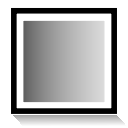

.. _layer_gradient:

##########################
    Linear Gradient Layer
##########################

.. _layer_gradient  About Linear Gradient Layer:

About Linear Gradient Layer
---------------------------

FIXME!!!

A short description of the layer can be found here: |Layer_Linear_Gradient|

.. _layer_gradient  Parameters of the Linear Gradient Layer:

Parameters of the Linear Gradient Layer
---------------------------------------

Parameters of the Linear Gradient Layer are:

+------------------------------------------------------------------+-------------------------+--------------+
| **Name**                                                         | **Value**               | **Type**     |
+------------------------------------------------------------------+-------------------------+--------------+
|     |Real\_icon.png| Z Depth                                     |   0.000000              |   real       |
+------------------------------------------------------------------+-------------------------+--------------+
|     |Real\_icon.png| Amount                                      |   1.000000              |   real       |
+------------------------------------------------------------------+-------------------------+--------------+
|     |Integer\_icon.png| Blend Method                             |   Composite             |   integer    |
+------------------------------------------------------------------+-------------------------+--------------+
|     |Vector\_icon.png| Point 1                                   |   1.000000,1.000000     |   vector     |
+------------------------------------------------------------------+-------------------------+--------------+
|     |Vector\_icon.png| Point 2                                   |   -1.000000,-1.000000   |   vector     |
+------------------------------------------------------------------+-------------------------+--------------+
|     |Gradient\_icon.png| |Gradient_Editor_Dialog|                |   |p_gradient.png|      |   gradient   |
|                                                                  |                         |              |
|                                                                  |                         |              |
|                                                                  |                         |              |
+------------------------------------------------------------------+-------------------------+--------------+
|     |Bool\_icon.png| Loop                                        |   |p_checkbox_off.png|  |   bool       |
|                                                                  |                         |              |
|                                                                  |                         |              |
|                                                                  |                         |              |
+------------------------------------------------------------------+-------------------------+--------------+
|     |Bool\_icon.png| ZigZag                                      |   |p_checkbox_off.png|  |   bool       |
|                                                                  |                         |              |
|                                                                  |                         |              |
|                                                                  |                         |              |
+------------------------------------------------------------------+-------------------------+--------------+

.. |Real_icon.png| image:: images/Type_real_icon.png
   :width: 16px
.. |Integer_icon.png| image:: images/Type_integer_icon.png
   :width: 16px
.. |Vector_icon.png| image:: images/Type_vector_icon.png
   :width: 16px
.. |Gradient_icon.png| image:: images/Type_gradient_icon.png
   :width: 16px
.. |Bool_icon.png| image:: images/Type_bool_icon.png
   :width: 16px
.. |p_checkbox_off.png| image:: images/p_checkbox_off.png
.. |p_gradient.png| image:: images/p_gradient.png   

.. |Layer_Linear_Gradient| replace:: `Linear Gradient Layer`
.. |Gradient_Editor_Dialog| replace:: :ref:`Gradient Editor Dialog <gradient_editor_dialog>`
