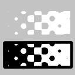

.. _layer_luma_key:

########################
   Luma Key Layer
########################

About Luma Key Layer
--------------------

FIXME!!!

The Luma Key layer does the following: For every pixel of image it
assigns the alpha value, based on its Luminosity. For example, black
pixels become 100% transparent. White pixels are absolutely opaque. Gray
pixels are semi-transparent.

Parameters of the Luma Key Layers
---------------------------------

Parameters of the Luma Key Layers are:

+---------------------------------------------------------------------+---------------+-------------+
| Name                                                                | Value         | Type        |
+---------------------------------------------------------------------+---------------+-------------+
|     |Real\_icon.png| `Z Depth <Z_Depth_Parameter>`__                |   0.000000    |   real      |
+---------------------------------------------------------------------+---------------+-------------+
|     |Real\_icon.png| `Amount <Amount_Parameter>`__                  |   1.000000    |   real      |
+---------------------------------------------------------------------+---------------+-------------+
|     |Integer\_icon.png| `Blend Method <Blend_Method_Parameter>`__   |   Composite   |   integer   |
+---------------------------------------------------------------------+---------------+-------------+
+---------------------------------------------------------------------+---------------+-------------+

.. |Real_icon.png| image:: images/Type_real_icon.png
   :width: 16px
.. |Integer_icon.png| image:: images/Type_integer_icon.png
   :width: 16px
