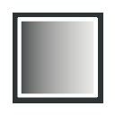

.. _layer_mandelbrot:

########################
    Mandelbrot Set Layer
########################

 
About Mandelbrot Set Layer
--------------------------

 The `Mandelbrot set <https://en.wikipedia.org/wiki/Mandelbrot_set>`__ is a compact set, since it is closed and contained in the closed disk of radius 2 around the origin.

Sample
------

 
Parameters of the Mandelbrot Set Layers
---------------------------------------

`Parameters <Parameter>`__ of the Mandelbrot Set Layers are:

+------------------------------------------------------------------------------------+---------------------+--------------+
| Name                                                                               | Value               | Type         |
+------------------------------------------------------------------------------------+---------------------+--------------+
|     |Integer\_icon.png| `Iterations <Iterations_Parameter>`__                      |   256               |   integer    |
+------------------------------------------------------------------------------------+---------------------+--------------+
|     |Real\_icon.png| `Bailout ValueBase <Bailout_ValueBase_Parameter>`__           |   2.000000          |   real       |
+------------------------------------------------------------------------------------+---------------------+--------------+
|     |Bool\_icon.png| `Break Set <Break_Set_Parameter>`__                           | |p_checkbox_off.png||   bool       |
+------------------------------------------------------------------------------------+---------------------+--------------+
|     |Bool\_icon.png| `Distort Inside <Distort_Inside_Parameter>`__                 | |p_checkbox_off.png||   bool       |
+------------------------------------------------------------------------------------+---------------------+--------------+
|     |Bool\_icon.png| `Shade Inside <Shade_Inside_Parameter>`__                     | |p_checkbox_on.png| |   bool       |
+------------------------------------------------------------------------------------+---------------------+--------------+
|     |Bool\_icon.png| `Solid Inside <Solid_Inside_Parameter>`__                     |                     |   bool       |
+------------------------------------------------------------------------------------+---------------------+--------------+
|     |Bool\_icon.png| `Invert Inside <Invert_Inside_Parameter>`__                   |                     |   bool       |
+------------------------------------------------------------------------------------+---------------------+--------------+
|     |Type\_gradient\_icon.png| `Gradient Inside <Gradient_Inside_Parameter>`__     |  |p_gradient.png|   |   gradient   |
+------------------------------------------------------------------------------------+---------------------+--------------+
|     |Real\_icon.png| `Offset Inside <Offset_Inside_Parameter>`__                   |   0.000000          |   real       |
+------------------------------------------------------------------------------------+---------------------+--------------+
|     |Bool\_icon.png| `Loop Inside <Loop_Inside_Parameter>`__                       |                     |   bool       |
+------------------------------------------------------------------------------------+---------------------+--------------+
|     |Bool\_icon.png| `Distort Outside <Distort_Outside_Parameter>`__               |                     |   bool       |
+------------------------------------------------------------------------------------+---------------------+--------------+
|     |Bool\_icon.png| `Shade Outside <Shade_Outside_Parameter>`__                   |                     |   bool       |
+------------------------------------------------------------------------------------+---------------------+--------------+
|     |Bool\_icon.png| `Solid Outside <Solid_Outside_Parameter>`__                   |                     |   bool       |
+------------------------------------------------------------------------------------+---------------------+--------------+
|     |Bool\_icon.png| `Invert Outside <Invert_Outside_Parameter>`__                 |                     |   bool       |
+------------------------------------------------------------------------------------+---------------------+--------------+
|     |Type\_gradient\_icon.png| `Gradient Outside <Gradient_Outside_Parameter>`__   |  |p_gradient.png|   |   gradient   |
+------------------------------------------------------------------------------------+---------------------+--------------+
|     |Bool\_icon.png| `Smooth Outside <Smooth_Outside_Parameter>`__                 |                     |   bool       |
+------------------------------------------------------------------------------------+---------------------+--------------+
|     |Real\_icon.png| `Offset Outside <Offset_Outside_Parameter>`__                 |   0.000000          |   real       |
+------------------------------------------------------------------------------------+---------------------+--------------+
|     |Real\_icon.png| `Scale Outside <Scale_Outside_Parameter>`__                   |   0.000000          |   real       |
+------------------------------------------------------------------------------------+---------------------+--------------+

.. |Integer_icon.png| image:: images/Type_integer_icon.png
   :width: 16px
.. |Real_icon.png| image:: images/Type_real_icon.png
   :width: 16px
.. |Bool_icon.png| image:: images/Type_bool_icon.png
   :width: 16px

.. |p_checkbox_off.png| image:: images/p_checkbox_off.png

   
