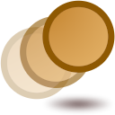

.. _layer_motion_blur:

########################
    Motion Blur Layer
########################

.. _layer_motion_blur  About Motion Blur Layer:

About Motion Blur Layer
-----------------------
Blur is a graphical effect that aims to imitate an unfocused image. In a
photography context blur can occur when the `focal
point <http://en.wikipedia.org/wiki/Focus_%28optics%29>`__ of the lens
is not at the right position of the target of the photograph. Also blur
can have other origins. Blurs can happen as the result of a poor
exposure during its recording (too long exposure time for a large
movement of the object or a high movement of the recorder). Also
blurring occurs when you use a very wide
`aperture <http://en.wikipedia.org/wiki/Aperture#In_photography>`__
(f4). In that case the objects that are out of focus are very blurred
compared to the situation where the aperture is fully closed (f22).

In a graphical context, blurs are effects that imitate those situations
(with more or less success). Motion Blur Layer allows to simulate the blur of picture, that arises by
movement.

.. _layer_motion_blur  Parameters of the Motion Blur Layer:

Parameters of the Motion Blur Layer
-----------------------------------

The parameters of the ``Motion Blur Layer`` are:

+----------------------------------------------------------------------------------+----------------+-------------+
| Name                                                                             | Value          | Type        |
+----------------------------------------------------------------------------------+----------------+-------------+
|     |Type\_time\_icon.png| `Aperture <#Aperture>`__                              |   0f           |   time      |
+----------------------------------------------------------------------------------+----------------+-------------+
|     |Type\_real\_icon.png| `Subsamples Factor <#Subsamples_Parameters>`__        |   1.000000     |   real      |
+----------------------------------------------------------------------------------+----------------+-------------+
|     |Type\_integer\_icon.png| `Subsampling Type <#Subsamples_Parameters>`__      |   Hyperbolic   |   integer   |
+----------------------------------------------------------------------------------+----------------+-------------+
|     |Type\_real\_icon.png| `Subsample Start Amount <#Subsamples_Parameters>`__   |   0.000000     |   real      |
+----------------------------------------------------------------------------------+----------------+-------------+
|     |Type\_real\_icon.png| `Subsample End Amount <#Subsamples_Parameters>`__     |   1.000000     |   real      |
+----------------------------------------------------------------------------------+----------------+-------------+

.. _layer_motion_blur  Aperture:

Aperture
~~~~~~~~

The ``Aperture`` parameter indicates the number of frames used to
compute the effect of motion. The concept is analogous to the shutter
speed or exposure time in photography.

.. _layer_motion_blur  Subsamples Factor:

Subsamples Factor
~~~~~~~~~~~~~~~~~

The ``Subsamples Factor`` affects the number of Subsamples to be
computed. Using a high value, the smudge is finer, but the rendering
takes longer as it involves much more computations.

.. _layer_motion_blur  Subsampling Type:

Subsampling Type
~~~~~~~~~~~~~~~~

The ``Subsampling Type`` parameter indicates the type of Subsampling
used between:

-  Constant
-  Linear
-  Hyperbolic

.. _layer_motion_blur  Subsample Start Amount:

Subsample Start Amount
~~~~~~~~~~~~~~~~~~~~~~

The ``Subsample Start Amount`` parameter indicates the value of
Subsample at the start. For example, if ``Subsample Start Amount`` is
set to 0, it won't have any blur on start. Otherwise the motion of
objects from lower layers begin as a smudge.

.. _layer_motion_blur  Subsample End Amount:

Subsample End Amount
~~~~~~~~~~~~~~~~~~~~

The ``Subsample End Amount`` parameter indicates the value of Subsample
at the end. For example, if ``Subsample End Amount`` is set to 0, the
last state of the objects from lower layers will appear without any
blur.

.. _layer_motion_blur  Samples:

Samples
-------

+--------------+-------------------------------------------------------------------+-------------------------------------------------------------------+
|              | From Subsample Start 0 to Subsample End 1                         | From Subsample Start 1 to Subsample End 0                         |
+==============+===================================================================+===================================================================+
|    0f–0f     | .. figure:: motion_blur_dat/Motion_blur_0-1_aperture_0-0f.gif                                                                         |    
|              |    :alt: Motion_blur_0-1_aperture_0-0f.gif                                                                                            |
|              |                                                                                                                                       |
|              |                                                                                                                                       |
+--------------+-------------------------------------------------------------------+-------------------------------------------------------------------+
|    0f–24f    | .. figure:: motion_blur_dat/Motion_blur_0-1_aperture_0-24f.gif    | .. figure:: motion_blur_dat/Motion_blur_1-0_aperture_0-24f.gif    |
|              |    :alt: Motion_blur_0-1_aperture_0-24f.gif                       |    :alt: Motion_blur_1-0_aperture_0-24f.gif                       |
|              |                                                                   |                                                                   |
|              |                                                                   |                                                                   |
+--------------+-------------------------------------------------------------------+-------------------------------------------------------------------+
|    24f–24f   | .. figure:: motion_blur_dat/Motion_blur_0-1_aperture_24-24f.gif   | .. figure:: motion_blur_dat/Motion_blur_1-0_aperture_24-24f.gif   |
|              |    :alt: Motion_blur_0-1_aperture_24-24f.gif                      |    :alt: Motion_blur_1-0_aperture_24-24f.gif                      |
|              |                                                                   |                                                                   |
|              |                                                                   |                                                                   |
+--------------+-------------------------------------------------------------------+-------------------------------------------------------------------+
|    24f–0f    | .. figure:: motion_blur_dat/Motion_blur_0-1_aperture_24-0f.gif    | .. figure:: motion_blur_dat/Motion_blur_1-0_aperture_24-0f.gif    |
|              |    :alt: Motion_blur_0-1_aperture_24-0f.gif                       |    :alt: Motion_blur_1-0_aperture_24-0f.gif                       |
|              |                                                                   |                                                                   |
|              |                                                                   |                                                                   |
+--------------+-------------------------------------------------------------------+-------------------------------------------------------------------+

Notes:

-  Rows in table – ``Aperture`` value from beginning (frame 0) to end
   (frame 120).
-  Columns in table – ``Subsample Start Amount`` value and
   ``Subsample End Amount`` value

:download:`Sample file <motion_blur_dat/Motion_blur.sifz>`

.. _layer_motion_blur  See also:

See also
--------

-  A short description of the blur layers can be found here:
   |Layer|
-  |Radial_Blur_Layer| with a radial control of
   the size of the blur.
-  |Blur_Layer| mostly used types of blur.

.. |Type_time_icon.png| image:: images/Type_time_icon.png
   :width: 16px
.. |Type_real_icon.png| image:: images/Type_real_icon.png
   :width: 16px
.. |Type_integer_icon.png| image:: images/Type_integer_icon.png
   :width: 16px

.. |Layer| replace:: :ref:`Layer <layers>`
.. |Radial_Blur_Layer| replace:: :ref:`Radial Blur Layer <layer_radial_blur>`
.. |Blur_Layer| replace:: :ref:`Blur Layer <layer_blur>`
