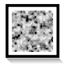

.. _layer_noise_gradient:

########################
    Noise Gradient Layer
########################

.. _layer_noise_gradient  About Noise Gradient Layer:

About Noise Gradient Layer
--------------------------

Noise Gradient Layer is a type of gradient
generated by procedural texture. This method consists of a creation of a
lattice of random interpolated gradient.

You can adjust various parameters to create different textures. You can
easily founds some clouds...

.. _layer_noise_gradient  Parameters of Noise Gradient Layer:

Parameters of Noise Gradient Layer
----------------------------------

The parameters of the Noise Gradient Layer are:

+---------------------------------------------------------------------------------------------+---------------------------+--------------+
| Name                                                                                        | Value                     | Type         |
+---------------------------------------------------------------------------------------------+---------------------------+--------------+
|     |Type\_real\_icon.png| |Z_Depth_Parameter|                                              |   0.000000                |   real       |
+---------------------------------------------------------------------------------------------+---------------------------+--------------+
|     |Type\_real\_icon.png| |Amount_Parameter|                                               |   1.000000                |   real       |
+---------------------------------------------------------------------------------------------+---------------------------+--------------+
|     |Type\_integer\_icon.png|  |Blend_Method_Parameter|                                     |   Composite               |   integer    |
+---------------------------------------------------------------------------------------------+---------------------------+--------------+
|     |Type\_gradient\_icon.png| |Gradient_Editor_Dialog|                                     |   |p_gradient.png|        |   gradient   |
+---------------------------------------------------------------------------------------------+---------------------------+--------------+
|     |Type\_integer\_icon.png|  RandomNoise Seed Parameter                                   |   1299736373              |   integer    |
+---------------------------------------------------------------------------------------------+---------------------------+--------------+
|     |Type\_vector\_icon.png|  Size Parameter                                                |   60.000000u,60.000000u   |   integer    |
+---------------------------------------------------------------------------------------------+---------------------------+--------------+
|     |Type\_integer\_icon.png|  Interpolation Parameter                                      |   Cosine                  |   integer    |
+---------------------------------------------------------------------------------------------+---------------------------+--------------+
|     |Type\_integer\_icon.png|  Detail Parameter                                             |   4                       |   integer    |
+---------------------------------------------------------------------------------------------+---------------------------+--------------+
|     |Type\_real\_icon.png|  Animation Speed Parameter                                       |   0.000000                |   real       |
+---------------------------------------------------------------------------------------------+---------------------------+--------------+
|     |Type\_bool\_icon.png|  Turbulent Parameter                                             |                           |   bool       |
+---------------------------------------------------------------------------------------------+---------------------------+--------------+
|     |Type\_bool\_icon.png|  Do Alpha Parameter                                              |                           |   bool       |
+---------------------------------------------------------------------------------------------+---------------------------+--------------+
|     |Type\_bool\_icon.png|  Super Sampling Parameter                                        |                           |   bool       |
+---------------------------------------------------------------------------------------------+---------------------------+--------------+

-  ``Size`` How much separated are two consecutive distortions

.. |Type_real_icon.png| image:: images/Type_real_icon.png
   :width: 16px
.. |Type_integer_icon.png| image:: images/Type_integer_icon.png
   :width: 16px
.. |Type_gradient_icon.png| image:: images/Type_gradient_icon.png
   :width: 16px
.. |Type_vector_icon.png| image:: images/Type_vector_icon.png
   :width: 16px
.. |Type_bool_icon.png| image:: images/Type_bool_icon.png
   :width: 16px
.. |p_gradient.png| image:: images/p_gradient.png   

.. |Z_Depth_Parameter| replace:: :ref:`Z Depth Parameter <parameters_zdepth>`
.. |Amount_Parameter| replace:: :ref:`Opacity <opacity>`
.. |Blend_Method_Parameter| replace:: :ref:`Blend Method <parameters_blend_method>`
.. |Gradient_Editor_Dialog| replace:: :ref:`Gradient <gradient_editor_dialog>`
