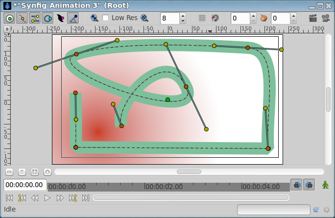

.. _layer_outline:

########################
    Outline Layer
########################

About Outline Layers
--------------------

Outline Layers are used to hold strokes or edges of filled shapes. They
give a cartoon look to an animation when added as the edge of the filled
shapes. Also standalone Outlines (strokes) are used to define fold of 3D
drawings and used together with shadows (created using gradients or
feathering) are the basis of an artist's work.

To create an Outline Layer use the `Spline Tool <Spline_Tool>`__ and
check ``Create Outline`` in the `Tool Options
Panel <Tool_Options_Panel>`__. Once you finish the definition of the
geometry of your outline and after pressing the ``Make Spline`` button
(or selecting another tool or state) you create the Outline Layer with
the `current <New_Layer_Defaults#Brush_Colors>`__ ``Outline Color``.

Depending on the options you choose in the `Tool Options
Panel <Tool_Options_Panel>`__ other like `Star Tool <Star_Tool>`__ or
`Circle Tool <Circle_Tool>`__ can also create Outline Layers.

Using the `Layer Menu <Canvas_Layer_Menu>`__ ``Make Advanced Outline``,
``Make Outline`` or ``Make Region`` commands you can also create those
layers.

Parameters of Outline Layers
----------------------------

The parameters of the Outline layers are:

+-----------------------------------------------------------------------------------------+-------------------------+-------------------+
| **Name**                                                                                | **Value**               | **Type**          |
+-----------------------------------------------------------------------------------------+-------------------------+-------------------+
|     |Type\_real\_icon.png| `Z Depth <Z_Depth_Parameter>`__                              |   0.000000              |   real            |
+-----------------------------------------------------------------------------------------+-------------------------+-------------------+
|     |Type\_real\_icon.png| `Amount <Amount_Parameter>`__                                | 1.000000                |   real            |
+-----------------------------------------------------------------------------------------+-------------------------+-------------------+
|     |Type\_integer\_icon.png| `Blend Method <Blend_Method>`__                           | Composite               |   integer         |
+-----------------------------------------------------------------------------------------+-------------------------+-------------------+
|     |Type\_color\_icon.png| `Color <Colors_Dialog>`__                                   | |p_color_green.png|     |   color           |
|                                                                                         |                         |                   |
|                                                                                         |                         |                   |
|                                                                                         |                         |                   |
+-----------------------------------------------------------------------------------------+-------------------------+-------------------+
|     |Type\_vector\_icon.png| `Origin <Origin_Parameter>`__                              |   0.000000u,0.000000u   |   vector          |
+-----------------------------------------------------------------------------------------+-------------------------+-------------------+
|     |Type\_bool\_icon.png| `Invert <Invert_Parameter>`__                                | |p_checkbox_off.png|    |   bool            |
|                                                                                         |                         |                   |
|                                                                                         |                         |                   |
|                                                                                         |                         |                   |
+-----------------------------------------------------------------------------------------+-------------------------+-------------------+
|     |Type\_bool\_icon.png| `Antialiasing <Antialiasing_Parameter>`__                    | |p_checkbox_off.png|    |   bool            |
|                                                                                         |                         |                   |
|                                                                                         |                         |                   |
|                                                                                         |                         |                   |
+-----------------------------------------------------------------------------------------+-------------------------+-------------------+
|     |Type\_real\_icon.png| `Feather <Feather_Parameter>`__                              |   0.000000pt            |   real            |
+-----------------------------------------------------------------------------------------+-------------------------+-------------------+
|     |Type\_integer\_icon.png| `Type of Feather <Feather_Parameter#Type_of_Feather>`__   |   Fast Gaussian Blur    |   integer         |
+-----------------------------------------------------------------------------------------+-------------------------+-------------------+
|     |Type\_integer\_icon.png| `Winding Style <Winding_Style_Parameter>`__               |   Non Zero              |   integer         |
+-----------------------------------------------------------------------------------------+-------------------------+-------------------+
|     |Type\_list\_icon.png| Vertices                                                     |   List                  |   list (Spline)   |
+-----------------------------------------------------------------------------------------+-------------------------+-------------------+
|     |Type\_real\_icon.png| `Outline Width <Outline_Layer#Outline_width>`__              |   2.000000pt            |   real            |
+-----------------------------------------------------------------------------------------+-------------------------+-------------------+
|     |Type\_real\_icon.png| `Expand <Outline_Layer#Expand>`__                            |   0.000000pt            |   real            |
+-----------------------------------------------------------------------------------------+-------------------------+-------------------+
|     |Type\_bool\_icon.png| `Sharp Cusps <Outline_Layer#Sharp_Cusps>`__                  | |p_checkbox_off.png|    |   bool            |
|                                                                                         |                         |                   |
|                                                                                         |                         |                   |
|                                                                                         |                         |                   |
+-----------------------------------------------------------------------------------------+-------------------------+-------------------+
|     |Type\_bool\_icon.png| `Rounded Begin <Outline_Layer#Rounded_Begin>`__              | |p_checkbox_off.png|    |   bool            |
|                                                                                         |                         |                   |
|                                                                                         |                         |                   |
|                                                                                         |                         |                   |
+-----------------------------------------------------------------------------------------+-------------------------+-------------------+
|     |Type\_bool\_icon.png| `Rounded End <Outline_Layer#Rounded_End>`__                  | |p_checkbox_off.png|    |   bool            |
|                                                                                         |                         |                   |
|                                                                                         |                         |                   |
|                                                                                         |                         |                   |
+-----------------------------------------------------------------------------------------+-------------------------+-------------------+
|     |Type\_real\_icon.png| `Loopyness <Outline_Layer#Loopyness>`__                      |   1.000000              |   real            |
+-----------------------------------------------------------------------------------------+-------------------------+-------------------+
|     |Type\_bool\_icon.png| `Homogeneous <Outline_Layer#Homogeneous>`__                  | |p_checkbox_off.png|    |   bool            |
|                                                                                         |                         |                   |
|                                                                                         |                         |                   |
|                                                                                         |                         |                   |
+-----------------------------------------------------------------------------------------+-------------------------+-------------------+

Specific parameters for Outline Layers
--------------------------------------

The first 11 parameters of the Outline are common parameters that are
shared for several types of Layers. Click on the links to see their definitions. Only
the particular parameters for the Outline Layer are described here.

This is a sample screenshot of an Outline Layer in action:

   
Outline width
~~~~~~~~~~~~~

The Outline width parameter is a float value in pixels that represents
the basic value of the width for all the points of the curve at the same
time. It works together with the width parameter of the vertices' child
values. So setting the ``Outline Width`` to 1.0px then the resulting
value for the rendered width in that vertex comes from this formula: W =
OLW \* VW + 2E.

Where:

-  W = resulting width of the outline at that vertex.
-  OLW = overall parameter for the width of all the vertices (that is
   the Outline Width parameter).
-  VW = specific vertex width value.
-  E = value of the Expand parameter.

The width `handle <Handle>`__ would show the radius value for that
vertex (W/2).

The width that ends up being used for each vertex is ((VertexWidth \*
OutLineWidth) + Expand\*2):

+-------------------------------------------------------------+-------------------------------------------------------------+
| .. figure:: outline_dat/Outline-Layer_default_0.63.06.png   | .. figure:: outline_dat/Outline-Layer_width_0.63.06.png     |
|    :alt: Outline-Layer_default_0.63.06.png                  |    :alt: Outline-Layer_width_0.63.06.png                    |
|    :width: 450px                                            |    :width: 450px                                            |
|                                                             |                                                             |
|                                                             |                                                             |
+-------------------------------------------------------------+-------------------------------------------------------------+
| Starting image                                              | After doubling the value of ``Outline Width``               |
+-------------------------------------------------------------+-------------------------------------------------------------+

It's possible to specify negative values for the width values, which
kind of turns the vertex inside out. Here's an example where the left
vertex has a negative width and the right has a positive width. Note how
the edges of the spline between the vertices cross each other in the
middle:

+------------------------------------------------------+---------------------------------------------------------------+
| .. figure:: outline_dat/Outline-negative-width.png   | .. figure:: outline_dat/Outline-negative-width-selected.png   |
|    :alt: Outline-negative-width.png                  |    :alt: Outline-negative-width-selected.png                  |
|                                                      |                                                               |
|                                                      |                                                               |
+------------------------------------------------------+---------------------------------------------------------------+

Expand
~~~~~~

The ``Expand`` parameter is similar to the ``Outline Width`` parameter,
but rather than being multiplied by each vertex's width, it is added to
the radius of each vertex. In other words (2\*Expand) is added to the
diameter of each vertex.

The width that ends up being used for each vertex is ((VertexWidth \*
OutLineWidth) + Expand\*2):

+-------------------------------------------------------------+------------------------------------------------------------+
| .. figure:: outline_dat/Outline-Layer_default_0.63.06.png   | .. figure:: outline_dat/Outline-Layer_expand_0.63.06.png   |
|    :alt: Outline-Layer_default_0.63.06.png                  |    :alt: Outline-Layer_expand_0.63.06.png                  |
|    :width: 450px                                            |    :width: 450px                                           |
|                                                             |                                                            |
|                                                             |                                                            |
+-------------------------------------------------------------+------------------------------------------------------------+
| Zero ``Expand``                                             | Non-zero ``Expand``                                        |
+-------------------------------------------------------------+------------------------------------------------------------+

Sharp cups
~~~~~~~~~~

Enabling ``Sharp Cusps`` makes the corners pointy when the tangents are
split:

+-------------------------------------------------------------+-----------------------------------------------------------+
| .. figure:: outline_dat/Outline-Layer_default_0.63.06.png   | .. figure:: outline_dat/Outline-Layer_sharp_0.63.06.png   |
|    :alt: Outline-Layer_default_0.63.06.png                  |    :alt: Outline-Layer_sharp_0.63.06.png                  |
|    :width: 450px                                            |    :width: 450px                                          |
|                                                             |                                                           |
|                                                             |                                                           |
+-------------------------------------------------------------+-----------------------------------------------------------+
| No ``Sharp Cusps``                                          | With ``Sharp Cusps``                                      |
+-------------------------------------------------------------+-----------------------------------------------------------+

Rounded Begin
~~~~~~~~~~~~~

Enabling ``Rounded Begin`` makes the start of the outline rounded:

+-------------------------------------------------------------+-------------------------------------------------------------------+
| .. figure:: outline_dat/Outline-Layer_default_0.63.06.png   | .. figure:: outline_dat/Outline-Layer_rounded_begin_0.63.06.png   |
|    :alt: Outline-Layer_default_0.63.06.png                  |    :alt: Outline-Layer_rounded_begin_0.63.06.png                  |
|    :width: 450px                                            |    :width: 450px                                                  |
|                                                             |                                                                   |
|                                                             |                                                                   |
+-------------------------------------------------------------+-------------------------------------------------------------------+
| no ``Rounded Begin``                                        | ``Rounded Begin``                                                 |
+-------------------------------------------------------------+-------------------------------------------------------------------+

Note: With cairo render activated, if the quality is superior to **6**,
enabling ``Rounded Begin`` enable also R\ ``Rounded End``.

Rounded End
~~~~~~~~~~~

Enabling ``Rounded End`` makes the end of the outline rounded:

+-------------------------------------------------------------+-----------------------------------------------------------------+
| .. figure:: outline_dat/Outline-Layer_default_0.63.06.png   | .. figure:: outline_dat/Outline-Layer_rounded_end_0.63.06.png   |
|    :alt: Outline-Layer_default_0.63.06.png                  |    :alt: Outline-Layer_rounded_end_0.63.06.png                  |
|    :width: 450px                                            |    :width: 450px                                                |
|                                                             |                                                                 |
|                                                             |                                                                 |
+-------------------------------------------------------------+-----------------------------------------------------------------+
| No ``Rounded End``                                          | With ``Rounded End``                                            |
+-------------------------------------------------------------+-----------------------------------------------------------------+

Note: With cairo render activated, if the quality is superior to **6**,
enabling ``Rounded End`` enable also ``Rounded Begin``.

Loopyness
~~~~~~~~~

This parameter currently does absolutely nothing at all!

Homogeneous
~~~~~~~~~~~

Enabling 'Homogeneous' changes the way that the width of the outline
changes from one spline point to the next. Each point in the spline has
its own width, and the spline has its own 'Outline Width' and 'Expand'
parameters which are used to give the final width at each spline point.
The 'Homogeneous' parameter controls how the width is interpolated
between two neighboring spline points:

-  When 'Homogeneous' isn't checked, the width is interpolated linearly
   with the spline's `'t'
   parameter <http://en.wikipedia.org/wiki/Bézier_curve>`__.
-  When 'Homogeneous' is checked, the width is interpolated linearly
   with the spline's length.

Turning off homogeneous often makes the fat end of a spline look lumpy.
Maybe that's a bug:

+-------------------------------------------------------+---------------------------------------------------+
| .. figure:: outline_dat/Outline-not-homogeneous.png   | .. figure:: outline_dat/Outline-homogeneous.png   |
|    :alt: Outline-not-homogeneous.png                  |    :alt: Outline-homogeneous.png                  |
|                                                       |                                                   |
|                                                       |                                                   |
+-------------------------------------------------------+---------------------------------------------------+
| not homogeneous                                       | homogeneous                                       |
+-------------------------------------------------------+---------------------------------------------------+

Misc
~~~~

The `Antialiasing Parameter‎ <Antialiasing_Parameter‎>`__ isn't specific
to the Outline layer, but it is particularly useful for the Outline
layer. It makes the edges appear smoother:

+------------------------------------------------------------------+-------------------------------------------------------------+
| .. figure:: outline_dat/Outline-Layer_no_antialias_0.63.06.png   | .. figure:: outline_dat/Outline-Layer_default_0.63.06.png   |
|    :alt: Outline-Layer_no_antialias_0.63.06.png                  |    :alt: Outline-Layer_default_0.63.06.png                  |
|    :width: 450px                                                 |    :width: 450px                                            |
|                                                                  |                                                             |
|                                                                  |                                                             |
+------------------------------------------------------------------+-------------------------------------------------------------+
| not antialiased                                                  | antialiased                                                 |
+------------------------------------------------------------------+-------------------------------------------------------------+

Note : :download:`File used <outline_dat/Outline_Layer.sifz>`

.. |Type_real_icon.png| image:: images/Type_real_icon.png
   :width: 16px
.. |Type_color_icon.png| image:: images/Type_color_icon.png
   :width: 16px
.. |Type_vector_icon.png| image:: images/Type_vector_icon.png
   :width: 16px
.. |Type_bool_icon.png| image:: images/Type_bool_icon.png
   :width: 16px
.. |Type_integer_icon.png| image:: images/Type_integer_icon.png
   :width: 16px
.. |Type_list_icon.png| image:: images/Type_list_icon.png
   :width: 16px
.. |p_color_green.png| image:: images/p_color_green.png
.. |p_checkbox_off.png| image:: images/p_checkbox_off.png
.. |Outline\_Layer.sifz| image:: Outline_Layer.sifz

