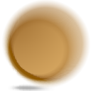
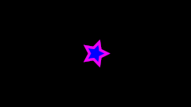

.. _layer_radial_blur:

########################
   Radial Blur Layer
########################

.. _layer_radial_blur  About Radial Blur Layers:

About Radial Blur Layers
------------------------

Radial control of the size of the blur.

.. _layer_radial_blur  Parameters of Radial Blur Layers:

Parameters of Radial Blur Layers
--------------------------------

The parameters of the ``Radial Blur Layer`` are:

+-----------------------------------------------------------------+-------------------------+-------------+
| Name                                                            | Value                   | Type        |
+-----------------------------------------------------------------+-------------------------+-------------+
|     |Type\_real\_icon.png| |Z_Depth_Parameter|                  |   0.000000              |   real      |
+-----------------------------------------------------------------+-------------------------+-------------+
|     |Type\_real\_icon.png| |Amount_Parameter|                   |   1.000000              |   real      |
+-----------------------------------------------------------------+-------------------------+-------------+
|     |Type\_integer\_icon.png| |Blend_Method|                    |   Composite             |   integer   |
+-----------------------------------------------------------------+-------------------------+-------------+
|     |Type\_vector\_icon.png| |Origin_Parameter|                 |   0.000000u,0.000000u   |   vector    |
+-----------------------------------------------------------------+-------------------------+-------------+
|     |Type\_real\_icon.png|  Size                                |   0.200000              |   real      |
+-----------------------------------------------------------------+-------------------------+-------------+
|     |Type\_bool\_icon.png|  Fade Out Parameter                  |                         |   bool      |
+-----------------------------------------------------------------+-------------------------+-------------+

.. _layer_radial_blur  Samples:

Samples
-------

If you wonder how the animations were made 
(:download:`sample file <radial_blur_dat/Radial_blur.sifz>`):

-  a |Star_Layer| is positioned at center of the Frame,
   with an |Outline_Layer| of width 0.05u
-  the animations have 120 frames, and the Size parameter of
   the blur goes from 0u,0u to 1u,1u
-  the |Render_dialog| settings are set to Quality 9 and
   Anti-Aliasing 1

First sample is without `Fade Out <#Fade_Out>`__:

   
   |Radial\_blur.gif|  |Radial\_blur\_fade\_out.gif|
   

.. _layer_radial_blur  See also:

See also
--------

-  A short description of the blur layers can be found here:
   |Layer|
-  |Blur_Layer| mostly used types of blur.
-  |Motion_Blur_Layer| a type of blur that aims to
   simulate a motion blur (the one that happens when the object's
   movement is too fast for the exposure time). It is controlled by a
   single parameter called ``Aperture``.

.. |Type_real_icon.png| image:: images/Type_real_icon.png
   :width: 16px
.. |Type_integer_icon.png| image:: images/Type_integer_icon.png
   :width: 16px
.. |Type_vector_icon.png| image:: images/Type_vector_icon.png
   :width: 16px
.. |Type_bool_icon.png| image:: images/Type_bool_icon.png
   :width: 16px
.. |Radial_blur.gif| image:: radial_blur_dat/Radial_blur.gif

.. |Z_Depth_Parameter| replace:: :ref:`Z Depth Parameter <parameters_zdepth>`
.. |Amount_Parameter| replace:: :ref:`Opacity <opacity>`
.. |Blend_Method| replace:: :ref:`Blend Method <parameters_blend_method>`
.. |Origin_Parameter| replace:: :ref:`Origin <parameters_origin>`
.. |Star_Layer| replace:: :ref:`Star Layer <layer_star>`
.. |Outline_Layer| replace:: :ref:`Outline Layer <layer_star>`
.. |Render_dialog| replace:: :ref:`Render Dialog <canvas_render>`
.. |Blur_Layer| replace:: :ref:`Blur Layer <layer_blur>`
.. |Motion_Blur_Layer| replace:: :ref:`Motion Blur Layer <layer_motion_blur>`
.. |Layer| replace:: :ref:`Layer <layers>`