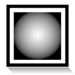

.. _layer_radial_gradient:

#############################
    Radial Gradient Layer
#############################

.. _layer_radial_gradient  About Radial Gradient Layers:

About Radial Gradient Layers
----------------------------

FIXME!!!

.. _layer_radial_gradient  Parameters of Radial Gradient Layers:

Parameters of Radial Gradient Layers
------------------------------------

The parameters of the radial gradient layers are:

+------------------------------------------------------------------------+-------------------------+--------------+
| **Name**                                                               | **Value**               | **Type**     |
+------------------------------------------------------------------------+-------------------------+--------------+
|     |Type\_real\_icon.png| |Z_Depth_Parameter|                         |   0.000000              |   real       |
+------------------------------------------------------------------------+-------------------------+--------------+
|     |Type\_real\_icon.png| |Amount_Parameter|                          |   1.000000              |   real       |
+------------------------------------------------------------------------+-------------------------+--------------+
|     |Type\_integer\_icon.png| |Blend_Method|                           |   Composite             |   integer    |
+------------------------------------------------------------------------+-------------------------+--------------+
|     |Type\_gradient\_icon.png| |Gradient_Editor_Dialog|                |  |p_gradient.png|       |   gradient   |
+------------------------------------------------------------------------+-------------------------+--------------+
|     |Type\_vector\_icon.png| Center                                    |   0.000000u,0.000000u   |   vector     |
+------------------------------------------------------------------------+-------------------------+--------------+
|     |Type\_real\_icon.png| Radius                                      |   1.000000u             |   real       |
+------------------------------------------------------------------------+-------------------------+--------------+
|     |Type\_bool\_icon.png| Loop                                        |   |p_checkbox_off.png|  |   bool       |
+------------------------------------------------------------------------+-------------------------+--------------+
|     |Type\_bool\_icon.png| ZigZag                                      |   |p_checkbox_off.png|  |   bool       |
+------------------------------------------------------------------------+-------------------------+--------------+

.. |Type_real_icon.png| image:: images/Type_real_icon.png
   :width: 16px
.. |Type_integer_icon.png| image:: images/Type_integer_icon.png
   :width: 16px
.. |Type_gradient_icon.png| image:: images/Type_gradient_icon.png
   :width: 16px
.. |Type_vector_icon.png| image:: images/Type_vector_icon.png
   :width: 16px
.. |Type_bool_icon.png| image:: images/Type_bool_icon.png
   :width: 16px
.. |p_checkbox_off.png| image:: images/p_checkbox_off.png
.. |p_gradient.png| image:: images/p_gradient.png   

.. |Z_Depth_Parameter| replace:: :ref:`Z Depth Parameter <parameters_zdepth>`
.. |Amount_Parameter| replace:: :ref:`Opacity <opacity>`
.. |Blend_Method| replace:: :ref:`Blend Method <parameters_blend_method>`
.. |Origin_Parameter| replace:: :ref:`Origin <parameters_origin>`
.. |Gradient_Editor_Dialog| replace:: :ref:`Gradient Editor Dialog <gradient_editor_dialog>`
