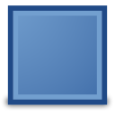

.. _layer_rectangle:

########################
    Rectangle Layer
########################

About Rectangle Layers
----------------------

The ``Rectangle Layer`` lets you draw rectangles by specifying two
opposite corners.

Parameters of Rectangle Layers
------------------------------

The parameters of the rectangle layers are:

+--------------------------------------------------------------------------+-------------------------+-------------+
| Name                                                                     | Value                   | Type        |
+--------------------------------------------------------------------------+-------------------------+-------------+
|     |Type\_real\_icon.png| `Z Depth <Z_Depth_Parameter>`__               |   0.000000              |   real      |
+--------------------------------------------------------------------------+-------------------------+-------------+
|     |Type\_real\_icon.png| `Amount <Amount_Parameter>`__                 |   1.000000              |   real      |
+--------------------------------------------------------------------------+-------------------------+-------------+
|     |type\_integer\_icon.png| `Blend Method <Blend_Method>`__            |   Composite             |   integer   |
+--------------------------------------------------------------------------+-------------------------+-------------+
|     |Type\_color\_icon.png| `Color <Colors_Dialog>`__                    | |p_color_green.png|     |   color     |
+--------------------------------------------------------------------------+-------------------------+-------------+
|     |Type\_vector\_icon.png| `Point 1 <Point_Parameter>`__               |   0.000000u,0.000000u   |   vector    |
+--------------------------------------------------------------------------+-------------------------+-------------+
|     |Type\_vector\_icon.png| `Point 2 <Point_Parameter>`__               |   1.000000u,1.000000u   |   vector    |
+--------------------------------------------------------------------------+-------------------------+-------------+
|     |Type\_real\_icon.png| `Expand amount <Expand_Amount_Parameter>`__   |   0.000000u             |   real      |
+--------------------------------------------------------------------------+-------------------------+-------------+
|     |Type\_bool\_icon.png| `Invert <Invert_Parameter>`__                 |                         |   bool      |
+--------------------------------------------------------------------------+-------------------------+-------------+

.. |Type_real_icon.png| image:: images/Type_real_icon.png
   :width: 16px
.. |Type_integer_icon.png| image:: images/Type_integer_icon.png
   :width: 16px
.. |Type_color_icon.png| image:: images/Type_color_icon.png
   :width: 16px
.. |Type_vector_icon.png| image:: images/Type_vector_icon.png
   :width: 16px
.. |Type_bool_icon.png| image:: images/Type_bool_icon.png
   :width: 16px
.. |p_color_green.png| image:: images/p_color_green.png   
