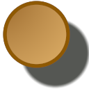

.. _layer_shade:

########################
    Shade Layer
########################

.. _layer_shade  About Shade Layers:

About Shade Layers
------------------

The Shade Layer creates a drop shadow underneath objects.

.. _layer_shade  Parameters of Shade Layers:

Parameters of Shade Layers
--------------------------

The parameters of the Shade Layer are:

+-------------------------------------------------------------------------------------+--------------------------+-------------+
| Name                                                                                | Value                    | Type        |
+-------------------------------------------------------------------------------------+--------------------------+-------------+
|     |Type\_real\_icon.png| |Z_Depth_Parameter|                                      |   0.000000               |   real      |
+-------------------------------------------------------------------------------------+--------------------------+-------------+
|     |Type\_real\_icon.png| |Amount_Parameter|                                       |   1.000000               |   real      |
+-------------------------------------------------------------------------------------+--------------------------+-------------+
|     |Type\_integer\_icon.png| |Blend_Method_Parameter|                              |   Composite              |   integer   |
+-------------------------------------------------------------------------------------+--------------------------+-------------+
|     |Type\_color\_icon.png| |Color_Parameter|                                       |   |p_color_green.png|    |   color     |
+-------------------------------------------------------------------------------------+--------------------------+-------------+
|     |Type\_vector\_icon.png| |Origin_Parameter|                                     |   0.200000u,-0.200000u   |   vector    |
+-------------------------------------------------------------------------------------+--------------------------+-------------+
|     |Type\_vector\_icon.png| Size                                                   |   0.100000u,0.100000u    |   vector    |
+-------------------------------------------------------------------------------------+--------------------------+-------------+
|     |Type\_integer\_icon.png| |Type_Parameter|                                      |   Fast Gaussian Blur     |   integer   |
+-------------------------------------------------------------------------------------+--------------------------+-------------+
|     |Type\_bool\_icon.png| |Invert_Parameter|                                       |                          |   bool      |
+-------------------------------------------------------------------------------------+--------------------------+-------------+

.. |Type_real_icon.png| image:: images/Type_real_icon.png
   :width: 16px
.. |Type_integer_icon.png| image:: images/Type_integer_icon.png
   :width: 16px
.. |Type_color_icon.png| image:: images/Type_color_icon.png
   :width: 16px
.. |Type_vector_icon.png| image:: images/Type_vector_icon.png
   :width: 16px
.. |Type_integer_icon.png| image:: images/Type_integer_icon.png
   :width: 16px
.. |Type_bool_icon.png| image:: images/Type_bool_icon.png
   :width: 16px
.. |p_color_green.png| image:: images/p_color_green.png 

.. |Z_Depth_Parameter| replace:: :ref:`Z Depth Parameter <parameters_zdepth>`
.. |Amount_Parameter| replace:: :ref:`Opacity <opacity>`
.. |Blend_Method_Parameter| replace:: :ref:`Blend Method <parameters_blend_method>`
.. |Color_Parameter| replace:: :ref:`Color <colors_dialog>`
.. |Origin_Parameter| replace:: :ref:`Origin <parameters_origin>`
.. |Type_Parameter| replace:: :ref:`Type <layer_blur  Type>`
.. |Invert_Parameter| replace:: :ref:`Invert <parameters_invert>`
