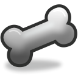

.. _layer_skeleton:

########################
    Skeleton Layer
########################

Parameters of Skeleton Layers
-----------------------------

The parameters of the skeleton layers are:

+--------------------------------------------------------------+------------------------+------------+
| **Name**                                                     | **Value**              | **Type**   |
+--------------------------------------------------------------+------------------------+------------+
|     |Type\_real\_icon.png| `Z Depth <Z_Depth_Parameter>`__   |   0.000000             |   real     |
+--------------------------------------------------------------+------------------------+------------+
|     |Type\_real\_icon.png| `Amount <Amount_Parameter>`__     |   0.500000             |   real     |
+--------------------------------------------------------------+------------------------+------------+
|     |Type\_string\_icon.png| Name                            |   skeleton             |   string   |
+--------------------------------------------------------------+------------------------+------------+
|     |Type\_list\_icon.png| `Bones <Bones>`__                 |   list (Static List)   |   list     |
+--------------------------------------------------------------+------------------------+------------+

Summary
-------

In the skeleton layer, each vertex is influenced by a weighted average
combination of bones *maybe from different skeletons?*

There are two ways to make a vector be influenced by bone(s). First is
the Link to Bone action that would give a 100% of influence of one bone 
to one vector. 
Second is the Link to Skeleton that is a semiautomatic
way to give weighted influence to a vector from all the bones that
overlaps its influence area over the vector position. The more covered
the vector is by the influence area, the higher is the influence weight.
In any case you can manually specify the bone and the influence that you
want by editing the values in the vector (sub)parameters. We need to
modify the bone(s) with handles to perform the indirect movement to the
vectors that are influenced by it(them).

Skeleton construction
---------------------

Add a ``Skeleton layer`` :

-  If your `Canvas <Canvas>`__ is empty you can do that from the main or
   `caret <Caret>`__ menus ``Layer -> New Layer -> Other -> Skeleton``.
-  If your canvas is not empty, right clicking inside the
   `Layers\_Panel <Layers_Panel>`__.

Once you have a ``Skeleton layer``, the first bone appears. You have
created the first bone of your Skeleton, this is your **first parent
bone**.

Each bones have the following `handles <Handle>`__ to control them :
``Origin``, ``Angle``, ``Local Length Scale``, ``Bone Width`` and
``Tip Width``. Take a look inside the `Parameters
Panel <Parameters_Panel>`__ of the ``Skeleton layer``, those handles are
relative to some of those values (with also some advanced parameters).

From the `WorkArea <WorkArea>`__, with the Bones `handles <Handle>`__
you can easily move and adjust part of your Skeleton.

Now, you can had child bones :

-  Right click on any `handles <Handle>`__ of the parent bone you want
   and select ``Create Child Bone``.
-  Repeat the operation, choosing accordingly the parent bone of your
   future bone (the parent of a hand bone is the arm, the parent bone of
   a finger is the hand bone...), to create your Skeleton.

When created, a ``Skeleton layer``, is `Disabled from
rendering <Canvas_Layer_Menu>`__ : the layer is visible in the
`WorkArea <WorkArea>`__ but disabled in the final Render.

Parameters of a Bone
--------------------

The parameters of a bone are:

+--------------------------------------------------------------------------------------------------+----------------------+---------------------+
| **Name**                                                                                         | **Value**            | **Type**            |
+--------------------------------------------------------------------------------------------------+----------------------+---------------------+
|     |Type\_string\_icon.png| Name                                                                |   Bone 1             |   string            |
+--------------------------------------------------------------------------------------------------+----------------------+---------------------+
|    `Parent <Parent_Parameter>`__                                                                 |   No Parent          |   bone\_valuenode   |
+--------------------------------------------------------------------------------------------------+----------------------+---------------------+
|     |Type\_vector\_icon.png| `Origin <Origin_Parameter>`__                                       |   0.00000, 0.00000   |   vector            |
+--------------------------------------------------------------------------------------------------+----------------------+---------------------+
|     |Type\_angle\_icon.png| `Angle <Angle_Parameter>`__                                          |   0.00°              |   angle             |
+--------------------------------------------------------------------------------------------------+----------------------+---------------------+
|     |Type\_real\_icon.png| Local Length Scale                                                    |   1.00000            |   real              |
+--------------------------------------------------------------------------------------------------+----------------------+---------------------+
|     |Type\_real\_icon.png| Bone Width                                                            |   0.10000            |   real              |
+--------------------------------------------------------------------------------------------------+----------------------+---------------------+
|     |Type\_real\_icon.png| Recursive Length Scale                                                |   1.00000            |   real              |
+--------------------------------------------------------------------------------------------------+----------------------+---------------------+
|     |Type\_real\_icon.png| Tip Width                                                             |   0.10000            |   real              |
+--------------------------------------------------------------------------------------------------+----------------------+---------------------+
|     |Type\_real\_icon.png| `Z-Depth <Z_Depth_Parameter>`__                                       |   0.00000            |   real              |
+--------------------------------------------------------------------------------------------------+----------------------+---------------------+
|     |Type\_real\_icon.png| Length Setup                                                          |   1.00000            |   real              |
+--------------------------------------------------------------------------------------------------+----------------------+---------------------+

Parent
~~~~~~

Angle
~~~~~

Local Length Scale
~~~~~~~~~~~~~~~~~~

Bone Width
~~~~~~~~~~

Has ``Tip Width``, ``Bone Width`` is used to set the influence of the
bone before the use of ``Link to Skeleton`` action.
``Bone Width`` parameter can be adjusted by the witdh
`Handle <Handle>`__. When adjusting the ``Bone Width``, the bone's shape
change accordingly.

Recursive Length Scale
~~~~~~~~~~~~~~~~~~~~~~

Tip Width
~~~~~~~~~

Has ``Bone Width``, ``Tip Width`` is used to set the influence of the
bone before the use of ``Link to Skeleton`` action. ``Tip Width``
parameter can be adjusted by the witdh `Handle <Handle>`__. When
adjusting the ``Tip Width``, the bone's shape change accordingly.

Z-Depth
~~~~~~~

This parameter can be used to change the 'depth' (order) of a Bone in a
Skeleton Layer.

Length Setup
~~~~~~~~~~~~

Skeleton / Bones actions
------------------------

Create Child Bone
~~~~~~~~~~~~~~~~~

When you add a ``Skeleton Layer``, only one bone is created. In order to
create a usable skeleton, you will need to add more bones.

Right clicking on any `handles <Handle>`__ of bone display a contextual
menu. From this menu select ``Create Child Bone`` and a new child bone
will be created. This child bone will move accordingly to his parent.

Link to Bone
~~~~~~~~~~~~

``Link to Bone`` link artwork, for example handles of a shape created
with the `Spline Tool <Spline_Tool>`__, to a bone.

Select a single or multiple handles from your artwork, right click on a
bone and from the contextual menu, select ``Link to Bone``. Now when you
move the Bone, the selected handles also move.

See it in action in `bones dev part
5 <https://www.youtube.com/watch?v=9yCLR-broWA>`__

Link to Skeleton
~~~~~~~~~~~~~~~~

Before you use ``Link to Skeleton`` you should adjust the ``Bone width``
and ``Tip width`` of each bones of you skeleton to set the bone shape.

Select one or more handles from your artwork, select the
``Skeleton layer`` right click on it and from the contextual menu,
select ``Link to Skeleton``. All the handles covered by the bone shape
will be automatically linked.

See it in action : `Bones dev part
7 <https://www.youtube.com/watch?v=NbI6TeAHbgs>`__

Disconnect
~~~~~~~~~~

If you want to disconnect / unlink a bone from the part of the artwork
it is linked to.

-  From the `Layers Panel <Layers_Panel>`__, select the `Skeleton
   Layer <Skeleton_Layer>`__
-  From the `Parameters Panel <Parameters_Panel>`__, open the ``Bones``
   list
-  Select the corresponding ``Item`` (the according bone's
   `handles <Handle>`__ will be highligthed whith red squares)
-  Right click to open the context menu and select ``Disconnect``.

Change parent
~~~~~~~~~~~~~

You can also change the parent of a bone in the skeleton, even during
animation.

-  From the `Layers Panel <Layers_Panel>`__, select the `Skeleton
   Layer <Skeleton_Layer>`__
-  From the `Parameters Panel <Parameters_Panel>`__, open the ``Bones``
   list
-  Select the corresponding ``Item`` (the according bone's
   `handles <Handle>`__ will be highligthed whith red squares)
-  Click on the ``Value`` of ``Parent`` to change the parent or set the
   parent to ``none``.

See Also
--------

-  To deform raster images :
   `Skeleton\_Deformation\_Layer <Skeleton_Deformation_Layer>`__.
-  Doc:Basic_Bone_Tutorial
-  A SIF-file of a rigged character using bones can be found here :download:`Riggedchar.zip <skeleton_dat/Riggedchar.zip>`

.. |Type_real_icon.png| image:: images/Type_real_icon.png
   :width: 16px
.. |Type_string_icon.png| image:: images/Type_string_icon.png
   :width: 16px
.. |Type_list_icon.png| image:: images/Type_list_icon.png
   :width: 16px
.. |Type_vector_icon.png| image:: images/Type_vector_icon.png
   :width: 16px
.. |Type_angle_icon.png| image:: images/Type_angle_icon.png
   :width: 16px

