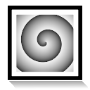

.. _layer_spiral_gradient:

###########################
    Spiral Gradient Layer
###########################

.. _layer_spiral_gradient  About Spiral Gradient Layers:

About Spiral Gradient Layers
----------------------------

The Spiral Gradient Layer draw a gradient
following spirals, clockwise or anticlockwise, at determined center,
radius and start angle.

.. _layer_spiral_gradient  Parameters of Spiral Gradient Layers:

Parameters of Spiral Gradient Layers
------------------------------------

The |Parameter| of the spiral gradient layers are:

+------------------------------------------------------------------------+-------------------------+--------------+
| **Name**                                                               | **Value**               | **Type**     |
+------------------------------------------------------------------------+-------------------------+--------------+
|     |Type\_real\_icon.png| |Z_Depth_Parameter|                         |   0.000000              |   real       |
+------------------------------------------------------------------------+-------------------------+--------------+
|     |Type\_real\_icon.png| |Amount_Parameter|                          |   1.000000              |   real       |
+------------------------------------------------------------------------+-------------------------+--------------+
|     |Type\_integer\_icon.png| |Blend_Method|                           |   Composite             |   integer    |
+------------------------------------------------------------------------+-------------------------+--------------+
|     |Type\_gradient\_icon.png| |Gradient_Editor_Dialog|                |  |p_gradient.png|       |   gradient   |
+------------------------------------------------------------------------+-------------------------+--------------+
|     |Type\_vector\_icon.png| Center                                    |   0.500000u,0.000000u   |   vector     |
+------------------------------------------------------------------------+-------------------------+--------------+
|     |Type\_real\_icon.png| Radius                                      |   0.500000u             |   real       |
+------------------------------------------------------------------------+-------------------------+--------------+
|     |Type\_angle\_icon.png| Angle                                      |   0.00                  |   angle      |
+------------------------------------------------------------------------+-------------------------+--------------+
|     |Type\_bool\_icon.png| Clockwise                                   | |p_checkbox_off.png|    |   bool       |
+------------------------------------------------------------------------+-------------------------+--------------+

.. |Type_real_icon.png| image:: images/Type_real_icon.png
   :width: 16px
.. |Type_integer_icon.png| image:: images/Type_integer_icon.png
   :width: 16px
.. |Type_gradient_icon.png| image:: images/Type_gradient_icon.png
   :width: 16px
.. |Type_vector_icon.png| image:: images/Type_vector_icon.png
   :width: 16px
.. |Type_angle_icon.png| image:: images/Type_angle_icon.png
   :width: 16px
.. |Type_bool_icon.png| image:: images/Type_bool_icon.png
   :width: 16px
.. |p_gradient.png| image:: images/p_gradient.png  
.. |p_checkbox_off.png| image:: images/p_checkbox_off.png 

.. |Parameter| replace:: :ref:`Parameter <parameters>`
.. |Z_Depth_Parameter| replace:: :ref:`Z Depth Parameter <parameters_zdepth>`
.. |Amount_Parameter| replace:: :ref:`Opacity <opacity>`
.. |Blend_Method| replace:: :ref:`Blend Method <parameters_blend_method>`
.. |Gradient_Editor_Dialog| replace:: :ref:`Gradient <gradient_editor_dialog>`