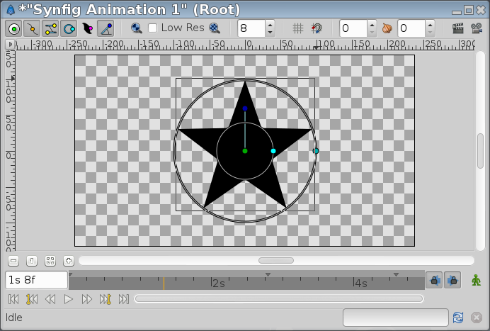
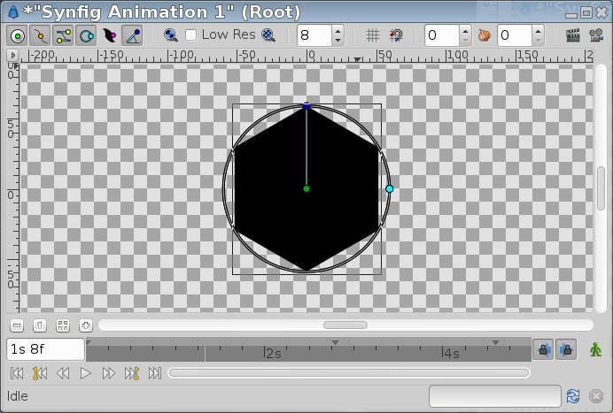

.. _layer_star:

########################
    Star Layer
########################

.. _layer_star  About Star Layers:

About Star Layers
-----------------

A ``Star Layer`` is a geometric object that is made by the filling the
region resulting from connecting the points of two concentric circles
with straight lines. The number of points on which the circles are
divided defines the number of peaks of the star. The points over the
circles are spread regularly over both circles but one of them has the
points rotated **N/360/2** degrees from the other circle (being **N**
the number of peaks or points).

.. _layer_star  Parameters of Star Layers:

Parameters of Star Layers
-------------------------

The parameters of the star layers are:

+------------------------------------------------------------------+-------------------------+-------------+
| **Name**                                                         | **Value**               | **Type**    |
+------------------------------------------------------------------+-------------------------+-------------+
|     |Type\_real\_icon.png| |Z_Depth_Parameter|                   |   0.000000              |   real      |
+------------------------------------------------------------------+-------------------------+-------------+
|     |Type\_real\_icon.png| |Amount_Parameter|                    |   1.000000              |   real      |
+------------------------------------------------------------------+-------------------------+-------------+
|     |Type\_integer\_icon.png| |Blend_Method|                     |   Composite             |   integer   |
+------------------------------------------------------------------+-------------------------+-------------+
|     |Type\_gradient\_icon.png| |Color_Editor_Dialog|             | |p_color_green.png|     |   color     |
+------------------------------------------------------------------+-------------------------+-------------+
|     |Type\_vector\_icon.png| Origin                              |   0.500000u,0.000000u   |   vector    |
+------------------------------------------------------------------+-------------------------+-------------+
|     |Type\_bool\_icon.png| |Invert_Parameter|                    | |p_checkbox_off.png|    |   bool      |
+------------------------------------------------------------------+-------------------------+-------------+
|     |Type\_bool\_icon.png| Antialiasing                          | |p_checkbox_off.png|    |   bool      |
+------------------------------------------------------------------+-------------------------+-------------+
|     |Type\_real\_icon.png| Feather                               |   0.500000u             |   real      |
+------------------------------------------------------------------+-------------------------+-------------+
|     |Type\_integer\_icon.png| Type of Feather                    |   Fast Gaussian Blur    |   integer   |
+------------------------------------------------------------------+-------------------------+-------------+
|     |Type\_integer\_icon.png| Winding Style                      |   Non Zero              |   integer   |
+------------------------------------------------------------------+-------------------------+-------------+
|     |Type\_real\_icon.png| Outer Radius                          |   1.500000u             |   real      |
+------------------------------------------------------------------+-------------------------+-------------+
|     |Type\_real\_icon.png| Inner Radius                          |   0.500000u             |   real      |
+------------------------------------------------------------------+-------------------------+-------------+
|     |Type\_angle\_icon.png| Angle                                |   0.00                  |   angle     |
+------------------------------------------------------------------+-------------------------+-------------+
|     |Type\_integer\_icon.png| Points                             |   5                     |   integer   |
+------------------------------------------------------------------+-------------------------+-------------+
|     |Type\_bool\_icon.png| Regular Polygon                       | |p_checkbox_off.png|    |   bool      |
+------------------------------------------------------------------+-------------------------+-------------+

The parameters of the star layers are the same as the majority of the
shape-like objects but it has specific parameters for its own
properties.

.. _layer_star  Outer Radius:

Outer Radius
~~~~~~~~~~~~

Defines the radius of the circle where the peaks of the star lay.

.. _layer_star  Inner Radius:

Inner Radius
~~~~~~~~~~~~

Defines the radius of the circle where the valleys of the star lay.

.. _layer_star  Angle:

Angle
~~~~~

Is the rotation angle for the first peak of the star. Its default value
is **90** degrees.

.. _layer_star  Points:

Points
~~~~~~

Defines the number of divisions done in the circles and therefore the
number of points and peaks in the star.

.. _layer_star  Playing Around:

Playing Around
--------------

.. _layer_star  Crazy Radii:

Crazy Radii
~~~~~~~~~~~

The ``Outer Radius`` shouldn't be greater than ``Inner Radius``. It only
changes the star's orientation:

+---------------------------------------------------------+---------------------------------------------------------+
| Inner Radius = **40**; Outer Radius = **60**            | Inner Radius = **60**; Outer Radius = **40**            |
+---------------------------------------------------------+---------------------------------------------------------+
| .. figure:: star_dat/Star_Layer_40-60_0.63.06.png       | .. figure:: star_dat/Star_Layer_60-40_0.63.06.png       |
|    :alt: Star_Layer_40-60_0.63.06.png                   |    :alt: Star_Layer_60-40_0.63.06.png                   |
|    :width: 500px                                        |    :width: 500px                                        |
+---------------------------------------------------------+---------------------------------------------------------+

You can also play with negative values:

+----------------------------------------------------------+---------------------------------------------------------+
| Inner Radius = **-40**; Outer Radius = **60**            | Inner Radius = **40**; Outer Radius = **-60**           |
+----------------------------------------------------------+---------------------------------------------------------+
| .. figure:: star_dat/Star_Layer_m40-60_0.63.06.png       | .. figure:: star_dat/Star_Layer_60-m40_0.63.06.png      |
|    :alt: Star_Layer_m40-60_0.63.06.png                   |    :alt: Star_Layer_60-m40_0.63.06.png                  |
|    :width: 500px                                         |    :width: 500px                                        |
+----------------------------------------------------------+---------------------------------------------------------+

.. _layer_star  Winding Style Hacks:

Winding Style Hacks
~~~~~~~~~~~~~~~~~~~

You can even play with the |Winding_Style_Parameter| and negative values to obtain
some effects:

+-----------------------------------------------------------------------------+--------------------------------------------------------------------+
| Inner Radius = **40**; Outer Radius = **-60**; WS=\ **even/odd**            | Inner Radius = **-40**; Outer Radius = **60**; WS=\ **even/odd**   |
+-----------------------------------------------------------------------------+--------------------------------------------------------------------+
| .. figure:: star_dat/Star_Layer_m40-60_ws_0.63.06.png                       | .. figure:: star_dat/Star_Layer_60-m40_ws_0.63.06.png              |
|    :alt: Star_Layer_m40-60_ws_0.63.06.png                                   |    :alt: Star_Layer_60-m40_ws_0.63.06.png                          |
|    :width: 500px                                                            |    :width: 500px                                                   |
+-----------------------------------------------------------------------------+--------------------------------------------------------------------+

.. _layer_star  Regular 2N-sided Polygons:

Regular 2N-sided Polygons
~~~~~~~~~~~~~~~~~~~~~~~~~

Also you can |Linking| both radii to create a **2\*N** sided
regular |Polygon_Layer|, where **N** is the number of points
(3 points for this case (six sides)):

.. |Type_real_icon.png| image:: images/Type_real_icon.png
   :width: 16px
.. |Type_integer_icon.png| image:: images/Type_integer_icon.png
   :width: 16px
.. |Type_gradient_icon.png| image:: images/Type_gradient_icon.png
   :width: 16px
.. |Type_vector_icon.png| image:: images/Type_vector_icon.png
   :width: 16px
.. |Type_bool_icon.png| image:: images/Type_bool_icon.png
   :width: 16px
.. |Type_integer_icon.png| image:: images/Type_integer_icon.png
   :width: 16px
.. |Type_angle_icon.png| image:: images/Type_angle_icon.png
   :width: 16px
.. |p_checkbox_off.png| image:: images/p_checkbox_off.png 
.. |p_color_green.png| image:: images/p_color_green.png       

