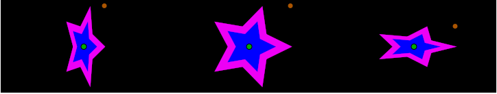

.. _layer_stretch:

########################
    Stretch Layer
########################

.. _layer_stretch  About Stretch Layers:

About Stretch Layers
--------------------

``Stretch Layer`` distorts objects of the lower layers in both axis.

.. _layer_stretch  Sample:

Sample
------

-  Center image is default size of Stretch Layer with |Amount_Parameter| – 1u,1u
-  |Amount_Parameter| for left image – 1u,0.5u
-  |Amount_Parameter| for right image – 0.5u,1u

.. _layer_stretch  Parameters of Stretch Layers:

Parameters of Stretch Layers
----------------------------

The parameters of the Stretch Layers are:

+---------------------------------------+-------------------------+------------+
| Name                                  | Value                   | Type       |
+---------------------------------------+-------------------------+------------+
|     |Type\_vector\_icon.png| Amount   |   1.000000u,1.000000u   |   vector   |
+---------------------------------------+-------------------------+------------+
|     |Type\_vector\_icon.png| Center   |   0.000000u,0.000000u   |   vector   |
+---------------------------------------+-------------------------+------------+

.. |Type_vector_icon.png| image:: images/Type_vector_icon.png
   :width: 16px

