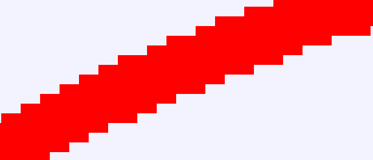
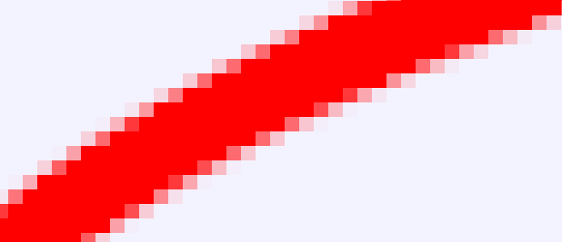
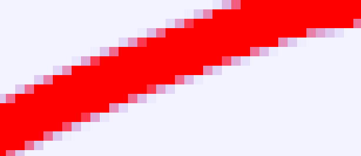
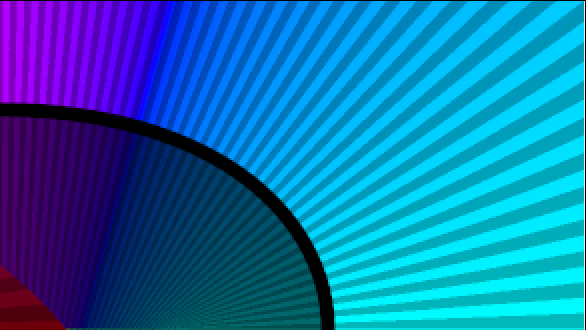
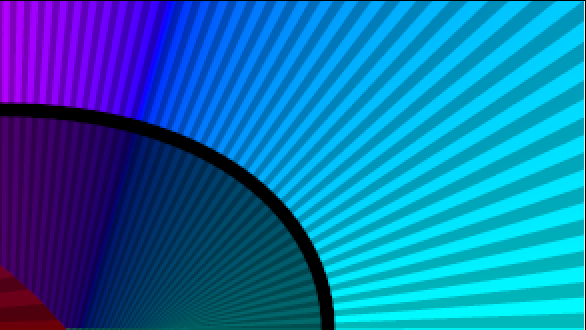

.. _layer_super_sample:

########################
    Super Sample Layer
########################

.. _layer_super_sample  About Super Sample Layers:

About Super Sample Layers
-------------------------

The Super Sample layer is used to anti-alias all the layers under it.

It isn't often needed, since most layers produce smooth output already.

.. _layer_super_sample  Parameters of Supersample Layer:

Parameters of Supersample Layer
-------------------------------

The parameters of the supersample layer are:

+---------------------------------------------+---------------------+---------+
| **Name**                                    | **Value**           | **Type**|
+---------------------------------------------+---------------------+---------+
|     |Type\_integer\_icon.png| Width         |   2                 | integer |
+---------------------------------------------+---------------------+---------+
|     |Type\_integer\_icon.png| Height        |   2                 | integer |
+---------------------------------------------+---------------------+---------+
|     |Type\_bool\_icon.png| Use Parametric   ||p_checkbox_off.png| | bool    |
+---------------------------------------------+---------------------+---------+
|     |Type\_bool\_icon.png| Be Alpha Safe    ||p_checkbox_off.png| | bool    |
+---------------------------------------------+---------------------+---------+

You specify width and a height parameters. Internally, the scene is
rendered times wider and times taller than the output image, and then
each by block is averaged down to a single pixel.

For example, the output image is 320x240 pixels, the width and height
parameters of the Super Sample layer are both set to the default value
of 2. Synfig will render a 640x480 image internally, and then average
the 4 pixels in each 2x2 block down into a single pixel that it then
uses in the output image.

This shows a zoomed image of an outline with anti-alias turned off, and
without a supersample layer:

The 'Use Parametric' checkbox makes it use the parametric renderer rather than the default accelerated renderer.

The 'Be Alpha Safe' checkbox makes the averaging process aware of the
alpha channel. When 'Alpha Safe', the average is sum(color \*
alpha)/sum(alpha), with an alpha value of sum(alpha)/sum(1). When not
'Alpha Safe', the average is simply sum(color)/sum(1).

For instance, consider averaging two pixels, one a completely
transparent blue (R:0 G:0 B:1 A:0) and the other an opaque red (R:1 G:0
B:0 A:1). When being alpha safe, the average is (R:1 G:0 B:0 A:0.5).
When not being alpha safe, the average is (R:0.5 G:0 B:0.5 A:0.5).

This is the same outline as before, but with a Super Sample layer over
the top of it. This one is with 'Be Alpha Safe' enabled:

And this one is without 'Be Alpha Safe'. The background is a strong
blue, but with a very low Alpha. The edges are much bluer than they
would be if alpha was taken into account:

It's worth pointing out that the Super Sample layer is disabled when the
'quality' setting is 10 or higher. During editing, the quality is 10.

If you want to see an example of what Super Sample does, create an
outline and turn off it's anti-aliasing parameter. It will look jagged
around the edges. Add a Super Sample layer over the top of it, save the
file and render it to an image. Rendering with 'synfig -Q 10 file.sif'
will leave it jagged, and 'synfig -Q 9 file.sif' will make it smoother.

.. _layer_super_sample  Examples:

Examples
--------

**width=1 height=1**

This is the same as not using Super Sample at all. 
 

**width=2 height=2**

Notice how there's only one intermediate color used to antialias in the very bottom right corner.  

**width=3 height=3**

Now two intermediate colors are used, and the result is smoother.  

.. figure:: super_sample_dat/Perp-curve-gradient-3-ss3x3.png

**width=4 height=4**

This looks good, but a 4x4 Super Sample layer increases the render time by a factor of 16.  

**width=1 height=4**

Vertical lines are jagged, horizontal lines are smooth.  

**width=4 height=1**

Vertical lines are smooth, horizontal lines are jagged .  

.. |Type_integer_icon.png| image:: images/Type_integer_icon.png
   :width: 16px
.. |Type_bool_icon.png| image:: images/Type_bool_icon.png
   :width: 16px
.. |p_checkbox_off.png| image:: images/p_checkbox_off.png 

