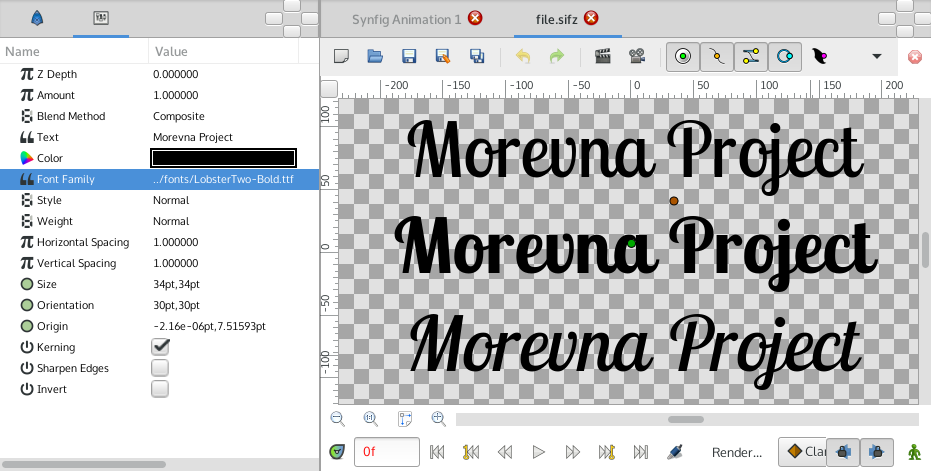

.. _layer_text:

########################
    Text Layer
########################

   
.. _layer_text  About Text Layers:

About Text Layers
-----------------

[todo]

A ``Text Layer`` can be created with the |Text_Tool| or by
drag and drop.

.. _layer_text  Parameters of Text Layers:

Parameters of Text Layers
-------------------------

The parameters of the text layers are:

+-----------------------------------------------------------------+-------------------------+-------------------------------------+
| **Name**                                                        | **Value**               | **Type**                            | 
+-----------------------------------------------------------------+-------------------------+-------------------------------------+
|  |Type\_real\_icon.png| |Z_Depth_Parameter|                     |   0.000000              |   real                              |
+-----------------------------------------------------------------+-------------------------+-------------------------------------+
|  |Type_real_icon.png| |Amount_Parameter|                        |   1.000000              |   real                              |
+-----------------------------------------------------------------+-------------------------+-------------------------------------+
|  |Type\_integer\_icon.png| |Blend_Method|                       |  Composite              |   integer                           |
+-----------------------------------------------------------------+-------------------------+-------------------------------------+
|  |Type\_string\_icon.png| Text                                  |  Text Layer             |   string                            |
+-----------------------------------------------------------------+-------------------------+-------------------------------------+
|  |Type\_gradient\_icon.png| |Color_Dialog|                      |  |p_color_green.png|    |   color                             |
+-----------------------------------------------------------------+-------------------------+-------------------------------------+
|  |Type\_integer\_icon.png| Font Family                          |   Sans Serif            |   string                            |
+-----------------------------------------------------------------+-------------------------+-------------------------------------+
|  |Type\_integer\_icon.png| Style                                |Nomral                   |   integer                           |
+-----------------------------------------------------------------+-------------------------+-------------------------------------+
|  |Type\_integer\_icon.png| Weight                               |Normal                   |integer                              |
+-----------------------------------------------------------------+-------------------------+-------------------------------------+
|  |Type\_real\_icon.png| Horizontal Spacing                      |1.000000                 |real                                 |
+-----------------------------------------------------------------+-------------------------+-------------------------------------+
|  |Type\_real\_icon.png| Vertical Spacing                        |1.000000                 |real                                 |
+-----------------------------------------------------------------+-------------------------+-------------------------------------+
|  |Type\_vector\_icon.png| Size                                  |0.500000u,0.500000u      |vector                               |
+-----------------------------------------------------------------+-------------------------+-------------------------------------+
|  |Type\_vector\_icon.png| Orientation                           |0.500000u,0.500000u      |vector                               |
+-----------------------------------------------------------------+-------------------------+-------------------------------------+
|  |Type\_vector\_icon.png| Origin                                |0.00000u,0.000000u       |vector                               |
+-----------------------------------------------------------------+-------------------------+-------------------------------------+
|  |Type\_bool\_icon.png| Kerning                                 |  |p_checkbox_off.png|   |bool                                 |
+-----------------------------------------------------------------+-------------------------+-------------------------------------+
|  |Type\_bool\_icon.png| Sharpen Edges                           |  |p_checkbox_off.png|   |bool                                 |
+-----------------------------------------------------------------+-------------------------+-------------------------------------+
|  |Type\_bool\_icon.png| |Invert_Parameter|                      |  |p_checkbox_off.png|   |bool                                 |
+-----------------------------------------------------------------+-------------------------+-------------------------------------+

.. _layer_text  How to use Text Layer:

How to use Text Layer
---------------------

Quick trick that allows to use custom fonts in Synfig.

Here's what you need:

-  Put your font (`ttf <https://en.wikipedia.org/wiki/TrueType>`__) file
   in the same dir as your Synfig (sif or sifz) file.
-  Create Text Layer and in the ``Font Family``
   parameter put full filename of font file (i.e.
   “LobsterTwo-Regular.ttf”, without quotes).

That's it!

 
After examining font files, you might notice that different variants of
font style are usually residing in separate files (i.e.
“LobsterTwo-Italic.ttf”, “LobsterTwo-Bold.ttf”,
“LobsterTwo-BoldItalic.ttf”, etc). So you can use different font
variants in the same way just by referencing the appropriate font file.

If your font file is placed in different location, then you can specify
absolute or relative path to it (i.e. “../fonts/LobsterTwo-Bold.ttf”).

.. |Type_real_icon.png| image:: images/Type_real_icon.png
   :width: 16px
.. |Type_integer_icon.png| image:: images/Type_integer_icon.png
   :width: 16px
.. |Type_string_icon.png| image:: images/Type_string_icon.png
   :width: 16px
.. |Type_gradient_icon.png| image:: images/Type_gradient_icon.png
   :width: 16px
.. |Type_integer_icon.png| image:: images/Type_integer_icon.png
   :width: 16px
.. |Type_vector_icon.png| image:: images/Type_vector_icon.png
   :width: 16px
.. |Type_bool_icon.png| image:: images/Type_bool_icon.png
   :width: 16px
.. |p_checkbox_off.png| image:: images/p_checkbox_off.png   
.. |p_color_green.png| image:: images/p_color_green.png   

.. |Text_Tool| replace:: :ref:`Text Tool <tool_text>`
.. |Z_Depth_Parameter| replace:: :ref:`Z Depth Parameter <parameters_zdepth>`
.. |Amount_Parameter| replace:: :ref:`Opacity <opacity>`
.. |Blend_Method| replace:: :ref:`Blend Method <parameters_blend_method>`
.. |Color_Dialog| replace:: :ref:`Color Dialog <colors_dialog>`
.. |Invert_Parameter| replace:: :ref:`Inver <parameters_invert>`
