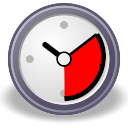
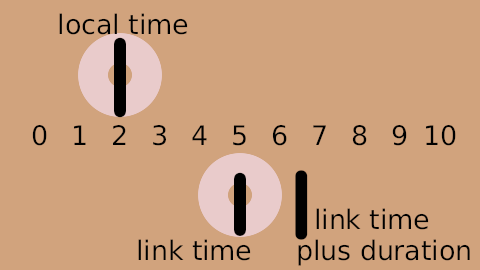
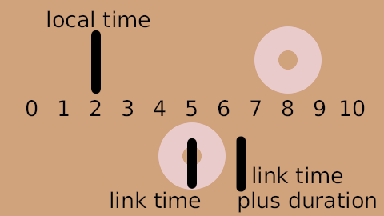
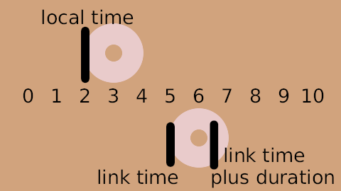

.. _layer_time_loop:

########################
    Time Loop Layer
########################

.. _layer_time_loop  About Time Loop Layers:

About Time Loop Layers
----------------------

The ``Time Loop layer`` is used to repeat an animation over and over. It
loops a section of the layers below and within the same canvas over and
over.

See also the |Convert_Time_Loop| conversion,
which can be used to loop the value of a single parameter, rather than
an entire layer or group of layers.

.. _layer_time_loop  Parameters of Time Loop Layers:

Parameters of Time Loop Layers
------------------------------

These parameters, to **prevent undesired modification**, by default are
Static Parameters.

The parameters of the time loop layers are:

+---------------------------------------------------------------------------------------------------------------------+----------------------+------------+
| **Name**                                                                                                            | **Value**            | **Type**   |
+---------------------------------------------------------------------------------------------------------------------+----------------------+------------+
| |Type_real_icon.png| |Z_Depth_Parameter|                                                                            | 0.000000             | real       |
+---------------------------------------------------------------------------------------------------------------------+----------------------+------------+
| |Type_time_icon.png| |Time_Loop_Layer#Link_Time_.28time.29|                                                         | 0f                   | time       |
+---------------------------------------------------------------------------------------------------------------------+----------------------+------------+
| |Type_time_icon.png| |Time_Loop_Layer#Local_Time_.28time.29|                                                        | 0f                   | time       |
+---------------------------------------------------------------------------------------------------------------------+----------------------+------------+
| |Type_time_icon.png| |Time_Loop_Layer#Duration_.28time.29|                                                          | 1s                   | time       |
+---------------------------------------------------------------------------------------------------------------------+----------------------+------------+
| |Type_bool_icon.png| |Time_Loop_Layer#Only_For_Positive_Duration_.28bool.29|                                        | |p_checkbox_off.png| | bool       |
+---------------------------------------------------------------------------------------------------------------------+----------------------+------------+
| |Type_bool_icon.png| |Time_Loop_Layer#Symmetrical_.28bool.29|                                                       | |p_checkbox_off.png| | bool       |
+---------------------------------------------------------------------------------------------------------------------+----------------------+------------+

.. _layer_time_loop  Link Time (time):

Link Time (time)
~~~~~~~~~~~~~~~~

Start time of cycled material/child layers.

.. _layer_time_loop  Local Time (time):

Local Time (time)
~~~~~~~~~~~~~~~~~

Start time of loop.

.. _layer_time_loop  Duration (time):

Duration (time)
~~~~~~~~~~~~~~~

Number of seconds or frames that are looped in the child layer.

.. _layer_time_loop  Only For Positive Duration (bool):

Only For Positive Duration (bool)
~~~~~~~~~~~~~~~~~~~~~~~~~~~~~~~~~

-  If checked and ``Duration`` is zero or negative, then the time loop
   layer is effectively disabled, and acts as if it wasn't there.
-  If not checked and the Duration is zero, the Time Loop layer freezes
   the animation of the children layers at the value of ``Link Time``.

.. _layer_time_loop  Symmetrical (bool):

Symmetrical (bool)
~~~~~~~~~~~~~~~~~~

If not checked, and the current time is less than ``Local Time``, then
``Duration`` is taken off the resulting time. This is to provide
compatibility with `version 0.1 <Time_Loop_Layer_(v0.1)>`__ of the time
loop layer.

.. _layer_time_loop  How to use the Time Loop Layer ?:

How to use the Time Loop Layer ?
--------------------------------

The ``Time Loop layer`` repeatedly loops through the ``Duration``
seconds of its child layers, from ``Link Time`` to ``Link Time`` +
``Duration``.

``Local Time`` is used to line up the offset of the time looping.

When the Time Loop layer is asked to set its time to ``Local Time``, it
sets the time in its child layers to be ``Link Time``, ie. the start of
the loop.

.. _layer_time_loop  Breaking loop:

Breaking loop
~~~~~~~~~~~~~

#.  Be Sure you are not in |Animate_Editing_Mode|
#. In the layer's parameters of the time loop, you need to remove the
   'green guy' (|Animate\_mode\_off\_icon.png|), indicating that the
   parameter is ``Static``, from |Time_Loop_Layer#Duration_.28time.29|. Just right-click
   on him and set ``Allow animation``. See Static Parameters for more informations.
#. On the |Timebar| navigate to a place where you want to
   break the animation. And now enter the |Animate_Editing_Mode|.
#. In the time loop parameters, set 'Duration' to ``EOT`` (End-of-Time).
#. Now you have three |Waypoint|. One before the current,
   we left it as it is. One is current, we |Convert| it to
   the ``constant`` (right-click on it -> Both -> Constant). And one
   after current, this one have to be removed (right-click on it ->
   Remove).
#. Now test it. Pay attention, that loop will always break at the very
   first frame of you animation, so you need to break it in the right
   place.

.. _layer_time_loop  Detailed explanation:

Detailed explanation
~~~~~~~~~~~~~~~~~~~~

'Green guy' (|Animate\_mode\_off\_icon.png|) - Static Parameters - is a guard that says “You shall not
pass!” to the animation. So when you attempt to change such parameter in
animation mode it just changes the usual way. It's done to prevent
unnecessary parameters to be animated, e.g. |Blend_Method_Parameter|.

Setting ``Duration`` to ``EOT``. If you set it to 0f, then the whole
animation will stop, because you try to play it from 0f (``local time``)
to 0f (``Duration``). And EOT means it'll continue to play your
animation to the end of the time...

Removing |Waypoint| after current one. If you skip this
step, then at the next waypoint ``Duration`` parameter will be restored
to the value before current waypoint. It's a standard Synfig's behavior,
but there's a magical button somewhere that can change it.

Converting current waypoint to the constant. Without it, ``Duration``
will be smoothly interpolated from value you set to the EOT and the
constant type will just set immediately at the waypoint. Interpolation
can be a bit confusing sometimes, so you better read this about
|Waypoint|.

.. _layer_time_loop  Visualized Example:

Visualized Example
------------------

For example, suppose:

-  Link Time is 5s
-  Duration is 3s
-  Local Time' is 4s

And suppose that the Time Loop layer is applied over an existing
animation. The ``Link Time`` and ``Duration`` specify that the section
from 5s to 8s in the children layers will be looped. The ``Local Time``
specifies that this loop will be at the beginning at 4s. (And so also
therefore at 1s, 7s, 10s, etc).

This is how the mapping actually works:

+-----------------+--------------------------+-----------------------------------------------------+
| **real time**   | **child time             | **child time                                        |
|                 | (symmetrical = true)**   | (symmetrical = false)**                             |
+-----------------+--------------------------+-----------------------------------------------------+
| 0               | 7                        | 4                                                   |
+-----------------+--------------------------+-----------------------------------------------------+
| 1               | 5                        | 2                                                   |
+-----------------+--------------------------+-----------------------------------------------------+
| 2               | 6                        | 3                                                   |
+-----------------+--------------------------+-----------------------------------------------------+
| 3               | 7                        | 4                                                   |
+-----------------+--------------------------+-----------------------------------------------------+
| 4               | 5                        | 5 (local time = 4; link time = 5)                   |
+-----------------+--------------------------+-----------------------------------------------------+
| 5               | 6                        | 6                                                   |
+-----------------+--------------------------+-----------------------------------------------------+
| 6               | 7                        | 7                                                   |
+-----------------+--------------------------+-----------------------------------------------------+
| 7               | 5                        | 5 (duration = 3, so loop repeats after 3 seconds)   |
+-----------------+--------------------------+-----------------------------------------------------+
| 8               | 6                        | 6                                                   |
+-----------------+--------------------------+-----------------------------------------------------+
| 9               | 7                        | 7                                                   |
+-----------------+--------------------------+-----------------------------------------------------+
| 10              | 5                        | 5                                                   |
+-----------------+--------------------------+-----------------------------------------------------+

Specifying a huge number for the Duration parameter effectively turns
the Time Loop layer into a Time Shift layer. The Link Time and Local
Time parameters controls which time in the children lines up with which
time in the Time Loop layer, giving the amount of the timeshift, with
both positive and negative differences working as expected.

.. _layer_time_loop  Contrived Example:

Contrived Example
-----------------

Download and examine this example file:
:download:`Time-loop-demo-0.2.sifz <time_loop_dat/Time-loop-demo-0.2.sifz>`

It's a 10 second animation, and shows 2 circles. The top one moves
linearly from the left to the right. Its position is marked by static
text digits 0 through 10.

The other circle is an identical copy of the first one, with the same
waypoints, but it's inside an Group layer. The parameters are:

-  Link Time: 5s
-  Duration: 1.5s
-  Local Time: 2s
-  Symmetrical: true

So as time=2s, the top circle is at position 2 (local time) and the
bottom circle is at position 5 (link time):

   
The loop is 1.5s long, so the bottom circle is also at position 5 every
1.5 seconds before and after this point in time, for example at t=3.5s
and at t=8s:

|Time-loop-demo-0.2-3s-12f.png| 

|Time-loop-demo-0.2-8s-0f.png|

The following two images show the positions at t=0s and t=3s. The loop
starts at t=2s, so it's also at the start at t=0.5s. So at t=0s it's
half a second before finishing the previous loop. And at t=3s the same
is true, but 2 loops later on:

|Time-loop-demo-0.2-0s-0f.png|

|Time-loop-demo-0.2-3s-0f.png|

There's a rendered copy of this example on
`YouTube <http://www.youtube.com/watch?v=WyYLd7319Gw>`__, and it's also
available for download:
`Time-loop-demo-0.2.avi‎ <Media:Time-loop-demo-0.2.avi‎>`__.

.. |Type_real_icon.png| image:: images/Type_real_icon.png
   :width: 16px
.. |Type_time_icon.png| image:: images/Type_time_icon.png
   :width: 16px
.. |Type_bool_icon.png| image:: images/Type_bool_icon.png
   :width: 16px
.. |Animate_mode_off_icon.png| image:: time_loop_dat/Animate_mode_off_icon.png
   :width: 16px
.. |p_checkbox_off.png| image:: images/p_checkbox_off.png   
.. |Time-loop-demo-0.2-3s-12f.png| image:: time_loop_dat/Time-loop-demo-0.2-3s-12f.png

.. |Time-loop-demo-0.2-0s-0f.png| image:: time_loop_dat/Time-loop-demo-0.2-0s-0f.png

.. |Convert_Time_Loop| replace:: :ref:`Convert: Time Loop <converters>`
.. |Z_Depth_Parameter| replace:: :ref:`Z Depth Parameter <parameters_zdepth>`
.. |Time_Loop_Layer#Link_Time_.28time.29| replace:: :ref:`Link Time <layer_time_loop  Link Time (time)>`
.. |Time_Loop_Layer#Local_Time_.28time.29| replace:: :ref:`Local Time <layer_time_loop  Local Time (time)>`
.. |Time_Loop_Layer#Duration_.28time.29| replace:: :ref:`Duration <layer_time_loop  Duration (time)>`
.. |Time_Loop_Layer#Only_For_Positive_Duration_.28bool.29| replace:: :ref:`Only for positive duration <layer_time_loop  Only For Positive Duration (bool)>`
.. |Time_Loop_Layer#Symmetrical_.28bool.29| replace:: :ref:`Symmetrical <layer_time_loop  Symmetrical (bool)>`
.. |Animate_Editing_Mode| replace:: :ref:`Animate Editing Mode <animation_mode>`
.. |Timebar| replace:: :ref:`Timebar <canvas_timebar>`
.. |Waypoint| replace:: :ref:`Waypoint <waypoints>`
.. |Convert| replace:: :ref:`Convert <converters>`
