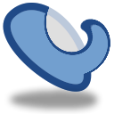
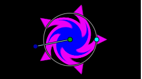
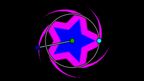
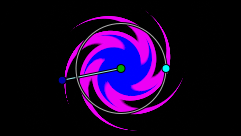

.. _layer_twirl:

########################
   Twirl Layer
########################

About Twirl Layers
------------------

``Twirl`` is the layer which deforms lower layers so that it seem as the
vortex. The intensity of the vortex is set over the rotation angle -
higher, the more intense.

Size of vortex is determinated by the radius of a circle, and distortion
can be activate separately for both the sides – inner and outer.

Sample
------

Distort Inside Parameter On
   

Distort Outside Parameter On  

Both Distort Parameters On

Parameters of Twirl Layers
--------------------------

The parameters of the twirl layers are:

+------------------------------------------------------------------------------+------------------------+------------+
| Name                                                                         | Value                  | Type       |
+------------------------------------------------------------------------------+------------------------+------------+
|     |Type\_vector\_icon.png| `Center <Center_Parameter>`__                   |   0.00000u,0.000000u   |   vector   |
+------------------------------------------------------------------------------+------------------------+------------+
|     |Type\_real\_icon.png| `Radius <Radius_Parameter>`__                     |   1.00000u             |   real     |
+------------------------------------------------------------------------------+------------------------+------------+
|     |Type\_angle\_icon.png| `Rotations <Rotations_Parameter>`__              |   0.00                 |   angle    |
+------------------------------------------------------------------------------+------------------------+------------+
|     |Type\_bool\_icon.png| `Distort Inside <Distort_Inside_Parameter>`__     |                        |   bool     |
+------------------------------------------------------------------------------+------------------------+------------+
|     |Type\_bool\_icon.png| `Distort Outside <Distort_Outside_Parameter>`__   |                        |   bool     |
+------------------------------------------------------------------------------+------------------------+------------+

.. |Type_vector_icon.png| image:: images/Type_vector_icon.png
   :width: 16px
.. |Type_real_icon.png| image:: images/Type_real_icon.png
   :width: 16px
.. |Type_angle_icon.png| image:: images/Type_angle_icon.png
   :width: 16px
.. |Type_bool_icon.png| image:: images/Type_bool_icon.png
   :width: 16px

