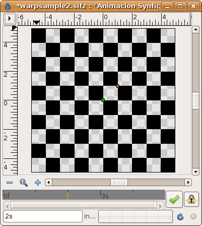
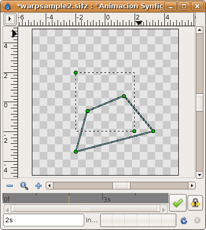
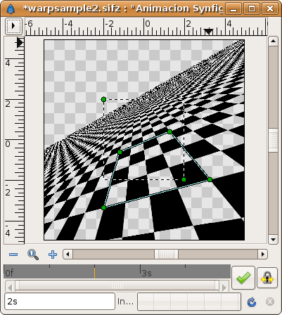
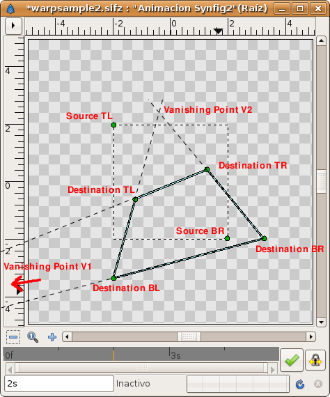
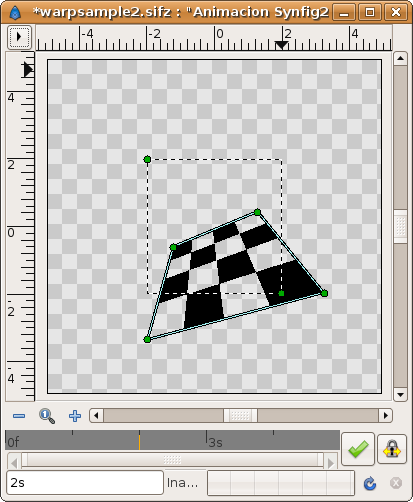

.. _layer_warp:

########################
    Warp Layer
########################
``Somes of the screenshots needs to be updated with 0.64.0``

About Warp Layers
-----------------

The warp layer is a simple but powerful distortion layer. In a few words
it takes a rectangular portion of the resulting render of the layers
that are behind it and maps the four corners of the rectangle to four
arbitrary points in the plane. It is a 2D -> 2D transformation.

To keep the object in place when apply the perspective, you need to set
the corners of the perspective destination properly around the object.
Notice that the source rectangle must be centered on the object, to
achieve a good effect.

If source == destination then object is not warped.

Parameters of Warp Layers
-------------------------

The parameters of the warp layers are:

+------------------------------------------+--------------------------+------------+
| Name                                     | Value                    | Type       |
+------------------------------------------+--------------------------+------------+
|     |Type\_vector\_icon.png| Source TL   |   -2.00000u,2.000000u    |   vector   |
+------------------------------------------+--------------------------+------------+
|     |Type\_vector\_icon.png| Source BR   |   2.00000u,-2.000000u    |   vector   |
+------------------------------------------+--------------------------+------------+
|     |Type\_vector\_icon.png| Dest TL     |   -1.800000u,2.100000u   |   vector   |
+------------------------------------------+--------------------------+------------+
|     |Type\_vector\_icon.png| Dest TR     |   2.20000u,-2.000000u    |   vector   |
+------------------------------------------+--------------------------+------------+
|     |Type\_vector\_icon.png| Dest BR     |   -2.20000u,-2.000000u   |   vector   |
+------------------------------------------+--------------------------+------------+
|     |Type\_vector\_icon.png| Dest BL     |   0.00000u,0.000000u     |   vector   |
+------------------------------------------+--------------------------+------------+
|     |Type\_bool\_icon.png| Clip          |                          |   bool     |
+------------------------------------------+--------------------------+------------+
|     |Type\_real\_icon.png| Horizon       |   1.00000                |   real     |
+------------------------------------------+--------------------------+------------+

Source TL
~~~~~~~~~

The Top Left corner (vertex) of the source that is going to be mapped.

Source BR
~~~~~~~~~

The Bottom Right corner (vertex) of the source that is going to be
mapped. Combined with Source TL ([Warp\_Layer#Source TL]) it defined the
``Source rectangle``.

Destination TL
~~~~~~~~~~~~~~

The Top Left corner (vertex) of the destination where the source is
going to be mapped.

Destination TR
~~~~~~~~~~~~~~

The Top Right corner (vertex) of the destination where the source is
going to be mapped.

Destination BL
~~~~~~~~~~~~~~

The Bottom Left corner (vertex) of the destination where the source is
going to be mapped.

Destination BR
~~~~~~~~~~~~~~

The Bottom Right corner (vertex) of the destination where the source is
going to be mapped.

Clip
~~~~

When checked (boolean) it only maps the pixels which lie inside the
``Source rectangle``.

Horizon
~~~~~~~

For infinite layers (gradients, checkerboard, etc.) it define (Real)
where to stop rendering the points of the vanishing point.

-  From 0.0 to 1.0 it renders all the points that are backwards on the
   perspective (in opposite direction to the vanishing point).
-  From 1.0 to +infinite it renders the points that go in the same
   direction of the vanishing point.

High values of Horizon make Synfig spend a lot of time rendering and the
result is slightly visibly better.

Some Samples
------------

Here are a few sample images of the result of applying the warp layer
over a `checkerboard layer <Checkerboard_Layer>`__.

Before distortion:

The handles of the warp layer. The dotted lines represent the Source
rectangle. Notice how it corresponds to a 4 by 4 section of the
checkerboard:

The resulting distortion (horizon = 15.0 and Clip = off). The
destination rectangle can be seen to contain the same 4 by 4 section of
the checkerboard that the source rectangle contains:

You can see that the rendered horizon is the result of connecting the
two vanishing points of the perspective distortion. In this case there
are two vanishing points given by the intersection of the lines that
connects the following points:

-  Intersection of the line that passes by Destination TL point and
   Destination TR point with the line that passes by Destination BL
   point and Destination BR point. It gives vanishing point V1 (not
   shown in the diagram because it is outside the visible area, far off
   to the left).
-  Intersection of the line that passes by Destination TL point and
   Destination BL point with the line that passes by Destination TR
   point and Destination BR point. It gives vanishing point V2

Connecting the Vanishing points V1 and V2 gives the horizon line.

See the diagram:

To understand how the Horizon parameter works see this animated image.
It moves the Horizon parameter from 0.0 to 30 in four seconds. Notice
that from horizon = 0.0 to 1.0 it renders from minus infinite to the
current observer position (it is made very fast in the animation, and
takes about in 4/30 seconds and most of the time the rendered section is
outside the visible area of the canvas - you can see it if you place a
zoom out layer on top of them). This means that the portion of plane
that is behind the observer point of view is rendered deformed and then
very enlarged). Notice too that from horizon = 1.0 to 30.0 it renders
the rest of the visible plane. As the horizon parameter gets larger, the
final visible horizon gets further away.

The Clip parameter
------------------

This image shows what you will get when check it on. Only the pixels
from inside the Source rectangle are mapped. In this case, the 4 by 4
section of the checkerboard.

Turning warp on/off
-------------------

Simply set the destination handles to the same position as the source
handles.

.. |Type_vector_icon.png| image:: images/Type_vector_icon.png
   :width: 16px
.. |Type_bool_icon.png| image:: images/Type_bool_icon.png
   :width: 16px
.. |Type_real_icon.png| image:: images/Type_real_icon.png
   :width: 16px

