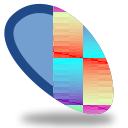
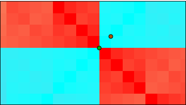

.. _layer_xor_pattern:

########################
    XOR Pattern Layer
########################

.. _layer_xor_pattern  About XOR Pattern Layers:

About XOR Pattern Layers
------------------------

[todo]

.. _layer_xor_pattern  Parameters of XOR Pattern Layers:

Parameters of XOR Pattern Layers
--------------------------------

The parameters of the XOR pattern layers are:

+-----------------------------------------------------------------+-------------------------+-------------+
| Name                                                            | Value                   | Type        |
+-----------------------------------------------------------------+-------------------------+-------------+
|     |Type\_real\_icon.png| |Z_Depth_Parameter|                  |   0.000000              |   real      |
+-----------------------------------------------------------------+-------------------------+-------------+
|     |Type\_real\_icon.png| |Amount_Parameter|                   |   1.000000              |   real      |
+-----------------------------------------------------------------+-------------------------+-------------+
|     |type\_integer\_icon.png| |Blend_Method|                    |   Composite             |   integer   |
+-----------------------------------------------------------------+-------------------------+-------------+
|     |Type\_vector\_icon.png| |Origin_Parameter|                 |   0.125000u,0.125000u   |   vector    |
+-----------------------------------------------------------------+-------------------------+-------------+
|     |Type\_vector\_icon.png| |Size_Parameter|                   |   0.250000u,0.250000u   |   vector    |
+-----------------------------------------------------------------+-------------------------+-------------+

.. |Type_real_icon.png| image:: images/Type_real_icon.png
   :width: 16px
.. |Type_integer_icon.png| image:: images/Type_integer_icon.png
   :width: 16px
.. |Type_vector_icon.png| image:: images/Type_vector_icon.png
   :width: 16px

