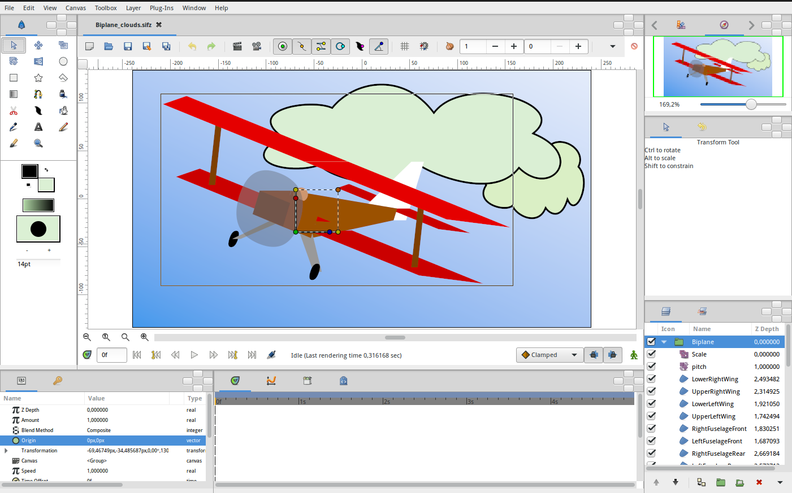
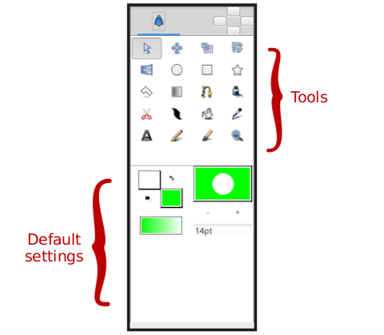
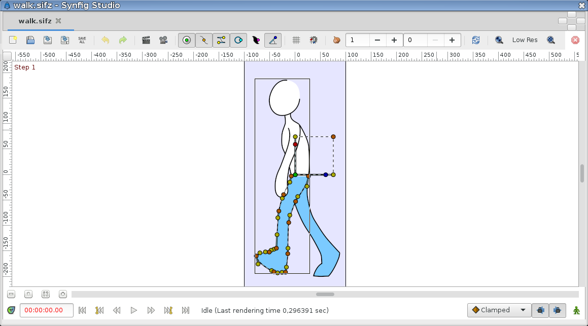
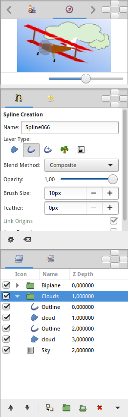
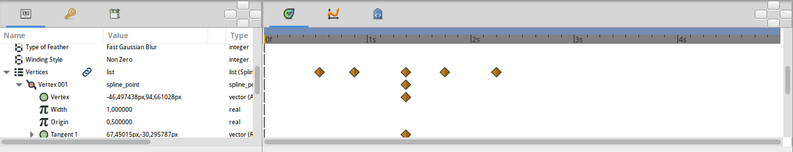

.. _interface:

########################
    Interface
########################
Synfig Studio start in one window, and dock a number of individual
|Panel| into that window. The default layout of user
interface is divided in three parts : the toolbox, the canvas and the
other panels.

This page tries to give you a short introduction to the different
elements you will find after opening synfig.

.. _interface  The Toolbox window:

The Toolbox window
------------------

The Toolbox Panel is a major piece of Synfig : even if you have several open projects,
there will only be one Toolbox.

The toolbox is separated into two areas:

-  The upper palette contains the **tools** which allow you to create
   and manipulate objects. In synfig we will talk of |layer|,
   as each object lies in its own layer. You can find a detailed
   description of each tool here.

-  The lowest palette contains the **default settings** for new layers:
   fore- and background colors |New_Layer_Defaults#Brush_Colors|,
   |New_Layer_Defaults#Brush_Size| and Current Gradient
   |New_Layer_Defaults#Current_Gradient|. You can find a detailed
   description of each default settings at |New_Layer_Defaults|.

.. _interface  The Canvas window:

The Canvas window
-----------------

|The Canvas| Once you have opened a file or created a new project you'll
see the Canvas Window. This is where you'll create your animation!

In addition of set of menus at the top of the screen, or the top of the
drawing window, Synfig has a |Canvas_Menu_Caret|: the
little black triangle in the upper left corner of the canvas. Beneath
are all the menus you would expect and that allow you to access most of
Synfig's features.

The area with the grey check-board pattern is your **working area** in
which you can create elements/layers and manipulate them.

The |Timebar| that you can see in the picture here only
appears when you have defined a non-zero duration in the
|Canvas_Properties_Dialog| of your project. To the left
you can see the number of the current frame and on the right side
buttons to |Lock_Keyframes| the keyframes and to switch
the |Animate_Editing_Mode|. The |Animation_Basics| Tutorial gives a good introduction on
how to work with this buttons.

In the picture above there are three elements on the canvas, the black
curve - called |Spline| - is selected. The little orange and
brown dots along the spline control the curve and are called
|handle|. Also you can see the
|Group_Transformation_Widget| of the
selected |Group_Layer|.

.. _interface  Show/Hide Menu Bar:

Show/Hide Menu Bar
~~~~~~~~~~~~~~~~~~

With the menu entry \ ``|Show Menu Bar|`` you can hide the menu bar. To
show again the menu bar use the same entry from the |Canvas_Menu_Caret|.

.. _interface  The other panels:

The other panels
----------------

.. _interface  The Navigator, Tool Options and Layers Panel:

The Navigator, Tool Options and Layers Panel
~~~~~~~~~~~~~~~~~~~~~~~~~~~~~~~~~~~~~~~~~~~~

|Navigator and Layers Panel| 

To the right side, three areas, each of
which can show different  panels: in this picture the |Navigator_Panel|, the |Tool_Options_Panel| and the |Layers_Panel|
are active.

You can access detailed descriptions of the other panels here.

.. _interface  The Parameter and Time Track Panel:

The Parameter and Time Track Panel
~~~~~~~~~~~~~~~~~~~~~~~~~~~~~~~~~~

|Parameters and Time Track panels| 

Finally, at the bottom you can see
the |Parameters_Panel|, where you can find detailed
|Parameter| and settings for the active element like
colour, width, opacity, location and so on. To the right is the
|Timetrack_Panel| that allows you to create and
modify |waypoints|.

.. |Panel| replace:: :ref:`Panels <ui>`
.. |layer| replace:: :ref:`Layer <layers>`
.. |New_Layer_Defaults#Brush_Colors| replace:: :ref:`Brush Colors <new_layer_defaults Brush Colors>`
.. |New_Layer_Defaults#Current_Gradient| replace:: :ref:`Current Gradient <new_layer_defaults Current Gradient>`
.. |New_Layer_Defaults#Brush_Size| replace:: :ref:`Current Gradient <new_layer_defaults Brush Size>`
.. |New_Layer_Defaults| replace:: :ref:`New Layer Defaults <new_layer_defaults>`
.. |Canvas_Menu_Caret| replace:: :ref:`Canvas Menu Caret <canvas_caret>`
.. |Timebar| replace:: :ref:`Timebar <timebar>`
.. |Canvas_Properties_Dialog| replace:: :ref:`Canvas Properties Dialog <canvas>`
.. |Lock_Keyframes| replace:: :ref:`Lock Keyframes <canvas_editing_lock_keyframe>`
.. |Animate_Editing_Mode| replace:: :ref:`Animate Editing Mode <animation_mode>`
.. |Animation_Basics| replace:: :ref:`Animations Basics <animation_basics>`
.. |Spline| replace:: `Spline <https://en.wikipedia.org/wiki/Spline_(mathematics)>`__
.. |handle| replace:: :ref:`handles`
.. |Group_Transformation_Widget| replace:: :ref:`Group Transformation Widget <group_transformation_widget>`
.. |Group_Layer| replace:: :ref:`group <layer_group>`
.. |Navigator_Panel| replace:: :ref:`Navigator Panel <panel_navigator>`
.. |Tool_Options_Panel| replace:: :ref:`Tool Options Panel <panel_tool_options>`
.. |Layers_Panel| replace:: :ref:`Layers Panel <panel_layers>`
.. |Parameters_Panel| replace:: :ref:`Parameters Panel <parameters>`
.. |Parameter| replace:: :ref:`Parameters <parameters>`
.. |Timetrack_Panel| replace:: :ref:`Timetrack Panel <panel_timetrack>`
.. |waypoints| replace:: :ref:`waypoints <waypoints>`