.. _keyframes:

########################
    Keyframes
########################
.. _keyframes  What is a keyframe?:

What is a keyframe?
-------------------

A keyframe is a basically a “mark” in the timeline. This mark allows the
user to make Synfig remember the state of the animation at that point
(frame). It means that the keyframe is like a label that tell Synfig
that this frame should be taken into account when creating waypoints. It
also indicates that the marked frame is a special frame where the
information of *every parameter of every layer is stored in order to be
reused later*.

Each keyframe is associated with a particular frame and a frame can only
have one keyframe.

.. _keyframes  What does a keyframe looks like?:

What does a keyframe looks like?
--------------------------------

A keyframe looks like a light brown vertical dashed line in the
|Timetrack_Panel| placed at the corresponding frame.
You can distinguish it from the |Time_Cursor| by its
color (the time cursor is blue).

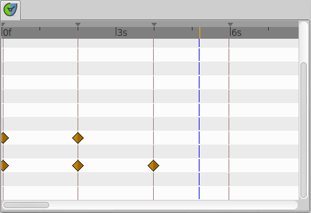

The symbols shown in the image are |Waypoints|.

The keyframe representation in the |Timebar| change
according their states : ``Normal``, ``Selected`` or ``Deactivated``

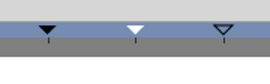
Three keyframes with three different states : **Normal**, **Selected**
and **Deactivated**

Keyframes also appear as entries in a list in the |Keyframes_Panel| 

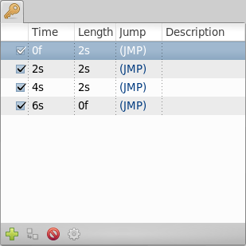
   
**Documentation writers note:** You can download the project to generate the screenshot: 
:download:`Keyframe-lookslike.sifz<keyframes_dat/Keyframe-lookslike.sifz>`

.. _keyframes  Keyframes and waypoints:

Keyframes and waypoints
-----------------------

A keyframe doesn't necessarily imply a waypoint, and a waypoint doesn't
necessarily imply a keyframe.

A keyframe could live all the time without any waypoint but it stores
the information of the values of the parameters on that specific frame.
If there is a waypoint there then the waypoint information (only the
parameter value) is stored too. If there is no waypoint in the keyframe
then its “stored” value is the result of the surrounding waypoints, its
parameter values and the interpolation values the waypoints have. This
means that a keyframe remembers the values of the parameters at that
frame but does not keep them static at that frame. To maintain a
parameter's value static in a certain frame you must use a waypoint.

The creation of a waypoint can cause the creation of new waypoints on
the neighboring keyframes depending on the current value of the |Lock_Keyframes| state. So, maybe, the creation of a
waypoint (modifying a parameter or pasting or moving a waypoint or even
duplicating a keyframe) can lead to the creation of a waypoint in the
keyframes that are immediately before and after the inserted waypoint's
frame. The waypoints created in the neighboring keyframes are created
according to the |New_Layer_Defaults_Default_Interpolation| in the |Toolbox|.

See the |examples| to understand how this works.

.. _keyframes  Adding, duplicating and removing keyframes:

Adding, duplicating and removing keyframes
------------------------------------------
.. _keyframes  Add a keyframe:

Add a keyframe
~~~~~~~~~~~~~~

Place the time cursor at a frame where there isn't currently any
keyframe. Then press the ``Add new Keyframe`` button. If you place the
time cursor at a frame where there is currently an existing keyframe or
if animation Start Time egals animation End Time (animation Duration is
0m 0s 1f) then the ``Add new Keyframe`` button is disabled. Once you
press the button then a new entry is added to the list of keyframes and
a vertical dashed line is added in the time line. No waypoint is
created.

.. _keyframes  Duplicate a keyframe:

Duplicate a keyframe
~~~~~~~~~~~~~~~~~~~~

.. figure:: keyframes_dat/KeyframeButton_Duplicate_0.63.06.png
   :alt: KeyframeButton_Duplicate_0.63.06.png

Select a keyframe in the keyframe list of the |Keyframes_Panel| and place the cursor at a frame where there
isn't currently any keyframe. Then press the ``Duplicate Keyframe``
button. This would have two separated effects:

#. If there is a waypoint at the original keyframe then the waypoint is
   duplicated. Its duplication includes the parameter value and its
   interpolation types.
#. If there is no waypoint in the original keyframe for any particular
   parameter then two things could happen:

   -  There is no waypoint for that parameter at ANY frame in the time
      line: Then NO waypoint is created.
   -  If there is a waypoint in the time line for that parameter, but
      not in the keyframe that is going to be duplicated, then in the
      duplicated keyframe is created a new waypoint with a value for the
      parameter of the result of the current value at the original
      keyframe and a ``TCB Smooth`` interpolation type for both ``In``
      and ``Out``.

Of course, duplicate a keyframe will produce a new keyframe at the place
pointed by the time cursor and will add a new one to the keyframe list
in the proper place. In the keyframe list, the new added keyframe have
the same description than the original, plus a ``(Duplicate)`` at the
end.

`video explanation <https://youtu.be/qvRt3ITSkrQ>`__

.. _keyframes  Remove a keyframe:

Remove a keyframe
~~~~~~~~~~~~~~~~~

.. figure:: keyframes_dat/KeyframeButton_Remove_0.63.06.png
   :alt: KeyframeButton_Remove_0.63.06.png

Just select a keyframe from the keyframe list and press the Remove
keyframe button. It will remove the keyframe and all the waypoints for
all parameters for all layers that are currently there.

\ *NOTE: If you move a keyframe by modifying its `time <#Time>`__ in the
keyframe list dialog and immediately press the Remove Keyframe button
then the waypoints are not deleted. It seems to be a bug but also can be
considered a feature if you really want to keep the waypoints and not
the keyframe.*\ 

.. _keyframes  Editing keyframes: time, length & description:

Editing keyframes: time, length & description
---------------------------------------------

You can see in the Keyframe list dialog that there are four headers and
before that, an empty column. This empty column maintain checkboxs
related to keyframe activation : enabled or disabled.

-  “Empty” [CheckBox]
-  Time
-  Length
-  Jump
-  Description

.. _keyframes  Activation:

Activation
~~~~~~~~~~

By changing the state of the checkbox you can activate or disable the
keyframe. A visual information about the keyframe state is displayed in
the |Timebar|.

.. _keyframes  Time:

Time
~~~~

You can modify the time (frame) where the keyframe is placed just making
a click in the corresponding ``Time`` cell. It will allow modify the
time forward or backward the amount that you want. You can also manually
place a keyframe at the desired time using the |Timebar|.

Modifying the Time of a keyframe has the following effects:

#. The existing |Waypoints| in the keyframe will move to
   the new position.
#. If any parameter have a a waypoint in the time line, then the moved
   keyframe will have a new waypoint set to |New_Layer_Defaults_Default_Interpolation| on those
   paramter(s).
#. According to the default interpolation method and the |Lock_Keyframes| status and to the parameters that have
   any waypoint in the time line, new waypoints will be created on the
   neighbouring keyframes of the destiny time (frame). The original
   neighbouring keyframes will be untouched if don't coincide with the
   destiny neighbouring keyframes.
#. If a keyframe is displaced and doesn't “jump” over other existing
   keyframe then the waypoints that are surrounding the original
   position of the moved keyframe are compressed and / or expanded in
   the timeline depending on the displacement of the keyframe. See the
   examples. This is a recent discovered behaviour

You cannot set the time of other keyframe. If you try to set the time of
a certain keyframe to be the same time of another existing keyframe then
the program gives you this message:

| ``keyframe_set: Cannot change keyframe time because another keyframe already exists with that time.``

See :ref:`the example <keyframes  Change Keyframe Time>` to see how changing the time
of a keyframe works.

.. _keyframes  Length:

Length
~~~~~~

Length parameter sets the time the keyframe is exposed in the timeline
until next keyframe. You can also manually change the length parameter
using the |Timebar| and holding ``alt`` key on releasing the
mouse button.

Changing the parameter shifts all following keyframes and
|Waypoints| forward or backwards.

.. _keyframes  Jump:

Jump
~~~~

The Jump column is only a short cut to place the
|Time_Cursor| at the keyframe where you make a click in
the ``(JMP)`` label.

.. _keyframes  Description:

Description
~~~~~~~~~~~

This cell allow the user insert a short description of the meaning of
the keyframe. Just make click on it and change the text.

.. _keyframes  Editing Keyframe Properties:

Editing Keyframe Properties
~~~~~~~~~~~~~~~~~~~~~~~~~~~

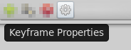

Hitting the keyframe Properties button, the ``Keyframe Properties``
dialog will appear. This dialog allows change the interpolation method
for all the waypoints on the keyframe at the same time. Even if, for a
certain parameter, there is no waypoint on the keyframe but the
parameter have other waypoints in the time line, then when you apply the
``Keyframe Properties`` you will add a waypoint at that keyframe were
there aren't currently any waypoint. The added waypoints have the
interpolation methods stated by the dialog. It means that the
``Keyframe Properties`` dialog will modify the interpolation methods for
all the parameters that have any waypoint in the time line.

The dialog have the following parameters:

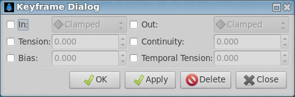

  
-  In: Checking this value you can change the interpolation method of
   the left part of the waypoints of the current selected keyframe of
   all the layers of the canvas to the selected |Waypoints_Interpolation| in the drop down menu.
-  Out: Same but for the right part of the waypoint.
-  Tension: See |TCB|
-  Bias: See |TCB|
-  Continuity: See |TCB|
-  Temporal Tension: See |TCB|

You can check only one of both ``In`` or ``Out`` check boxes to only
affect the change to the left or right part of the waypoints. The non
checked part would not be modified. Same comment applies for the Manual
interpolation method parameters (``Tension``, ``Bias``, ``Continuity``
and ``Temporal Tension``)

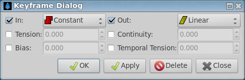

 
This dialog would not affect what's the interpolation method for a new
waypoint created by the user, automatically created by the |Keyframe_Duplicate_a_keyframe| or by the |Lock_Keyframes| state. The interpolation methods for new
waypoints created in those cases will be both the same (``In`` and
``Out`` or Left and Right) and depend only on the |New_Layer_Defaults_Default_Interpolation| method of
the `Toolbox <:Category:Toolbox>`__ window.

See the `examples <#Examples>`__ to understand better how it works.

.. _keyframes  Edit a keyframe from the timebar:

Edit a keyframe from the timebar
--------------------------------

Three keyframes with three different states : **Normal**, **Selected** and **Deactivated**

You can adjust the |Keyframe_Time| of a keyframe by a normal
drag and drop. To adjust it's |Keyframe_Length|, hold ``Alt``
key when releasing the mouse button.

During a keyframe drag and drop operation a tooltip indicator will be
displayed with some time informations.

Right click over a keyframe or in upper part of the ``Timebar`` open the
Keyframe Menu giving access to the
keyframes actions.

.. _keyframes  Examples:

Examples
--------

.. _keyframes  Duplicate a keyframe with no waypoint on it:

Duplicate a keyframe with no waypoint on it
~~~~~~~~~~~~~~~~~~~~~~~~~~~~~~~~~~~~~~~~~~~

For example, imagine that you have following set of keyframes and
waypoints and the corresponding parameter of the radius of a circle:

Before duplicate keyframe at 2s to 6s

+---------+------------+------------+----------+-----------------+
| Frame   | Keyframe   | Waypoint   | Radius   | Interpolation   |
+=========+============+============+==========+=================+
| 0s      | yes        | yes        | 20.0     | TCB Smooth      |
+---------+------------+------------+----------+-----------------+
| 2s      | yes        | no         | 25.0     | n/a             |
+---------+------------+------------+----------+-----------------+
| 4s      | yes        | no         | 30.0     | n/a             |
+---------+------------+------------+----------+-----------------+
| 8s      | no         | yes        | 40.0     | TCB Smooth      |
+---------+------------+------------+----------+-----------------+

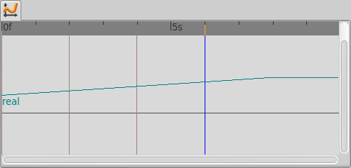

.. note::
   Notice that although the interpolation between 0s and 8s is TCB Smooth the real result 
   is linear due that they are the only two waypoints of the animation for that parameter.

If you select the keyframe at 2s, place the time cursor at 6s (where
there isn't a keyframe), set the |New_Layer_Defaults_Default_interpolation| to |TCB|, and have the |Lock_Keyframes|
to ``All keyframes locked`` and press the ``Duplicate keyframe`` button,
then the result is the following:

After duplicate keyframe at 2s to 6s

+---------+------------+------------+------------+-----------------+
| Frame   | Keyframe   | Waypoint   | Radius     | Interpolation   |
+=========+============+============+============+=================+
| 0s      | yes        | yes        | 20.0       | TCB Smooth      |
+---------+------------+------------+------------+-----------------+
| 2s      | yes        | no         | 25,78125   | n/a             |
+---------+------------+------------+------------+-----------------+
| 4s      | yes        | yes        | 30.0       | TCB Smooth      |
+---------+------------+------------+------------+-----------------+
| 6s      | yes        | yes        | 25.0       | TCB Smooth      |
+---------+------------+------------+------------+-----------------+
| 8s      | no         | yes        | 40.0       | TCB Smooth      |
+---------+------------+------------+------------+-----------------+

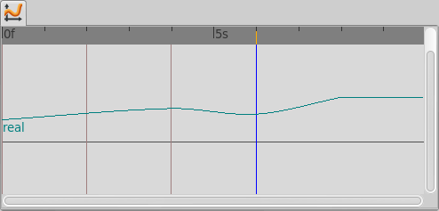

You can see that:

#. At 0s none has changed. Not affected by the insertion of the
   keyframe. It is two keyframes away from 6s and also have a waypoint.
#. At 2s there was a keyframe and stills there. But previous to the
   creation of the keyframe at 6s the current interpolated value of the
   ``radius`` was 25.0. After the creation of the keyframe at 6s the
   radius is the result of the interpolation between 0s and 4s frames
   waypoints with its radius values and its interpolation methods. That
   is 25.78125. This keyframe is more than one keyframe away from the
   new 6s keyframe so no waypoint is created.
#. At 4s there was a keyframe and still being there. But in this case
   the 4s keyframe is a neighbor of the new 6s keyframe. As well as the
   lock keyframe state was set to ``All keyframes locked`` then the
   keyframe at 4s has been locked adding a waypoint on it. The radius
   value hasn't changed (still being 30.0) because it was locked adding
   a waypoint with its current value). The Interpolation mode of the
   waypoint was set to ``TCB Smooth`` as stated by its default value.
#. At 6s there is a new keyframe with a new waypoint with the old value
   of the interpolated value of the keyframe at 2s. That is a ``radius``
   of 25.0.
#. At 8s nothing has changed. There wasn't any keyframe and there was a
   waypoint so nothing is expected to change.

Return to the previous state before you duplicate the keyframe with the
|History_Panel|, and imagine now that you do the same
operations but you choose the default interpolation set to
|Constant|. Then the result is the following:

After duplicate keyframe at 2s to 6s (constant interpolation)

+---------+------------+------------+----------+-----------------+
| Frame   | Keyframe   | Waypoint   | Radius   | Interpolation   |
+=========+============+============+==========+=================+
| 0s      | yes        | yes        | 20.0     | TCB Smooth      |
+---------+------------+------------+----------+-----------------+
| 2s      | yes        | no         | 20.0     | n/a             |
+---------+------------+------------+----------+-----------------+
| 4s      | yes        | yes        | 30.0     | Constant        |
+---------+------------+------------+----------+-----------------+
| 6s      | yes        | yes        | 25.0     | TCB Smooth      |
+---------+------------+------------+----------+-----------------+
| 8s      | no         | yes        | 40.0     | TCB Smooth      |
+---------+------------+------------+----------+-----------------+

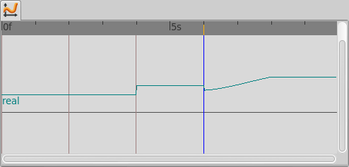

Now you can see that the keyframe at 2s doesn't hold the value of the
parameter by itself. It only remember the value if a waypoint is created
on it, by the result of the insertion of a neighbour waypoint, or if a
keyframe is duplicated and the lock keyframe status affects that
keyframe. In this example the value at 2s has changed drastically due to
the different interpolation method for the created waypoint on 4s. If in
this situation you duplicate again the keyframe at 2s to other frame
(ej. 10s) then it would copy a keyframe with a waypoint on it with a
radius's value of 20.0, what is the current value of the parameter in
that keyframe before duplicate it.

**Documentation writers note:** You can download the project to generate the screenshot: 
:download:`Keyframe-example1.sifz<keyframes_dat/Keyframe-example1.sifz>`

.. _keyframes  Editing Keyframe Properties:

Editing Keyframe Properties
~~~~~~~~~~~~~~~~~~~~~~~~~~~

Consider this situation for a certain layer:

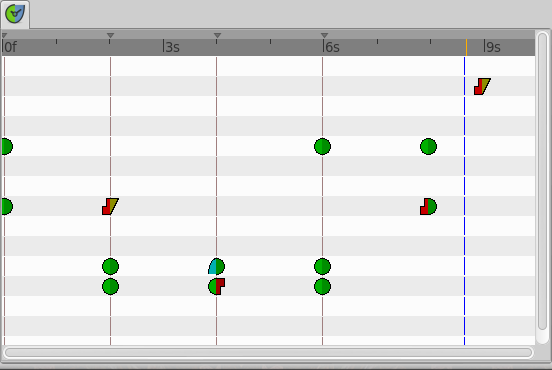

In the sample the animation duration is 10 seconds so the image shows
all the existing waypoints and keyframes. The time cursor isn't over any
keyframe.

Now consider that you have the following default values:

-  |New_Layer_Defaults_Default_Interpolation|
   method set to ``Ease in/out``
-  |Lock_Keyframes| status set to
   ``All Keyframes Locked``

Now select the keyframe at frame 4s in the keyframe list. Press the
``Keyframe Properties`` button and set the following interpolation
method:

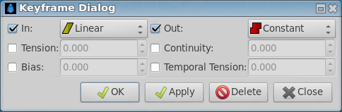

and press ``Apply`` button. The result will be this:

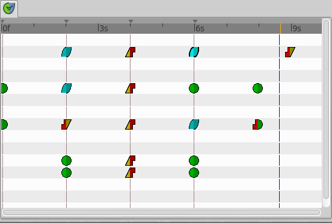

You can see the following effects:

#. The existing waypoints at 4s keyframe have changed its interpolation
   methods according to the ``Keyframe Properties`` dialog.
#. There are new added waypoints at 4s keyframe. The waypoints are added
   to the paramters that have almost one waypoint in the time line (for
   example the one that have only a waypoint at 9s). The added waypoints
   at 4s keyframe have the interpolation settings that was stated by the
   ``Keyframe Properties`` dialog.
#. New waypoints have been created for the neighbouring keyframes to 4s
   (2s and 6s) for all the parameters that have any waypoint in the time
   line. The waypoints are created in the neighbouring keyframes
   according to the |Lock_Keyframes| status. Also the
   created waypoints interpolation method responds to the |New_Layer_Defaults_Default_Interpolation| method
   you have set.

If in the ``Keyframe Properties`` dialog you were checked off the
``Out`` or the ``In`` check boxes then it would have happened two
things:

#. The existing waypoints at 4s would only change its interpolation
   method on the side the check box was checked on. The other side will
   be untouched.
#. The new added waypoints will have the interpolation method set to
   ``TCB Smooth`` method where the check box is off and the
   interpolation method set by the ``keyframe properties`` dialog where
   the check box is on.

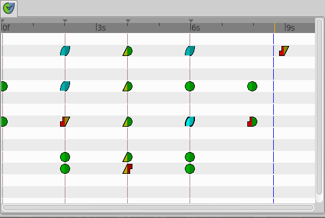

  
In this sample it was only checked on the ``In`` check box.

**Documentation writers note:** You can download the project to generate the screenshot: 
:download:`Keyframe-example2.sifz<keyframes_dat/Keyframe-example2.sifz>`

.. _keyframes  Change Keyframe Time:

Change Keyframe Time
~~~~~~~~~~~~~~~~~~~~

.. _keyframes  Without waypoints between keyframes:

Without waypoints between keyframes
^^^^^^^^^^^^^^^^^^^^^^^^^^^^^^^^^^^

Consider again this situation for a certain layer:

 
Now consider that you have the following default values:

-  |New_Layer_Defaults_Default_Interpolation|
   method set to ``Ease in/out``
-  |Lock_Keyframes| status set to
   ``All Keyframes Locked``

Now select the keyframe at frame 4s in the keyframe list. Make a click
in the ``Time`` cell and modify the time to be 3s. The result will be
this:

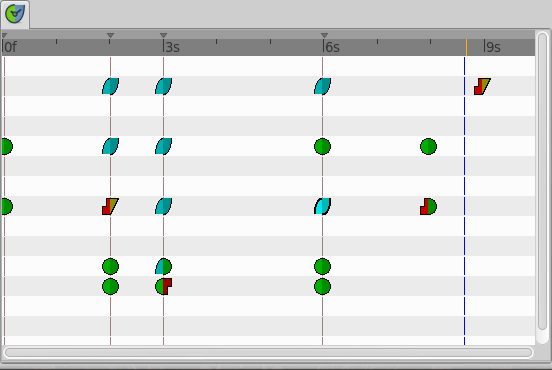

 
.. _keyframes  With waypoints between keyframes:

With waypoints between keyframes
^^^^^^^^^^^^^^^^^^^^^^^^^^^^^^^^

Consider now this situation for a certain layer:

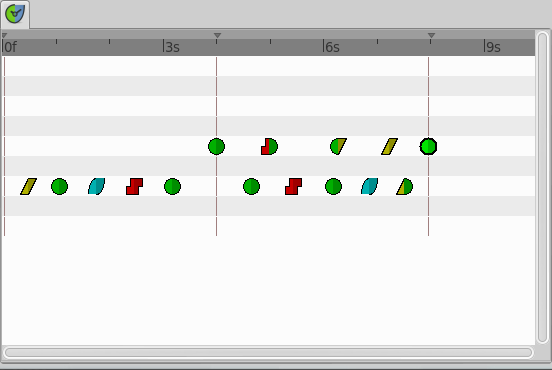

 
Now consider that you have the following default values:

-  |New_Layer_Defaults_Default_Interpolation|
   method set to ``Ease in/out``
-  |Lock_Keyframes| status set to
   ``All Keyframes Locked``

Now select the keyframe at 4s in the keyframe list. Make a click in the
``Time`` cell and modify the time to be 2s. The result is this:

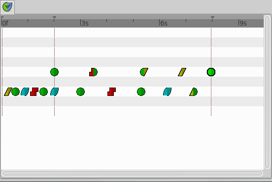

  
You can see how the waypoints at right and left of the moved keyframe
have been compressed and expanded in the time line. Also notice that any
waypoint has been formed in the moved keyframe at the paramter at the
bottom of the list but yes in the static keyframes.

.. note::
   It seems to be a bug (?) - to be verified.

Trying to understand this behaviour I see that also the keyframes keep
the waypoints between two adjacent keyframes although you move them,
keeping the distribution of the waypoints in the portion of time line
between keyframes. This behaviour doesn't happen if the moved keyframe
“jumps” over other keyframe when moved. Please add here as much
information you can discover about keyframes behaviour. It seems that
there are some bugs and any information is welcome

**Documentation writers note:** You can download the project to generate the screenshot: 
:download:`Keyframe-example3.sifz<keyframes_dat/Keyframe-example3.sifz>`

.. _keyframes  Advanced uses of keyframes:

Advanced uses of keyframes
--------------------------

.. _keyframes  Reusing keyframes:

Reusing keyframes
~~~~~~~~~~~~~~~~~

If you want to learn more about advanced uses of keyframes see this
tutorial about reusing animations. Keyframes can be like stored “poses”
that can be reused several time in the animation. Very useful for lip
sync.

|Reuse_Animations|

.. _keyframes  Usage of Onionskin:

Usage of Onionskin
~~~~~~~~~~~~~~~~~~

To properly use the onion skin feature (``Alt+O`` or
``Menu Caret -> View -> Toggle Onion Skin``) you should consider the
frame where the keyframes are set. Onion skin will show you the before
and after keyframes images with a 50% opaque copy of the current view.
Also the current view is 50% opaque.

See |Onion_Skin| for more detail.

.. _keyframes  Quickly creating/importing Keyframes:

Quickly creating/importing Keyframes
~~~~~~~~~~~~~~~~~~~~~~~~~~~~~~~~~~~~

Using a `Synfig
plug-in <https://github.com/berteh/import-audacity-labels-keyframes>`__
it is possible to quickly import keyframes from a list of timings, as
explained in the |Audio_Synchronisation|
tutorial.

.. |KeyframesLook-TimeTrack\_0.63.06.png| image:: KeyframesLook-TimeTrack_0.63.06.png
.. |Three keyframes with three different states : **Normal**, **Selected** and **Deactivated**| image:: Keyframe_State_Representation.png
.. |KeyframesLook-KeyframePanel\_0.63.06.png| image:: KeyframesLook-KeyframePanel_0.63.06.png
.. |``Keyframe-lookslike.sifz``| image:: Keyframe-lookslike.sifz
.. |``Keyframe-example1.sifz``| image:: Keyframe-example1.sifz
.. |``Keyframe-example2.sifz``| image:: Keyframe-example2.sifz
.. |``Keyframe-example3.sifz``| image:: Keyframe-example3.sifz

.. |Timetrack_Panel| replace:: :ref:`Timetrack Panel <panel_timetrack>`
.. |Time_Cursor| replace:: :ref:`Time Cursor <glossary_time_cursor>`
.. |Waypoints| replace:: :ref:`Waypoints <waypoints>`
.. |Timebar| replace:: :ref:`Timebar <timebar>`
.. |Keyframes_Panel| replace:: :ref:`Keyframes Panel <panel_keyframes>`
.. |Lock_Keyframes| replace:: :ref:`Lock Keyframes <editing_lock_keyframe>`
.. |New_Layer_Defaults_Default_Interpolation| replace:: :ref:`New Layer Defaults: Default Interpolation <new_layer_defaults Default Interpolation>`
.. |Toolbox| replace:: :ref:`Toolbox <panel_toolbox>`
.. |examples| replace:: :ref:`examples <keyframes  Examples>`
.. |Waypoints_Interpolation| replace:: :ref:`Waypoints Interpolations <waypoints  Interpolation>`
.. |TCB| replace:: :ref:`TCB <interpolations_TCB>`
.. |Clamped_interpolation| replace:: :ref:`Clamped <interpolations_Clamped>`
.. |Constant| replace:: :ref:`Constant <interpolations_Constant>`
.. |Ease_In_Out| replace:: :ref:`EaseIn/Out <interpolations_EaseIn_Out>`
.. |Linear| replace:: :ref:`Linear <interpolations_Linear>`
.. |Keyframe_Duplicate_a_keyframe| replace:: :ref:`Keyframe duplication <keyframes  Duplicate a keyframe>`
.. |Keyframe_Time| replace:: :ref:`Keyframe time <keyframes  Time>`
.. |Keyframe_Length| replace:: :ref:`Keyframe Length <keyframes  Length>`
.. |History_Panel| replace:: :ref:`History Panel <panel_history>`
.. |Reuse_Animations| replace:: :ref:`Reuse Animations <reuse_animations>`
.. |Onion_Skin| replace:: :ref:`Onion Skin <onion_skin>`
.. |Audio_Synchronisation| replace:: :ref:`Audio Synchronisation <audio_synchronisation>`