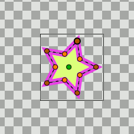

.. _linking:

########################
    Linking
########################

.. _linking Introduction:

Introduction
------------

It's possible to link two |handles| together so that when one moves, the other moves with it, like it is explained in |Animating_shapes#Adding_the_petals|.

.. _linking Automatic links

Automatic links
~~~~~~~~~~~~~~~

This is done automatically when you create an |Outline_Layer| and |Region_Layer| at the same time in the |Spline_Tool|; a single spline is created, and is linked to the vertices parameter of both the outline and the region. This allows you to move the outline around and have the region it surrounds automatically move with it.

   With "Link Origins" checked : Move the outline around and have the region it surrounds automatically move with it.

Manual links
~~~~~~~~~~~~

To link some handles together, select them by selecting their layer(s) and dragging a box around them, or by holding the ``Control`` key and toggling individual handles on, then right-click on one of the selected handles and select "Link" from the context menu.

Link offset by |Origin_Parameter|
~~~~~~~~~~~~~~~~~~~~~~~~~~~~~~~~~

Everything links perfectly as long as neither origin is moved before the link !

However, as soon as you move either origin, it offsets the linking location by however far the origin was moved. So, it appears that a shape moved the origin of the other shape after she placed on the origin. The way to fix it easiest is to not move the origin before you link.

Link offset by origin, is not absolutely intuitive, but allows for some powerful and flexible editing when things get complicated. Play with it until you understand it ;-)

Handles type
~~~~~~~~~~~~

All of the selected |handles| must be of the same basic type. You can't link a real value to a vector value. You can usually link a vertex to a tangent if you like, because they are both vector values. I'm not sure it makes much sense to do so, however.

Which Handle Moves and Which Stays Still?
-----------------------------------------

So you've selected a bunch of handles, right clicked to bring up the menu and clicked 'link'. Which of the handles' positions is used as the new shared position?

It works like this: a tiered decision process:

Tier 0
~~~~~~

Tier 0 is applied only for handles which are simple values (ie. none of them correspond to a |ValueNode|). There could be two cases:

* If each handle is from a different layer, then the 'first' one is the one from the topmost layer. Before that the one from the lowest layer was used.
* If the handles are from the same layer, it seems to be the handle listed last in the parameter dialog that has its value used.

This case won't happen if any of the handles are animated, converted, or already linked to anything else, including being part of a spline.

Tier 1
~~~~~~

If any of the handles are an exported value:

* If all the handles which are an exported value are the same exported value, then that value is used.
* Otherwise it's an error; linking isn't allowed to change an exported value.

Tier 2
~~~~~~

So none of the handles are an exported value.

If any of the handles are referenced more than the others, then one of those is used.

What does 'referenced' mean? It's a count of how many times the value is used. If 2 handles are linked together, that value will be referenced twice.

Notice that if you draw an outline and region at once using the spline tool, the points in the created layers will each have a reference count of one, since the points themselves aren't linked to each other. Rather, it is the blines (the lists of blinepoints) that are linked. On the other hand, if you draw an outline and a region separately and link their vertices individually, then each vertex will have a reference count of 2.

Tier 3
~~~~~~

If it's still not decided which one to use, and some of the handles are animated and others are constant values, then one of the animated ones will be used.

Tier 4
~~~~~~

After that, if two or more handles are animated, the one with the most waypoints gets priority.

Tier 5
~~~~~~
If it's still not decided, then the one that was least recently modified will get priority.

So if all other things are equal, you can decide which handle gets moved by nudging the one you want to move a little just before linking.

Tier 6
~~~~~~

If even the modification date of the ValueNodes is the same, there's nothing to base the decision on and so the 'first' handle's value is used.

.. |handles| replace:: :ref:`handles <handles>`
.. |Animating_shapes#Adding_the_petals| replace:: :ref:`Animating Shapes: Adding the petals <animating_shapes  Adding the petals>`
.. |Outline_Layer| replace:: :ref:`Outline Layer <layer_outline>`
.. |Region_Layer| replace:: :ref:`Region Layer <layer_region>`
.. |Spline_Tool| replace:: :ref:`Spline Tool <tool_spline>`
.. |Origin_Parameter| replace:: :ref:`Origin <parameters>`
.. |ValueNode| replace:: :ref:`ValueNode <valuenode>`
