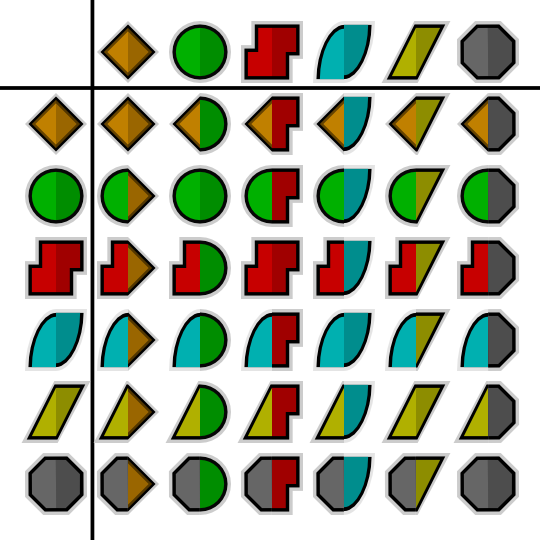
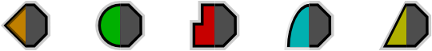
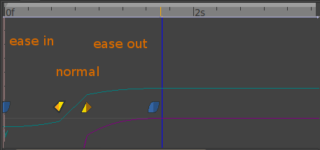

.. _waypoints:

########################
    Waypoints
########################
Introduction
------------

``Waypoints`` are the graphical symbols that show up on the
`Timetrack <Timetrack>`__ panel. Each time the value of a parameter is
edited in `animate editing mode <Animate_Editing_Mode>`__, a Waypoint
will be created. For example, when you adjust a ``Tangent``
`Handle <Handle>`__ of a vertex in a `Spline <Spline>`__, a ``Waypoint``
will be created to note the change. However, you didn't really adjust
the tangent, you adjusted the two parameters which define the tangent:
its angle (``Theta``), and its length (``Radius``). Opening up the
tangent's nodes in the `Parameters Panel <Parameters_Panel>`__ will show
that ``Waypoints`` have been created against each of these 2 parameters.

As a result of adjusting a single ``Tangent`` Handle, ``Waypoint`` have
been created as follows:

-  the length of the tangent changed (``Radius``)
-  the angle of the tangent changed (``Theta``)
-  the tangent changed (``Tangent 1``)
-  the vertex changed (``Vertex 001``)
-  the vertices changes (``Vertices``)

Only the first 2 of these are 'leaf waypoints' - the rest are parents
(and grandparents, etc) of these 2 waypoints.

Selecting Waypoints
-------------------

Holding Ctrl allows you to select more than one waypoint for a given
valuenode at a time.

*When nothing is selected, clicking on a point in either normal mode or
additive mode will select the time point closest to the click.
Subtractive click will do nothing.
 
*When things are already selected,
clicking on a selected point does nothing (in both normal and add mode).
Add mode clicking on an unselected point adds it to the set. Normal
clicking on an unselected point will select only that one time point.
Subtractive clicking on any point will remove it from the the set if it
is included. Normal click out of a waypoint unselect all.

Editing Waypoints
-----------------

Move it
~~~~~~~

Waypoints can be dragged left or right with the left mouse button to
change the time at which they act upon their parameter(s). If you drag a
parent's Waypoint, all its child Waypoints will move with it.

Move some
~~~~~~~~~

You can select multiple Waypoints using ``Ctrl|Click``, and then they
can be dragged left or right has moving single waypoint
([Waypoint#Move\_it]).

More actions
~~~~~~~~~~~~

Right-clicking on Waypoint shows a context menu, containing:

-  ``Jump to``: Set the current time to be the time of the waypoint.
-  ``Duplicate``: [STRIKEOUT:Only appears for single-leaf Waypoints.]
   Creates a copy of the current Waypoint at the currently selected
   time.
-  ``Remove``: Only appears for single-leaf waypoints. Deletes the
   Waypoint.
-  ``Remove ``\ **``n``**\ `` Waypoints``: Only appears for multi-leaf
   waypoints. Deletes the **n** Waypoints.
-  ``Edit``: [STRIKEOUT:Only appears for single-leaf Waypoints.]

TODO: writeme (brings up a dialog allowing various parameters to be set).

-  ``Both``.: Allows you to change the ``In`` and ``Out`` interpolation
   ([Waypoint#Interpolation]) setting for the Waypoint and all its
   children.
-  ``In``.: Allows you to change the ``In`` interpolation setting for
   the Waypoint and all its children.
-  ``Out``.: Allows you to change the ``Out`` interpolation setting for
   the Waypoint and all its children.

If the Waypoint is `Linked <Linking>`__ other menu entries related to
the link will appear up to those one.

TODO: writeme (describe added menu entries in case of linked waypoint).

Interpolation
-------------

Default Interpolation
~~~~~~~~~~~~~~~~~~~~~

The default type of interpolation
([New\_Layer\_Defaults#Default\_Interpolation]) for new waypoints is
defined by a dropdown list at bottom of the  Canvas Window.

It is possible to fix interpolation by parameter. Right-click any and
choose its default interpolation from a submenu. The defined
interpolation is indicated in the `Parameters
Panel <Parameters_Panel>`__ with corresponding icon near the parameter
value.

Interpolation In & Out
~~~~~~~~~~~~~~~~~~~~~~

Each Waypoint has an ``In`` and an ``Out`` interpolation setting, which
determines the manner in which its parameter changes - whether it
changes linearly over time, or follows a curve.

The ``In`` interpolation defines how the parameter changes in the
moments before the Waypoint is reached, and ``Out`` defines how it
changes in the moments after the Waypoint. Available interpolation types
are as follows:

-  `TCB Smooth <TCB>`__: If you imagine a graph of the parameter's value
   against time, using the TCB interpolation type will fit a smooth
   curve between adjacent waypoints, much like the `Spline
   Tool <Spline_Tool>`__ fits smooth curves between adjacent spline
   vertices.
-  `Clamped <Clamped_interpolation>`__: Acts like TCB interpolation, but
   never “overshoots” (or “undershoots”) the values you set in the
   `Parameters Panel <Parameters_Panel>`__.
-  `Constant <Constant>`__: Stops the animation.
-  `Ease In/Out <Ease_In/Out>`__: The graph is horizontal as it leaves
   the Waypoint.
-  `Linear <Linear>`__: The graph of parameter value against time is a
   straight line.
-  Undefined: This is only shown for multi-leaf Waypoints, where there
   is more than one different interpolation type amongst its leaf
   Waypoints.

Graphical Representation
~~~~~~~~~~~~~~~~~~~~~~~~

The color and shape of the Waypoint as displayed in the
`Timetrack <Timetrack>`__ indicates its interpolation type:

**Waypoints**

+---------------------------------------------------------+---------------------------------------------------------+---------------------------------------------------------+---------------------------------------------------------+---------------------------------------------------------+---------------------------------------------------------+
| .. figure:: waypoints_dat/Waypoint-clamped.png          | .. figure:: waypoints_dat/Waypoint-tcb.png              | .. figure:: waypoints_dat/Waypoint-constant.png         | .. figure:: waypoints_dat/Waypoint-ease.png             | .. figure:: waypoints_dat/Waypoint-linear.png           | .. figure:: waypoints_dat/Waypoint-undefined.png        |
+=========================================================+=========================================================+=========================================================+=========================================================+=========================================================+=========================================================+
| Clamped                                                 | TCB Smooth                                              | Constant                                                | Ease In/Out                                             | CLinear                                                 | Undefined                                               |
+---------------------------------------------------------+---------------------------------------------------------+---------------------------------------------------------+---------------------------------------------------------+---------------------------------------------------------+---------------------------------------------------------+

Each Waypoint is split into two halves. The left half indicates its
``In`` interpolation and the right half indicates its ``Out``
interpolation, so many different combinations are possible:

In the chart above the ``In`` interpolation is shown on the left, and
the ``Out`` interpolation is shown across the top.

Note: the .sif file used to generate these screenshots is available.

:download:`Waypoint-examples.sif <waypoints_dat/Waypoint-examples.sif>`

Here is an 
:download:`Interpolation.sif <waypoints_dat/Interpolation.sif>`
showing 25 different blobs, and how
they move with different combinations of Waypoints. It renders to a
`634K .avi
file <http://dooglus.rincevent.net/synfig/interpolation.avi>`__, and is
available in lower resolution `on
YouTube <http://www.youtube.com/watch?v=SI1VaH2psts>`__. Notice how:

-  the blobs with any red (`Constant <Constant>`__) on them don't move
   at all
-  the yellow (`Linear <Linear>`__) sides of blobs 'bounce' off the
   walls
-  the cyan (`Ease <Ease_In/Out>`__) sides slow gracefully to a halt at
   the walls
-  the green (`TCB Smooth <TCB>`__) sides bounce at the top (the
   animation is a single down-and-up animation, looped, so there's no
   'context' at the top for the TCB to fit the curve to) but act
   smoothly at the bottom

The 'undefined' (grey) symbol is used when the row in the
`Timetrack\_Panel <Timetrack_Panel>`__ represents multiple Waypoints.
For example, the 'vertices' row represents all the vertices making up a
Spline. Each of those vertices can have multiple Waypoints, each with
different interpolations. If all the interpolations are the same, that
interpolation's symbol will be used. Otherwise, the grey 'undefined'
symbol is used.

Look at the Waypoints below. They are from the Timetrack for the
``Vertices`` of an `Outline Layer <Outline_Layer>`__.

 
You'll see the left side of each of the Waypoints is colored. This means
the ``In`` interpolation for each vertex is the same. However, the right
side is grey, indicating that the ``Out`` interpolation for each vertex
differs.

*TODO: rewrite the above so it doesn't hurt the brain so much.*

Example combining Waypoints
---------------------------

Ease in - Normal - Ease out
~~~~~~~~~~~~~~~~~~~~~~~~~~~

  

