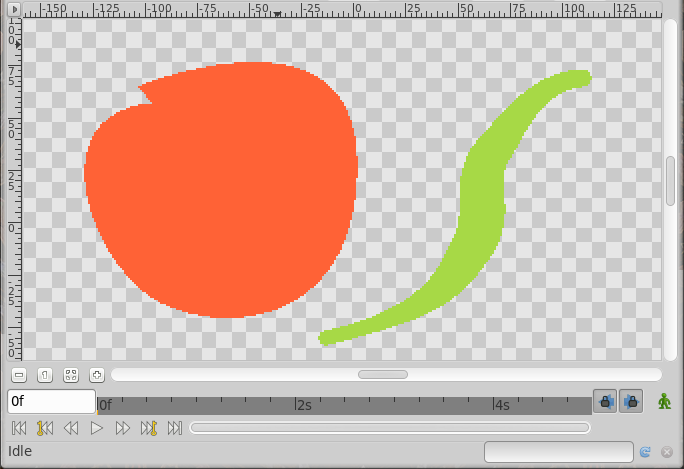

.. _parameters_antialiasing:

########################
Anitaliasing
########################

The Antialiasing Parameter is a boolean parameter that activate the `antialiased <http://en.wikipedia.org/wiki/Anti-aliasing>`__ render of the shape (region, outline, etc.) what makes the edge of the shape to not be crisped against the background. When unchecked the antialiasing effect disappear and the shape is rendered more crisped.

Antialiasing on 
---------------

Antialiasing off
----------------

