.. _parameters_blend_method:

########################
    Blend Method Parameter
########################
.. _parameters_blend_method  General informations:

General informations
====================

You can select the ``Blend Method`` of a layer during his creation in
|Tool_Options_Panel| and change it from
|Parameters_Panel|. By default, ``Blend Method``
parameter is Static Parameters. To animate it over the
time, right click on it and choose ``Enable animation``.

Selecting a layer ``Blend Method`` changes the appearance of the layer
or composition, based on the layer or layers beneath it. If there is
only one layer, the blend method has no effect. There must therefore be
at least two layers in the composition to be able to use blend method.

In the following descriptions, 'A' refers to the color on the layer with
the blend method setting, and 'B' refers to the color on the layers
beneath it. Note that in almost all layers, the alpha channel of the
colors will have a scaling effect on the blending. The |Amount_Parameter| will also have a scaling effect. In most
descriptions these 2 details have been glossed over.

In the examples that follow a gradient (A) is blended on the image of
Tux penguin (B). The transparent areas are indicated with the
checkerboard pattern.

 A |Gradient.png|    
 
 B |Tux.png|

.. _parameters_blend_method  List of available blend methods:

List of available blend methods
===============================

.. _parameters_blend_method  Composite:

Composite
---------

This blend method is the default option, it simply displays the content
of the layer : Color A is composited onto B (Taking A's alpha into
account).

This blend mode is similar the layer blend mode **Normal Mode** often
found in 2D programs.

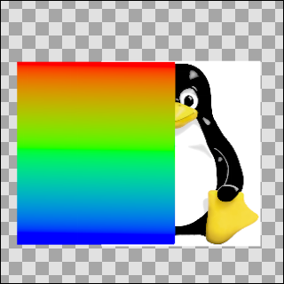

.. _parameters_blend_method  Straight:

Straight
--------

This blend method looks similar to the previous one, except that the
objects under a *straight*-object will be invisible. So if there is a
more or less transparent object on the *Straight mode* layer, the
objects on the layers underneath won't show through it.

More precisely, the resulting color is “(A-B)\*amount + B”. So if amount
is 1 the result is A and if amount is 0 the result is B. In particular,
if amount is 1 and A is a very transparent color, the resulting color
will also be A; despite the fact that A is very transparent, none of B's
color is used.

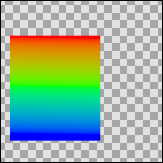

.. _parameters_blend_method  Onto:

Onto
----

If a layer is set to the *Onto* blend method, only the parts of the
layer that are over a not transparent area will be visible.

Precisely: this is the same as the Composite blend method except that
the transparency of the resulting color is set to be the same as the
transparency level of layer B.

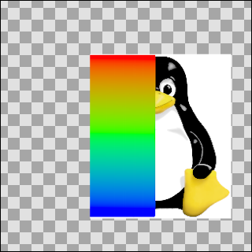

.. _parameters_blend_method  Straight Onto:

Straight Onto
-------------

.. note::
   Warning, `actually <http://www.synfig.org/issues/thebuggenie/synfig/issues/868>`__
   broken in some cases. 
   `Bug report #868 <http://www.synfig.org/issues/thebuggenie/synfig/issues/868>`__ -    Straight Onto blend method broken (both render engine) : When using
   groups result is the same has “Straight” on the workarea and when
   rendering and cobra (0991d44751f) to render empty on vector artwork.

This method is a combination of the two methods above. E.g. if an
half-transparent object is set to *Straight Onto*, it will only be
visible over a non-transparent area, and the non-transparent part under
that object won't be visible.

Precisely: the resulting color is “(X-B)\*amount + B” where X is A but
with its transparency set to A's transparency times B's transparency.

So if amount is 1 the result is A, but with its transparency multiplied
by that of B, and if amount is 0 the result is B. In particular, if
amount is 1 and A is a very transparent color, the resulting color will
be a possibly more transparent version of A; despite the fact that A is
very transparent, none of B's color is used in the result.

(Yuck. Are these 'precisely' comments useful?)[Yes!]

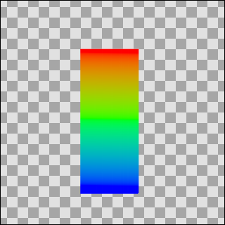

.. _parameters_blend_method  Behind:

Behind
------

This blend method makes the layer visible over transparent areas, and
invisible over non-transparent areas, giving the impression that the
layer is behind the other layers. It is often used for the “Shade”
effect layer, to make a drop-shadow effect.

Precisely: this is the same as the composite blend method, but with A
and B swapped. B is composited onto A instead of A being composited onto
B.

.. figure:: blend_method_dat/Behind.png
   :alt: Behind.png
   
.. _parameters_blend_method  Screen:

Screen
------

This blend method is similar to the **Screen Mode** often found in 2D
programs. It combines the colors of the *screen mode layer* and the ones
behind it, and gives a lighter result in general.

.. figure:: blend_method_dat/Screen.png
   :alt: Screen.png

.. _parameters_blend_method  Overlay:

Overlay
-------

This is similar to **PhotoShop** - layer blend mode **Overlay Mode**

Precisely: define 3 new colours: RM = A \* B; RS = 1-(1-A)\*(1-B); RET =
A\*RS + (1-A)\*RM then blend RET onto B as in the Onto method above(!)

Any idea what that is aiming to do? Or what the layer does in this
**PhotoShop** program? This appears to emulate the effect of a
cross-fade between the two layers if they are set to equal amounts - i.e
like 'add', but maintaining the overall brightness of the image

.. _parameters_blend_method  Hard Light:

Hard Light
----------

This is similar to **PhotoShop** - layer blend mode **Hard Light Mode**

For each of red, green and blue, if the component is in the top half of
its range then calculate X=1-(1-(2A-1))\*(1-B), otherwise calculate
X=2AB, then blend X onto B as in the Onto method above.

Is this aiming to make bright colours brighter and dark colours darker?

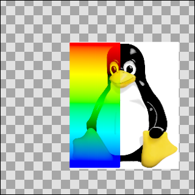

.. _parameters_blend_method  Multiply:

Multiply
--------

This is similar to **PhotoShop** - layer blend mode **Multiply Mode**

Precisely: the resulting colour is (((A\*B)-B)\*amount+B). The
calculation is performed independently on red, green, and blue
components. When amount is 0, this simplifies to B. When amount is 1 it
simplifies to A\*B.

.. _parameters_blend_method  Divide:

Divide
------

*Describe me*

Precisely: the resulting color is (((B/A)-B)\*amount)+B.

When amount is 0, this becomes simply B.

When amount is 1, this becomes B/A.

A very small quantity is added to A before dividing by it to avoid a
divide-by-zero condition. This causes the divide blend method to bias
toward positive values, but the effect is really negligible.

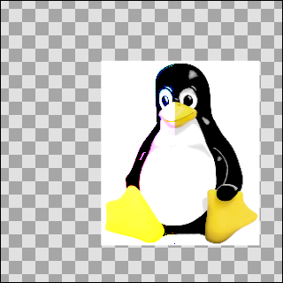

.. _parameters_blend_method  Add:

Add
---

*Describe me*

Precisely: the resulting color is (B + A\*A.alpha\*amount). The
calculation is performed independently on red, green, and blue
components. The resulting color's alpha is B.alpha.

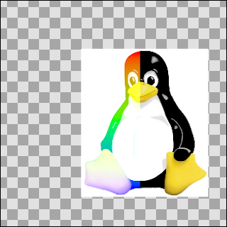

.. _parameters_blend_method  Subtract:

Subtract
--------

*Describe me*

Precisely: the resulting colour is (B-A). The calculation is performed
independently on red, green, and blue components.

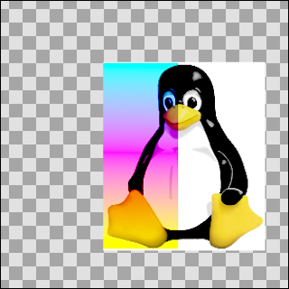

.. _parameters_blend_method  Difference:

Difference
----------

*Describe me*

Precisely: the resulting colour is the absolute value of (B-A). The
calculation is performed independently on red, green, and blue
components.

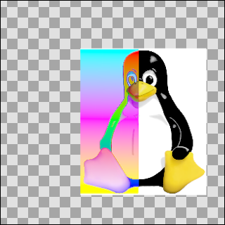

.. _parameters_blend_method  Brighten:

Brighten
--------

*Describe me*

Precisely: for each of the red, green, and blue components, compare A's
value with B's value and use the higher of the pair.

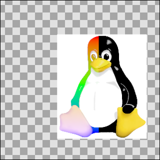

.. _parameters_blend_method  Darken:

Darken
------

*Describe me*

Precisely: for each of the red, green, and blue components, compare A's
value with B's value and use the lower of the pair.

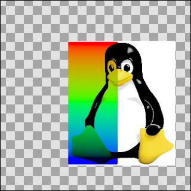

.. _parameters_blend_method  Color:

Color
-----

*Describe me*

Precisely: the resulting colour is obtained by adjusting B to have the
same U and V values as A, while keeping Y the same.

straight.png + synfigtux.png = color.png

As this example looks just like the saturation one, perhaps a yellow
gradient instead of a white one would be more illustrative

yellowgradient.png + synfigtux.png = coloryg.png

.. _parameters_blend_method  Hue:

Hue
---

*Describe me*

Precisely: the resulting colour is obtained by adjusting B to have the
same hue as A.

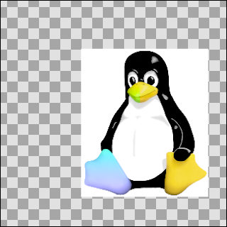

.. _parameters_blend_method  Saturation:

Saturation
----------

*Describe me*

Precisely: the resulting colour is obtained by adjusting B to have the
same saturation as A. Saturation is the magnitude of the `UV
vector <http://en.wikipedia.org/wiki/YUV>`__.

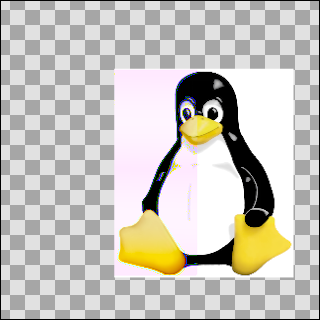

As this example is so similar to the 'Color' blend example, here it is
with a yellow gradient -

yellowgradient.png + synfigtux.png = saturationyg.png

.. _parameters_blend_method  Luminance:

Luminance
---------

*Describe me*

Precisely: the resulting colour is obtained by adjusting B to have the
same Y (luma) value as A, while keeping U and V the same.

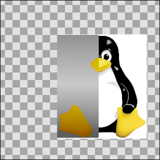

.. _parameters_blend_method  Alpha over:

Alpha over
----------

Layer A act like a mask on B.

Have a look to Doc:Basic_Masking and
|Subtracting_Shapes| tutorials for usage
example.

Precisely : multiply alphas and then straight blends using the amount.

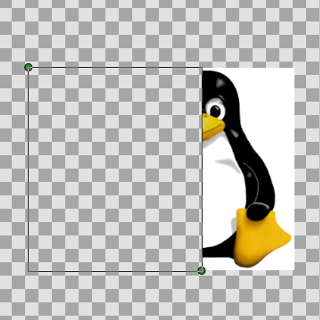

.. _parameters_blend_method  Alpha Brighten:

Alpha Brighten
--------------

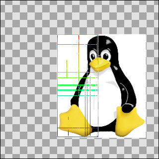

.. _parameters_blend_method  Alpha Darken:

Alpha Darken
------------

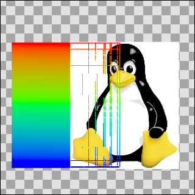

.. _parameters_blend_method  Use cases of the Blend Method Parameter:

Use cases of the Blend Method Parameter
=======================================

.. _parameters_blend_method  Hide behind a shape:

Hide behind a shape
-------------------

|Import_Image_Layer| a picture, add a
|Star_Layer| up of the image, set the Stars Layer's
|Blend_Method_Parameter| to |Blend_Method_Parameter_Alpha_over| and finally check
``invert``.

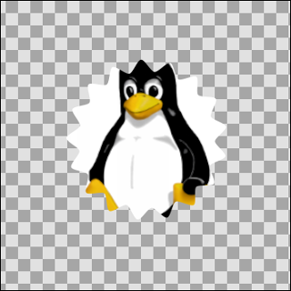

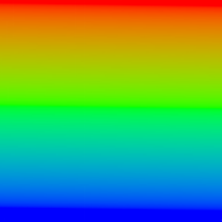
.. |Tux.png| image:: blend_method_dat/Tux.png

.. |Tool_Options_Panel| replace:: :ref:`Tool Options Panel <panel_tool_options>`
.. |Parameters_Panel| replace:: :ref:`Parameters Panel <panel_parameters>`
.. |Amount_Parameter| replace:: :ref:`Opacity <opacity>`
.. |Import_Image_Layer| replace:: :ref:`Import Image <import_image_layer>`
.. |Star_Layer| replace:: :ref:`Star Layer <layer_star>`
.. |Blend_Method_Parameter| replace:: :ref:`Blend Method <parameters_blend_method>`
.. |Blend_Method_Parameter_Alpha_over| replace:: :ref:`Blend Method: Alpha Over <parameters_blend_method  Alpha over>`
