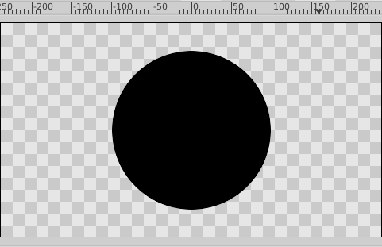
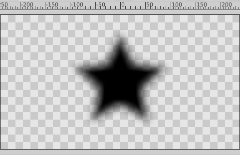
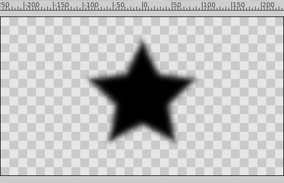
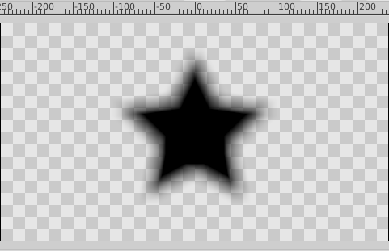
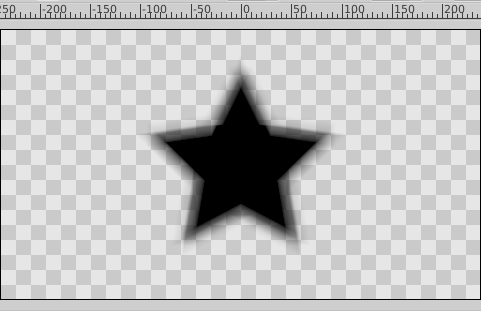
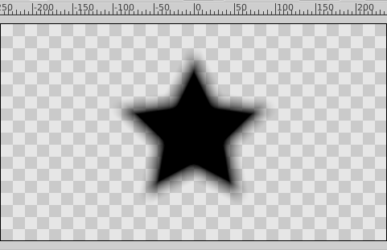
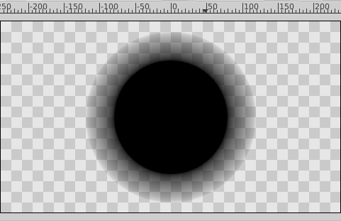
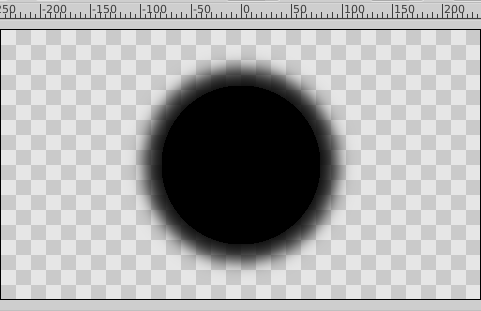
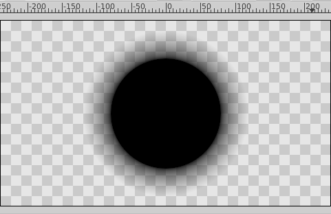

.. _parameters_feather:

########################
Feather
########################

.. _parameters_feather About the feather concept:

About the feather concept
--------------------------

Feather is a float value in points (or whatever unit you have defined in File > Setup > Misc > Unit System) that represents the width of the area that is going to be dissolved at the edge. Feather is the light horny waterproof structure forming the external covering of birds. See `English Feather definition <https://www.wordreference.com/definition/feather>`__.

The Feather parameter is an standard parameter for the following types of layers:

* |Outline_Layer|
* |Region_Layer|
* |Circle_Layer|
* |Polygon_Layer|
* |Star_Layer|
Strangely |Rectangle_Layer| doesn't have the Feather parameter.

When you apply a Feather to any of those layers, then the edge of the shape becomes dissolved and spread out and shrunk the amount that the Feather value indicates.

    Circle with Feather set to 0 points

.. figure:: feather_dat/Circle_Feather_20_0.63.06.png 
    :alt: Circle_Feather_20_0.63.06.png
    
    Circle with Feather set to 20 points

    

.. _parameters_feather Feather's Complementary Parameters:

Feather's Complementary Parameters
-----------------------------------

There is another parameter that works together with the Feather parameter, and which specifies the type of feathering to be used. On Circle layers the parameter is called Fall Off and for the other featherable layers it is called Type of Feather.

.. _parameters_feather Type of Feather:

Type of Feather
---------------
This complementary parameter can be set in Outline Layer, Advanced Outline Layer, Region Layer, Polygon Layer and Star Layer. All the example images below have the same amount of Feather (set to 20 points).

    Fast Gaussian Blur

    Gaussian Blur

    Box Blur 

    Cross-Hatch Blur

    Disc Blur

.. _parameters_feather Fall Off:

Fall Off
--------
That's the type of feather for the Circle Layer. All the example images below have the same amount of Feather (set to 20 points).

    Square Root

    Square

    Sigmond

.. figure:: feather_dat/Circle_Feather_Cosine_0.63.06.png 
    :alt: Circle_Feather_Cosine_0.63.06.png

    Cosine

    Linear

.. |Outline_Layer| replace:: :ref:`Outline Layer <layer_outline>`
.. |Region_Layer| replace:: :ref:`Region Layer <layer_region>`
.. |Circle_Layer| replace:: :ref:`Circle Layer <layer_circle>`
.. |Polygon_Layer| replace:: :ref:`Polygon Layer <layer_polygon>`
.. |Star_Layer| replace:: :ref:`Star Layer <layer_star>`
.. |Rectangle_Layer| replace:: :ref:`Rectangle Layer <layer_rectangle>`