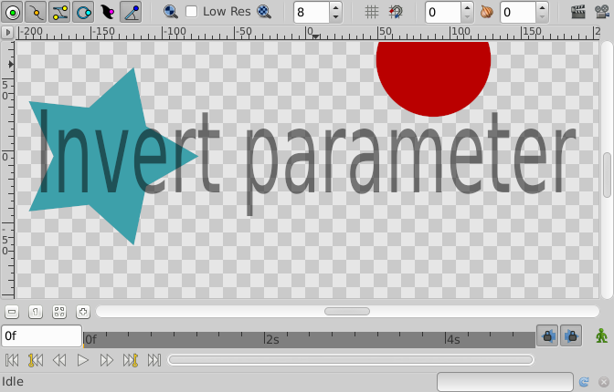
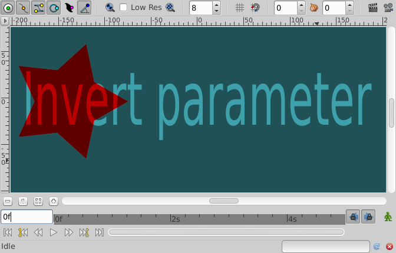

.. _parameters_invert:

########################
Invert
########################

Invert is a boolean property that applies to the following Layers:

* |Region_Layer|
* |Outline_Layer|
* |Circle_Layer|
* |Polygon_Layer|
* |Rectangle_Layer|
* |Star_Layer|
* |Text_Layer|

This parameter inverts the filling of the shape to the outside part of its contour when checked on. Its default value is checked off (shape looks as usual).

A sample of Invert Parameter set to off:

A sample of Invert Parameter set to on:

.. |Region_Layer| replace:: :ref:`Region Layer <layer_region>`
.. |Outline_Layer| replace:: :ref:`Outline Layer <layer_outline>`
.. |Circle_Layer| replace:: :ref:`Cicle Layer <layer_circle>`
.. |Polygon_Layer| replace:: :ref:`Polygon Layer <layer_polygon>`
.. |Rectangle_Layer| replace:: :ref:`Rectangle Layer <layer_rectangle>`
.. |Star_Layer| replace:: :ref:`Star Layer <layer_star>`
.. |Text_Layer| replace:: :ref:`Text Layer <layer_text>`
