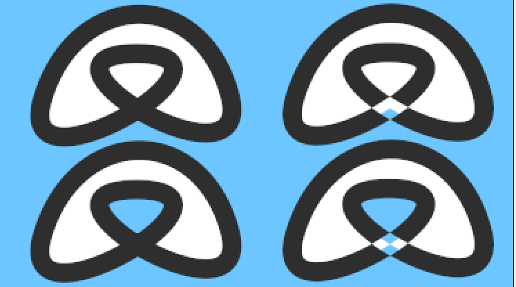

.. _parameters_winding_style:

########################
Winding Sytle Parameter
########################

The Winding Style parameter is available in these layers:

* Outline Layer
* Region Layer
* Polygon Layer
* Star Layer (where it can be used to produce some interesting effects)
It determines the way in which Synfig decides whether a point is 'inside' or 'outside' which coloring the layer in.

The Winding Style parameter has two possible values:

* Non Zero
* Even/Odd
The easiest way to see the distinction is to draw a region which contains a loop inside itself:

    :download:`winding_style.sif <winding_style_dat/Winding_style.sifz>` 

The top two images have their region winding styles set to "Non Zero" and the bottom two have their region winding styles set to "Even/Odd". "Even/Odd" makes the region see-through when it crosses itself.

The left two images have their outline winding styles set to "Non Zero" and the right two have their outline winding styles set to "Even/Odd". "Even/Odd" makes the outline see-through when it crosses itself.

http://dooglus.rincevent.net/synfig/regions.html has notes I made while investigating how region filling works, and describes the Winding Style parameter.

