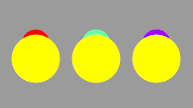

.. _parameters_zdepth:

########################
    Z-Depth
########################

This parameter can be used to change the 'depth' (order) of a layer in
the layer stack, or of a Bone in a |Skeleton_Layer|.

By default, each canvas gives its layers zdepths which depend on their
order in the canvas. The first layer has a depth of 0, the 2nd has a
depth of 1, and so on.

Zdepth may be thought of as an indication of the distance to an
observer: layers with a lower zdepth are 'nearer' to an observer than
layers with a higher zdepth.

The Z Depth parameter on each layer can be used to adjust this default
depth. The value of the Z Depth parameter is added to the layer's
'natural' depth, given by its order in its canvas.

For example, suppose we have 2 layers, first a circle, and then a
rectangle. The circle will have a 'natural' depth of 0, and the
rectangle's will be 1, so the circle will be drawn on top of the
rectangle.

If we use the parameters dialog to set the rectangle's zdepth to -2,
however, -2 will be added to its natural depth of 1, giving a new depth
of -1, and so it will be drawn above the circle.

The parameter can be animated, so that layers change order throughout
the animation.

Here's an example which shows the Z Depth parameter being animated to
bring one circle in front of another at a certain point in time:

|Offset-z-depth-revisited.gif| :download:`source sif
file <z-depth_dat/Offset-z-depth-revisited.sifz>`

.. warning::

   This feature is broken in some cases: See `Bug report #868 <http://www.synfig.org/issues/thebuggenie/synfig/issues/868>`__   -  a layer's Z-Depth parameter animation is not affected by a time offset manipulation of the group is included to.

.. _parameters_zdepth  Too Much Detail:

Too Much Detail
---------------

If you want to see a more complex Z depth order animation and an
explanation to how it was done please watch this animation and this PDF
file.

Animation: http://www.youtube.com/watch?v=YTpSfUthuVE

Project : *complex Z depth order animation by genete* :download:`Zdepth-balls.sifz <z-depth_dat/Zdepth-balls.sifz>`

Explanatory PDF file: http://www.darthfurby.com/genete/synfig/Balls.pdf

Same file but ODT format:
http://www.darthfurby.com/genete/synfig/Ballsv2.odt

