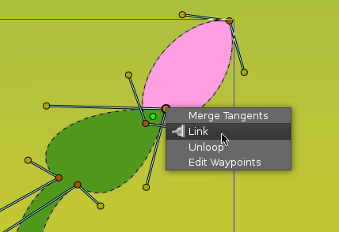
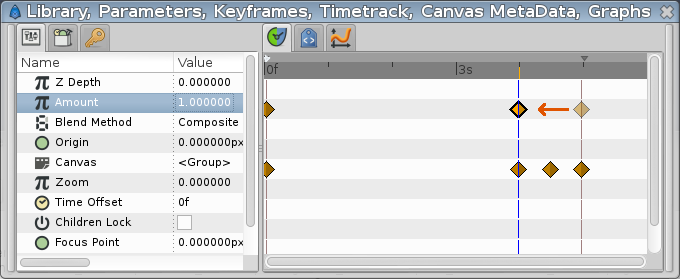

.. _animating_shapes:

########################
    Animating Shapes
########################

.. _animating_shapes  Basic settings:

Basic settings
--------------

In the `previous tutorial <Doc:Creating_Shapes>`__, you have learned to
create shapes with the |Spline_Tool|, in this tutorial
we will learn how to create a simple animation of a growing flower using
`Splines <Doc:Creating_Shapes>`__.

|FlowerTutorial_0.png| 

Start Synfig Studio — a new animation will be
created. If you already have Synfig Studio started, select ``File|New``
in the toolbox.

First, we need to create a gradient for a background. Click on the
outline and fill colors in the |Toolbox| to select the
colors our gradient will have. You can also directly edit the gradient
by clicking the gradient line in the toolbox.

Select the |Gradient_Tool| and drag your cursor
vertically across the canvas to fill it with the gradient.

Next, select the |Spline_Tool| and in the Tool Options
Panel, make sure that only ``Create Region Spline`` is checked. In the
toolbox, set the fill color to green. Draw a kind of triangle with the
Spline tool. To close the shape after drawing the 3 vertices, right
click on the first vertex and choose ``Loop Spline``.

| Now that the trace of the form is closed, you can generate the proper
  form by selecting another tool or by pressing the button with the gear
  icon at the bottom of the |Tool_Options_Panel|.
| |FlowerTutorial_1_Canvas.png|

This will be the base of the stem. You can tweak the tangent handles
(red dots) a bit to make a rounder triangle. With the |Transform_Tool|, right-click on each vertex and select
``Split Tangents``, so the tangent handles of each vertex can be moved
separately.

.. note::
   Shape |Origin_Parameter|, transformation and
   link
   
   Be certain that the shape's origin is set to ``0,0`` ... this will
   save you from headhache in further steps.

We're done with the basic settings.

.. _animating_shapes  Animate the stem:

Animate the stem
----------------

In the Canvas Menu, select the |Caret| icon in the upper
left hand corner, where the rulers intersect, and then select
``Edit|Properties``. Go to the ``Time`` tab, set the ``End time`` to
``6s`` and click OK button.

Click at the beginning of the timetrack (``0f``), then, in the
|Keyframes_Panel| (the one with a key icon) click
the button with a “+” icon (add a new keyframe).
|Keyframe| allow us to *settle down* the scene; i.e. on a
keyframe, every element of the scene will have all its properties
remembered. Click again on the timetrack, at ``4s 12f`` (ie 4.5s at 24
fps). Press the green man at the bottom right of the canvas (or whatever
icon you have there, depending on your icon theme) to switch to the
|Animate_Editing_Mode| (the man is now red).

With the |Transform_Tool|, select the green sprout,
and move the upper vertex up to make a stem. You can play with the
vertex handles to bend the shape a bit if you want.

While you are still at ``4s 12f``, right-click on the stem border, close
to the top, and choose ``Insert Item (smart)``. Do the same on the other
side of the stem. Right click on those new points and choose
``Split Tangents``. Then try to make a shape that looks like the one on
the image, to create the flower bud.

Now if you click on ``2s`` (for example), you'll see that the shape of
the bud is slightly visible, even if the sprout is rather small, and
even if the bud handles are invisible.

Let's say we want the bud to appear only at 3s 12f, and be full size at
4s 12f.

Click on ``3s 12f`` on the timetrack. Now take a look at the
``Parameters`` and ``Timetrack`` panels at the bottom. You'll see that
each parameter in the |Parameters_Panel| matches a
row in the |Timetrack_Panel|. The last parameter is
the vertices list. Click on the small arrow on the left to unfold the
list. You should see something like this:

Each brown diamond (or |waypoints|) stands for a recorded
value (here the vertices positions were recorded at 0f with the
keyframe, and at 4s when we moved some vertices or vertices handles).
The two vertices we added to make the bud are marked with green and red
vertical line on their 0s and 4s waypoints. Right-click on them in the
parameters list, and select ``Mark Activepoint as Off``.

The panel should now look like this, the grayed part being the part
where the bud vertices have no effect on the stem.

For example if you click on ``2s`` or even ``3s`` now, the bud shape is
not visible. It starts to appear only a little after 3s 12f.

However, the shape of the stem may not look very nice during its growth
between 0 and 4s. Make sure you're still in Animate Edit Mode, and tweak
the shape at various moments in time, to get something you like.

The animation of the stem is now finished, but it still lacks the
petals. You can watch a preview of your animation: Go to
``File|Preview``, validate, wait for the preview to be generated, and
watch.

.. note::
   Previews are often pixelated and blurry, but the final
   render will be clean-cut. Higher quality previews are obtainable by
   using higher values for 'Zoom' and 'Frames per second' in the preview
   dialog window.

.. _animating_shapes  Adding the petals:

Adding the petals
-----------------

Now leave the ``Animate Editing Mode`` by clicking on the red circle at
the right bottom of the canvas.

Change the fill color to pink, and create a petal with the Spline Tool.
You'll notice that the green |handle| that allows easy
movement of a shape is at the center (|Origin_Parameter| : ``0,0``) of the canvas. Select all the
vertices of the petal with ``Ctrl|a`` and move them close to the green
handle (with the Transform Tool), as shown.

Then drag the green handle very close to the top of the bud. Hit
``Ctrl|a`` again to select all vertices of the petal and tweak it a bit
with Rotate Tool. Also, in the |Layers_Panel| select
the petal layer and put it **under** the stem layer. Click on the petal
to select it, then ctrl-click on the stem. Both objects should be
selected.

Now click on the vertex at the top of the stem and ctrl-click on the
green handle of the petal (both should appear in a lighter color, as
they are selected). Then right-click on the stem top vertex, and select
``Link``. The petal will move a bit as the green handle is snapped on
the stem vertex.

Now that there's a link between the petal and the top of the stem, when
the top of the stem moves, the petal will follow the move. (And if the
green handle of the petal moves, the top of the stem will move, but we
don't want to do that here.)

.. note::
   I'm going mad, can't link the stem and the petal!
   
   The problem is trivial. The ‘origin’ parameter of ‘Stem’ and ‘Petal’ layers 
   is different. They should be same, because you’re linking origin of layer 
   with some vertex that has its own layer’s origin.
   Set both origins to the same values (0,0), then link.

On the Layers Panel, select the newly created Petal layer and duplicate
it (with the third button, on the bottom of the Layers Panel). On the
canvas, press ``Ctrl|A`` to select all the vertices of the duplicated
petal, and move them a little, so the petals are no longer overlaid.
(Don't move the green handle, just the orange ones). Repeat the process
several time, to get something looking like this image.

Note that the duplicated petals are also linked to the stem. If you go
back to the first keyframe, you'll see that the petals are visible. We
don't want that. We want the petals to appear and bloom almost at the
end of the growth.

.. _animating_shapes  Hiding the petals:

Hiding the petals
-----------------

Let's say we want the petals to appear a little after 4 seconds in the
animation, and be full size at 5 seconds, instead of being visible and
full size all the time.

Switch to ``Animate Editing Mode`` again by clicking on the green circle
at the bottom right of the canvas. But if we will go to ``4s`` and
modify them, then they also change at ``5s``. Because the shape/position
of the petals is not fixated at this moment of time by any waypoints or
keyframes. That means that we need a keyframe at ``5s``. On the
timetrack, click to place the cursor at 5 seconds. On the |Keyframes_Panel|, click on “+” to add a new keyframe.

Now click on ``4s``, and on the Layers Panel, select all the petals
layers (with ctrl+click), then press ``Ctrl|A`` to select all the petals
vertices. Scale them down with the |Scale_Tool|, and move
them, so they are hidden by the stem, as shown.

From 4s to 5s, the petals will now appear and bloom. But notice that we
have a keyframe at 0s which also remembers petals shape. That makes the
problem — the petals are still visible from the first keyframe to the 4s
keyframe. We could either make the petals tiny and hidden tweaking their
size on every frame from 0s to 4s, or we could make them invisible on
this interval.

Let's choose the second solution. To make things easier, we are going to
|Group| the petal layers into an |Group_Layer|. With all the petal layers selected, right-click
on them on the Layers Panel and select ``Group``. You can rename the
layers to make things more understandable.

Select the “Petals” Group Layer and jump to the first keyframe. In the
Parameters Panel, set the ``Amount`` value to ``0``. The petals are now
invisible on that keyframe. Note that two waypoints were added in front
of the ``Amount`` parameter, one at 0s and the other at 5s. Drag the 5s
waypoint to 4s, so that the opacity of the petals will be 1 at 4s.

There is still one problem left: from 0s to 4s, the opacity of the
petals slowly increases, making the petals visible when they shouldn't.
To solve this, we will change the Amount interpolation method. Right
click on the Amount waypoint at 0f, and select ``Edit``. A new dialog
will appear, in which you can choose the In and Out interpolation. Set
the Out Interpolation to ``Constant``.

.. note::
   Tip
   
   You can also change waypoint Out interpolation by
   right-clicking on it and selecting ``Out|Constant``.
   
This means that*after* that waypoint, the Amount value will remain constant, until
another waypoint is encountered. So from 0f to 4s the Amount value will
be equal to 0, and at 4s it will suddenly changed to 1, and make the
petals visible, as expected. Alternatively, we could have achieved the
same effect by setting the In Interpolation of the waypoint at 4s to
``Constant``.

Notice how (half of) the waypoint changes from a green circle (meaning
smooth animation of the amount parameter) to a red step (meaning that
the amount parameter is suddenly stepped).

Now you're done. The stem grows for 4.5 seconds and then stays still the
last 1.5 seconds. The petals are hidden until 4 seconds, and then grow
quickly between 4 and 5 seconds, and stay still the last 1 second too.

Click on ``File|Render`` to render your animation. Select any format you
want, and ensure that ``Use current frame`` option is unchecked
(otherwise, one frame only will be rendered).

You can :download:`download the project <animating_shapes_dat/FlowerTutorial.sifz>` used for the screenshots.

.. _animating_shapes  What's next:

What's next
-----------

Synfig Studio have a |Skeleton_Layer|, in
the `next step <Doc:Basic_Bone_Tutorial>`__ you will learn how to setup
a basic skeleton.

