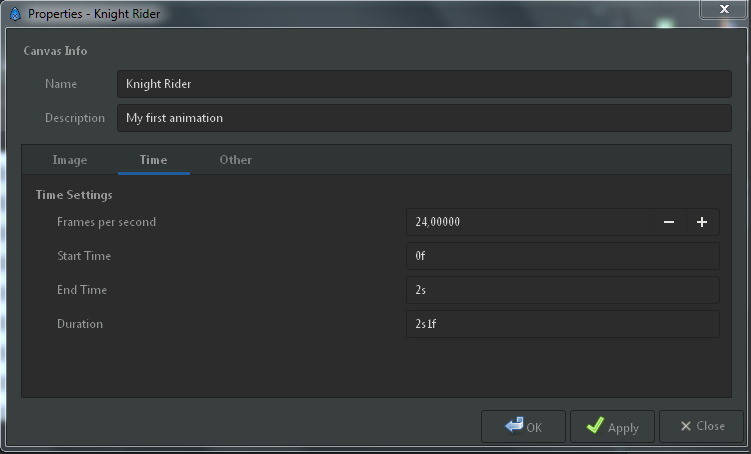
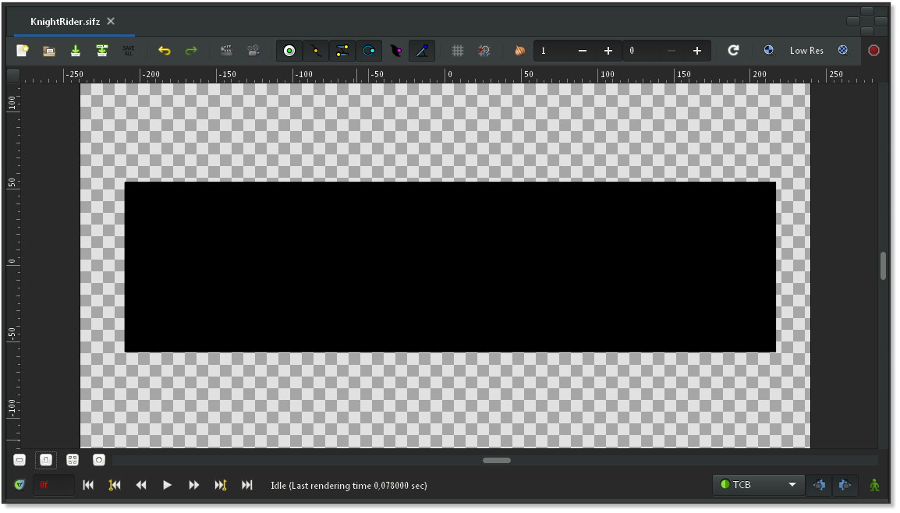
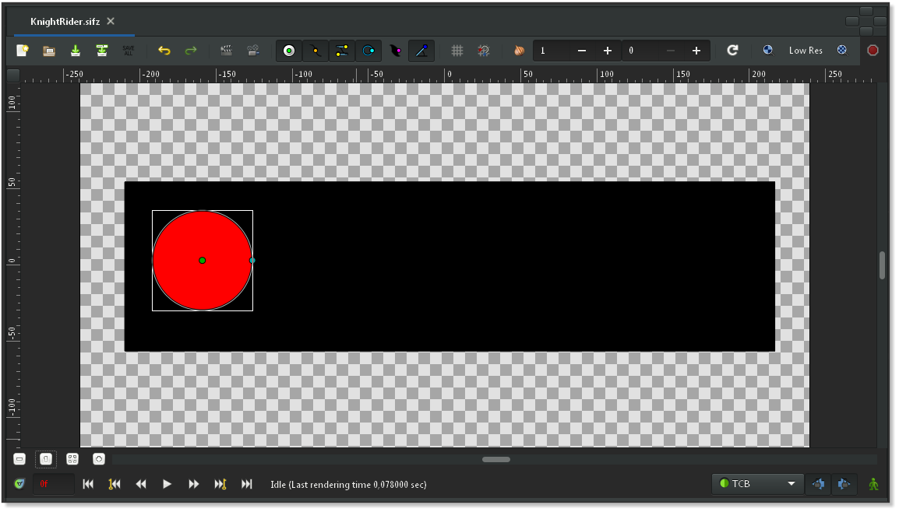
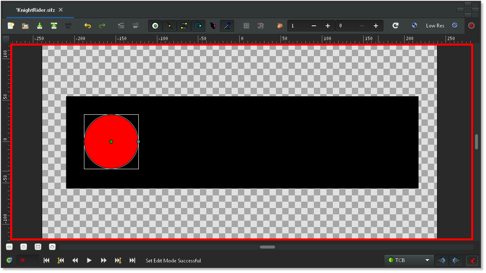
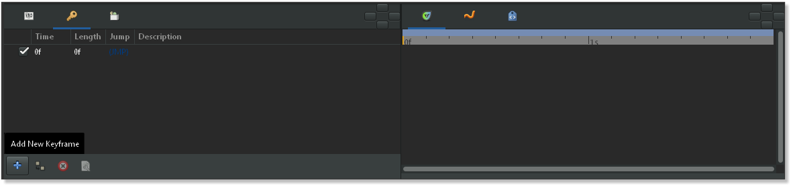
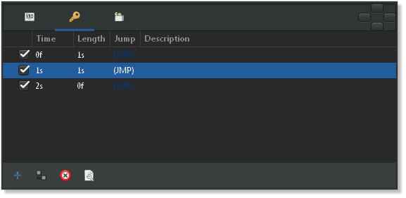
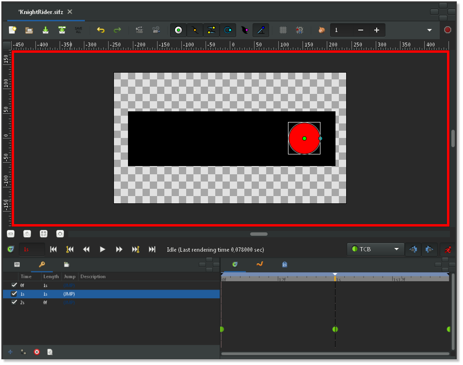
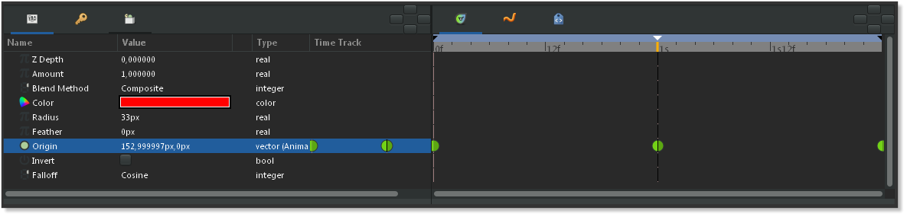
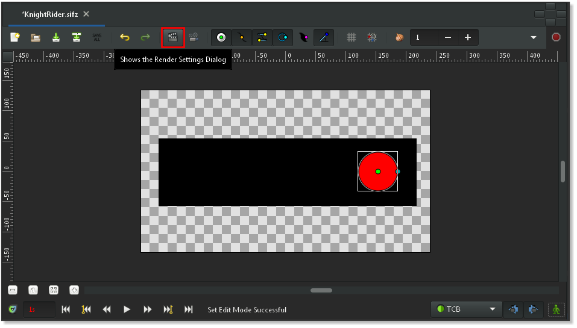
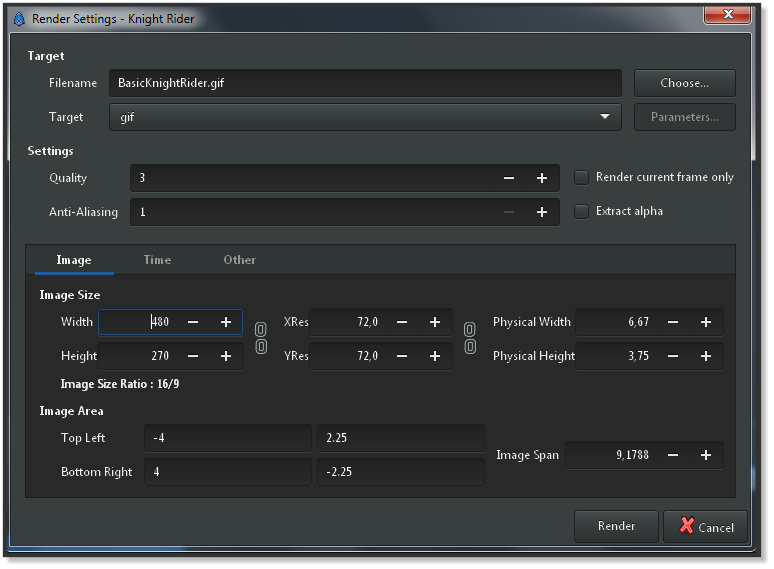

.. _animation_basics:

########################
    Animation Basics
########################

Introduction
------------

Creating an animation in Synfig Studio is really easy. It basically
means to change a drawing — you just need to create the first stage and
last stage of a change, and Synfig takes care of the steps in between.

Let's look at a simple example. Consider a moving light like the one at
the front of the Knight Rider car. Drop the realism, you get a circle
moving from left to right and back. In other words, you need to create
three 'steps' or 'stages':

#. The circle is on the left.
#. The circle is on the right.
#. The circle is back on the left.

Setting up the workspace
------------------------

Let's do it. Start Synfig Studio. A new file is created at the start
automatically . Click the `caret menu <Canvas_Menu_Caret>`__ (between
the horizontal and vertical rules, in the top left hand corner of the
canvas), then select ``Canvas|Properties`` or select
``Canvas|Properties`` from the menu. The
`Canvas\_Properties\_Dialog <Canvas_Properties_Dialog>`__ will appear.

Give a name and description for your canvas, then click ``Apply`` (don't
click ``OK`` yet — we're not quite done with the Properties dialog). Go
to the ``Time`` tab and make sure to edit ``End Time``. Change “5s” to
“2s” — that will make our animation 2 seconds long.

.. note:: Good to know: Synfig and time representation
   Synfig Studio can display the time in various formats (Timestamp). 
   You can configure the Timestamp in Preferences. If the endtime is not
   displayed in seconds then go to <tt>Edit|Preferences|Misc</tt> and 
   change the Timestamp into: (HHh MMm SSs) FFf. 
   More about the Timestamp and its settings can be found
   here ([Preferences_Dialog#Time_Stamp]).
   

   
   Canvas Properties Dialog

Now click “OK”, select the `Rectangle Tool <Rectangle_Tool>`__ and
create a simple black rectangle that will serve as our background. It's
not necessary to make it cover the whole canvas.

   
Now we need a circle. Change the fill color to red, select the `Circle
Tool <Circle_Tool>`__ and create a circle. It doesn't matter if it's not
perfect: You can edit it. Select the `Transform Tool <Transform_Tool>`__
and click the circle. It will go into an editing mode which is easy to
detect by the small green dot in the middle and the white rectangle
around it. You can move the circle by grabbing it on its green dot (the
*Origin*) in the middle.

   
These are the first steps to draw an object and to move it, but not an
animation yet, you may say. Indeed. Let's have a look how this works.

Adding movement
---------------

In the beginning, you entered a value of 2 seconds in the Properties
dialog. Because the length of your animation is non-zero, your canvas
window (the one where you draw) has a grey time slider at the bottom,
the `Timebar <Timebar>`__. You can click on it, and a small orange
indicator will appear indicating your position in time. Try clicking in
several places on the time slider and notice that the entry field on the
left of the time slider is changing its values to something like “12f”,
“1s 15f”, etc. You can set your position on the time slider by changing
values in that field. For example, if you enter “1s” and press
``enter``, the orange indicator will move in the middle of the time
slider, and entering “2s” will move it to the end of the time slider.

.. note::
   At 2s the orange indicator won't be visible. That's because
   “2s” is at the far right boundary of the time slider, putting the
   indicator out of view.

You may notice that nothing changes on the canvas at this point. Return
to “0s” and switch to `Animate Editing Mode <Animate_Editing_Mode>`__ by
clicking the green man button to the right of the gray time slider. The
canvas will display a red outline; it reminds you that changes to your
objects now affect your animation at the time shown in the time slider.

In animate editing mode, every change to your objects creates a
`waypoint <Waypoint>`__ that associates the changes with the current
time. As you will see, Synfig can create smooth intermediate changes
between waypoints, and you can even choose the way in which the
intermediate changes take place. You will probably find it helpful to
associate some or all of your waypoints with `keyframes <Keyframe>`__.

Previously, three “steps” or “stages” were mentioned. These are
represented by `keyframes <Keyframe>`__. (Just in case you're familiar
with video encoding: No, it's not the same!) A keyframe is an image in
time where something important happens with your objects.

.. note:: 
   
   Default keyframe at 0f
   
   When creating a new project, a default
   ``keyframe`` is already set at 0f. If for any reason you do not have
   this default keyframe, go to the `Keyframes\_Panel <Keyframes_Panel>`__
   — click on the little tab with the small key icon in the bottom window —
   to edit keyframes. Now press the small button with the “plus” sign and
   you should get a new entry in the list displaying ``0f, 0f, (JMP)``.

   Keyframes Panel and Time Track Panel

Now, go to the “1s” mark in the time slider. The small orange indicator
should move there. Then add another keyframe by clicking the small plus
sign. Repeat the process with the time slider indicator set to “2s”
(it's at the end of your animation). You should now have three keyframes
in the list.

     

The s's and f's: Understanding the Timeline
-------------------------------------------

By now, you may have figured out what those mysterious “1s 10f”-type
marks represent. They indicate a specific point on the timeline,
expressing a location in terms of seconds (s) and frames (f).

By default each second is divided into 24 frames, much like a meter on a
measuring tape is divided into 100 centimeters. The frame markings begin
at zero (0) and go up to 24, whereupon a new second is entered and the
framecount returns to zero.

For example, when five whole seconds and three frames have passed, using
this timeline notation would be “5s 3f”.

The Keyframes Panel
-------------------

The `Keyframes Panel <Keyframes_Panel>`__ is rather easy to understand.
It displays ``Time`` which is basically the start time, ``Length`` which
is self-explanatory, ``Jump`` which we'll cover next, and
``Description`` which is, again, self-explanatory.

You might be wondering about the entries called ``(JMP)``. In fact,
these are links just like web links: click them, and the indicator in
your time slider will jump to the correct time.

You can use this to edit your image for a given moment in time. For
instance, you can now jump to the first second “1s”, and move the red
circle to the right. There! You made your first movement, your first
animation with Synfig!

   Canvas Window, Keyframes Panel and Time Track Panel

Wondering where the animation is? Just click to an arbitrary position on
the time slider: You will note that the red circle is in a new position,
one that you didn't specify! So what happened? Synfig figured out what
you would like to do, namely move the circle, and drew all the images
between these states. Each image will later make a frame in your
animation and the circle will appear to be moving.

Note that you don't need to go to the last keyframe at “2s” and move
your circle back to the left. Keyframes make Synfig remember the image
states at particular times. That's why when we modified the circle's
position at “1s”, it stayed on the left at “2s” (as well as at “0s”). If
you switch back to the Parameters Panel, and look at the `Timetrack
Panel <Timetrack_Panel>`__ you will see that three orange diamonds (or
green dots depending on the default interpolation) appeared on the right
of the ``Origin`` parameter. Those are called `Waypoints <Waypoints>`__,
and they represent times at which object's parameters, like location or
color, are instructed to take on specified new values.

   Parameters Panel and Time Track Panel with green Waypoints

Rendering your animation
------------------------

Before you can see your animation, you need to render your work. There
are two ways to do so: using the Synfig Studio (what you have been using
so far) or the command-line program called “synfig”.

Let's try the first way. Leave the `Animate Editing
Mode <Animate_Editing_Mode>`__ by clicking on the red man icon in the
timeline editing widget, and save your file; for instance under the name
“BasicKnightRider.sifz”. Then go to menu in the Canvas Window (`Canvas
Menu Caret <Canvas_Menu_Caret>`__ button in the upper left corner) and
select ``File|Render`` or click on the render icon. Change the filename
to “BasicKnightRider.gif” in the same location where you saved
“BasicKnightRider.sifz” and choose ``gif`` target format instead of
``Auto``, then click ``Render``. Depending on your processor speed it
should take a few moments, but finally the image window status bar
(located on the bottom of the window) should say “File rendered
successfully”.

   The Render Icon

   Render Settings

.. note::
   The “magick++” target (if it is available) produces much
   better gif files than the “gif” target because it can optimize the
   palette for the image. 
   
Open BasicKnightRider.gif in Firefox or another
application that is able to show animated gif's. However, Firefox will
replay the GIF all the time which makes your short animation a rather
long one. If you're now seeing a red circle moving from the left to the
right and back, congratulations! You just made your first animation!

.. note::
   You can also preview your animation. Press the “caret” menu
   button in the upper left corner of the Canvas Window and choose
   ``File|Preview``. 

If you would rather use the command line instead of
the menu to render your animation, then open a terminal (on Windows, go
to ``Start|Run``, type ``cmd`` and press ``enter``), change to the
directory you saved the file in, and type something like this:

``synfig -t gif BasicKnightRider.sifz``

A few messages appear that don't matter right now. Depending on your
processor speed it should take a few moments, but finally a line like
this will appear:

``BasicKnightRider.sifz ==> BasicKnightRider.gif: DONE``

Then you are done and can view your animated gif using Firefox or
another program as mentioned above and it should look like this.

   Rendered Animation

Conclusion
----------

Of course, the position of an object is not the only thing you can
change with Synfig Studio. Other possibilities include its size, its
outline, its color, etc. Synfig comes with several example files that
should let you dig deeper into the possibilities.

Now, let's continue with the next manual chapter: `Adding
Layers <Doc:Adding_Layers>`__

You can download the project used : 
:download:`BasicKnightRider.sifz <animation_basics_dat/BasicKnightRider.sifz>`

