.. _bones_cutout:

########################
   Basic Bone Tutorial
########################

 |bone.gif|

.. _bones_cutout  Introduction  :

Introduction  
------------------

In this tutorial we are going to rig an arm with
fixed joints using the |Skeleton_Layer| and three
bones. The arm consists of three parts: the **upperArm**, the
**lowerArm** and the **hand**. (pic.1) Each part is grouped in its own
layer and the three groups are again grouped in a layer that is called
**arm** (pic.2). 

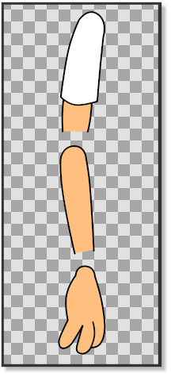

   PICTURE 1: Three parts of the arm
   
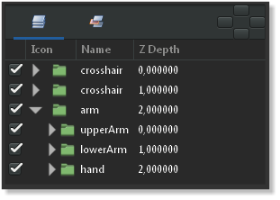
      
   PICTURE 2: The layers  

.. _bones_cutout  Prepare the joints:

Prepare the joints
-------------------
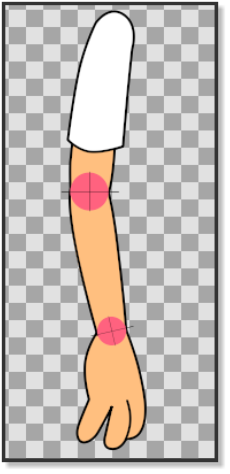

   PICTURE 3: Joints

Before we start rigging the arm we have to prepare
it to make sure that the joints properly rotate.

In *picture 1* we can see that the lower side of the upper arm is
straight and does not have an outline, while the upper part of the lower
arm has an outline that is curved. The bottom part of the lower arm does
not have an outline and is also straight. The joint of the hand is also
curved with an outline.

To make sure that the joint parts of the arm rotate correctly, we made
them with the help of a couple of crosshairs
|Basic_Bone_Tutorial#Tip_for_making_a_crosshair| (picture
3). In *picture 4* and *picture 5* we can see how the horizontal
crosshair line matches the straight line of the bottom of the upper arm
and at the same time the outline of the circle of the crosshair matches
the top curved outline of the lower arm.

The same principle is applied to the hand and the bottom part of the
lower arm. The crosshairs also mark the centre of the rotation point
that will later be used when placing the bones. Before placing the bones
we can align the |Group_Transformation_Widget| (press control and move the left
corner handle of the |Group_Transformation_Widget| to move it.) of the **lowerArm**
group and the **hand** group with the crosshairs of the elbow and the
wrist to check if the joints rotate correctly.

| Don’t forget to bring the arm into its original position by pressing
  undo. (Don’t worry if the hand does not rotate with the elbow when you
  check the elbow joint by using the |Group_Transformation_Widget|.)
  
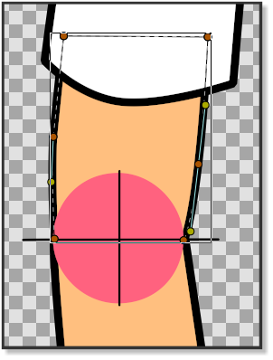

   PICTURE 4: Joints align
   
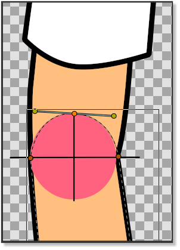

   PICTURE 5: Joints align     
  

.. _bones_cutout  Adding the bones:

Adding the bones
----------------

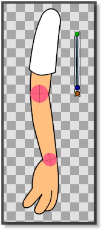
   
   PICTURE 6: Adding bone   

| Now it’s time to add a |Skeleton_Layer| that will
  provide the bones we need to rig the arm.

| Right-click on any layer in the |Layers_Panel| and
  choose ``New Layer -> Other -> Skeleton``. A new |Skeleton_Layer| (pic. 7) will appear in the |Layers_Panel| alongside with a small bone in the canvas
  (pic.6). Put the |Skeleton_Layer| above the **arm**
  group if it is not already there. The green handle of the bone is the
  origin of the bone and is used to move the bone in place and is also
  its centre of rotation. The blue handle is used to rotate the bone.
  The orange handle determines the lenght of the bone is used to stretch
  the bone and its contents. The first bone is the parent bone and
  should be moved toward the shoulder and stretched so that it almost
  reaches the outlines of the first crosshair of the elbow. Right-click
  on any of the handles of the parent bone and select
  ``Create Child Bone``. Move the green origin point of the child bone
  so that it matches the crosshair of the elbow and stretch it until it
  almost reaches the crosshair of the wrist. Right click on any of the
  handles of the child bone and create another child bone. Move the
  green origin point of the second child bone so that it matches the
  crosshair of the wrist (pic.8). Stretch the bone until it reaches the
  end of the fingers. 
  
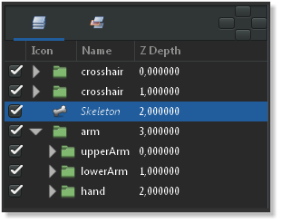

   PICTURE 7: Adding skeleton layer
   
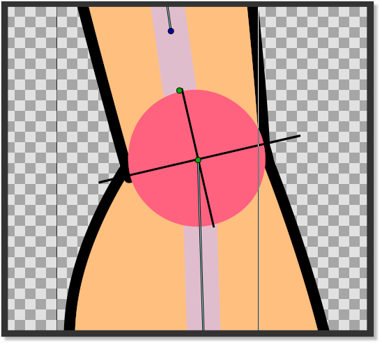

   PICTURE 8: Green origin point hand
   
 
.. _bones_cutout  Attaching the bones:

Attaching the bones
-------------------

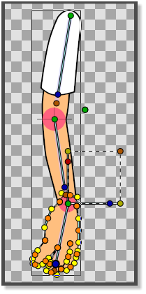

   PICTURE 8: Attaching hand to second child bone
   
Now that the |Skeleton_Layer| is in place we have to attach the bones to the
parts of the arm.

In the |Layers_Panel| click on the **upperArm** group,
right-click and ``Select All Child Layers``. Then press ``ctrl|A`` in
the canvas window. With everything in the **upperArm** group
highlighted, ``ctrl``-click on any bone in the canvas window and
right-click on any of the handles of the parent bone and click
``Link to Bone``. The **upperArm** group is now linked to the parent
bone. Go the |Layers_Panel| again and select the
**lowerArm** group. Right-click and ``Select All Child Layers``. Press
``ctrl|A`` in the canvas window and ``ctrl``-click on one of the bones.
Then right-click on any of the handles of the first child bone and
select ``Link to bone``. The **lowerArm** group is now linked to the
second child bone. In the |Layers_Panel| select all the
child layers of the **hand** group and press ``ctrl|A`` in the canvas
window. ``ctrl``-click on any bone and then right-click on any of the
handles of the second child bone and select ``Link to bone`` (pic.8).

The hand is now linked to the second child bone and the entire skeleton
is now linked to the arm.

It is worth to note for new users that in case the bone is linked to an
image, selecting all its handles and linking them to the bone could lead
to an initially unpredictable behavior. If we need for example to apply
only a rotation around the pivot point defined by the bone, it is
necessary to select only the green handle that defines its position.
Then use the blue handle of the bone to apply the rotation.

| 

.. _bones_cutout  Tip for making a crosshair:

Tip for making a crosshair
--------------------------

| Making a crosshair in Synfig is easy. Draw a circle. Draw the outlines
  of a square and align them with the circle. Draw an X using the
  corners of the square as a reference. Delete the square. Group the
  circle and the X. Rotate 45 degrees using the |Group_Transformation_Widget|. 
  
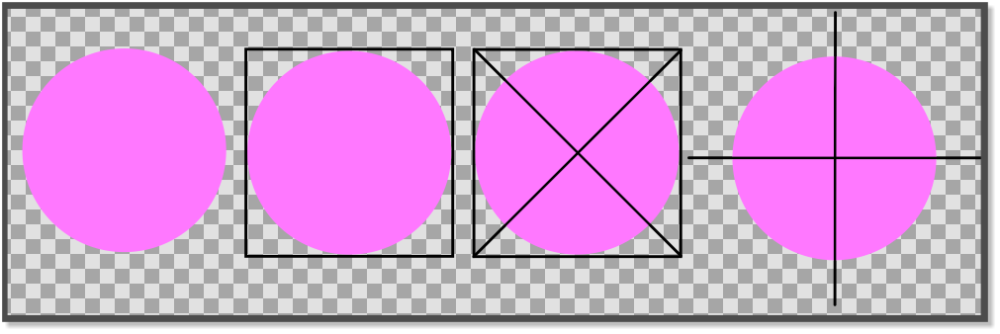

   PICTURE 9: Drawing a crosshair

.. _bones_cutout  Project file:

Project file
------------

The sif file containing the parts of this tutorial can be found
:download:`here <bones_cutout_dat/Rigarm.zip>`

.. _bones_cutout  Explanation n°2 additional:

Explanation n°2 additional
==========================

.. _bones_cutout  To transform 2 sticks into 1 leg:

To transform 2 sticks into 1 leg
--------------------------------

**The top stick is a “thigh”, the bottom stick is a calf.**

-  0: 2 identical sticks + a crosshair.

-  1: The 2 sticks touch edge to edge to form a crosshair.

-  2: The 2 sticks without crosshair of flesh color.

-  3: The 2 sticks with crosshair without color.

-  4: This mark must be used.

-  5: To cut the upper limb.

-  6: Like here.

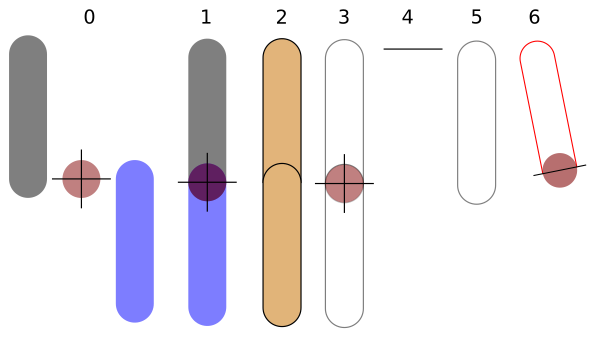

-  7: Then the limb must be merged (full).

-  8: With the cut part.

-  9: Result.

-  10: Same for bottom limb.

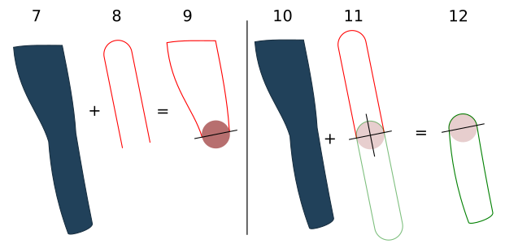

-  13: The only part not to be merge is the one where the circle (blue)
   it is the crosshair that should not be touched.

-  15: Then the rotation will be correct.

-  16: To be able to do any rotation.

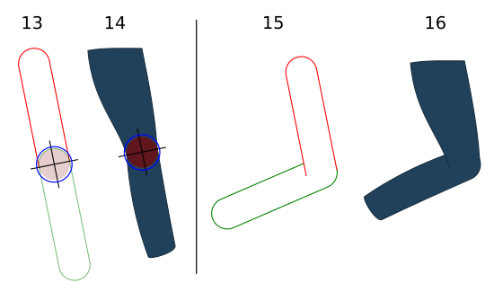

-  17: Limb of the top.

-  18: Limb of the bottom.

-  21: Limbs in movement (detached).

-  22: Limbs in movement (attached).

-  23: The leg finished with the crosshair.

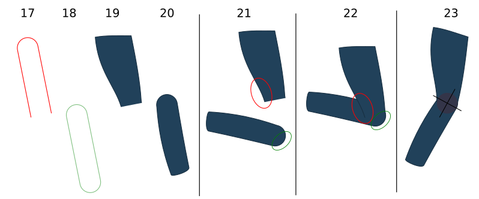

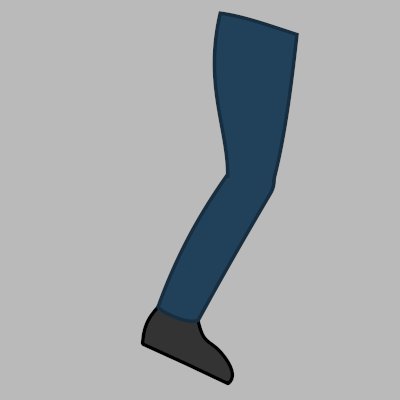

   Animated Leg.

.. admonition:: Important
The crosshair must stay with our 2 sticks, for the duration of the
limb's creation.

Now you are ready for the **last tutorial** in this section. Hang on!

.. _bones_cutout  Project File:

Project File
------------

The zip file containing the parts of this tutorial can be found here:
:download:`Crosshair-leg.zip <bones_cutout_dat/Crosshair-leg.zip>`

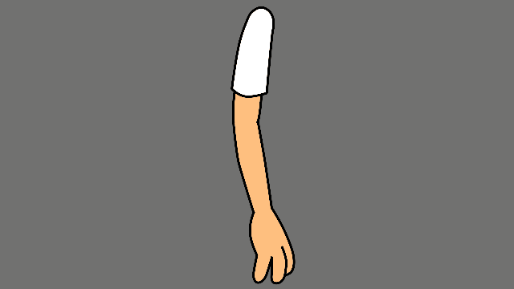

.. |Skeleton_Layer| replace:: :ref:`Skeleton Layer <layer_skeleton>`
.. |Group_Transformation_Widget| replace:: :ref:`Group Transformation Widget <group_transformation_widget>`
.. |Basic_Bone_Tutorial#Tip_for_making_a_crosshair| replace:: :ref:`crosshair <bones_cutout  Tip for making a crosshair>`
.. |Layers_Panel| replace:: :ref:`Layers Panel <panel_layers>`