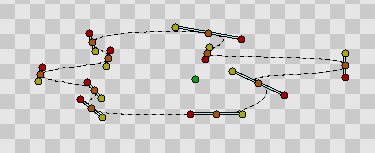
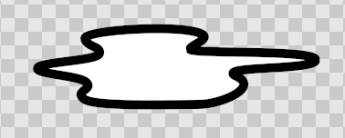
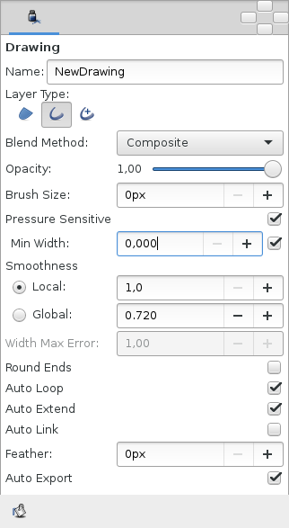
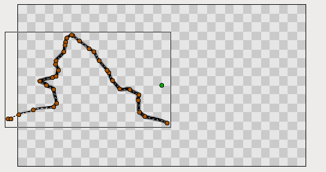
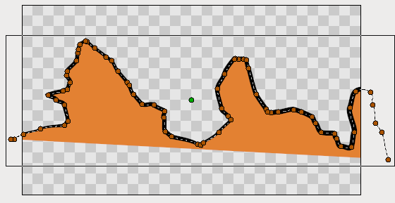
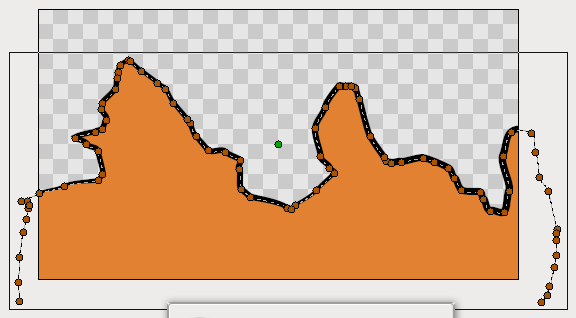
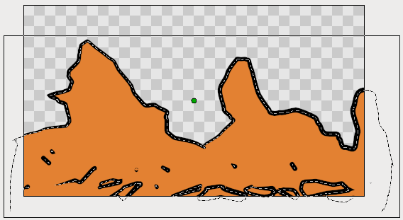
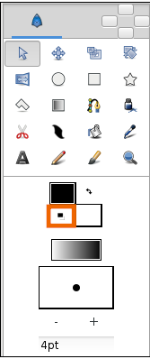

.. _creating_shapes:

########################
    Creating Shapes
########################

.. _creating_shapes  Introduction:

Introduction
------------

Basic |Primitive_Layer| such as
|Circle_Layer| or |Rectangle_Layer|, that we
have learn to work with |previous_tutorial|, are all
great but they are pretty much geometrically inflexible. What about
creating more complex shapes? To do this, we use the |Spline_Tool|.

.. _creating_shapes  Spline Tool:

Spline Tool
-----------

In Synfig, the construct for describing shapes is called a Spline. This
is roughly analogous to a “path” in other programs, except that it is
strictly a `cubic hermite
spline <https://en.wikipedia.org/wiki/Cubic_Hermite_spline>`__.

|Reset Colors button in the Toolbox| 

Before we start with the Spline
tutorial, let's look at some additional notes on how Synfig works. When
you click on the |Spline_Tool|, you will see that the
handles from your currently selected object (if there was one) will
disappear, but the layer(s) will still remain selected in the |Layers_Panel|. This is normal. Anything you create with the
Spline Tool will be inserted above the currently selected layer. Keep in
mind that if you want to insert a shape somewhere, you should select
where you want to insert it before you go into the Spline Tool —
changing the selection afterward will automatically swap you back to the
Transform Tool.

Now, go ahead and click on the ``Reset Colors`` button in the lower left
corner of the FG/BG color widget in the |Toolbox|. This will
reset us back to the default black and white. Also, set the line width
([Spline Tool#Options]) to something nice and thick — 10pt should do the
trick.

After you switched to Spline Tool, take a look at the |Tool_Options_Panel|. Make sure that only ``Create Region``,
``Create Outline`` and ``Link Origins`` are checked.

Clicking with your mouse in the canvas will place vertices. While you
are placing a vertex, you can drag out its tangent by dragging the
mouse. Do this over and over, and you construct a Spline.

Keep in mind, however, that during this construction, there is nothing
stopping you from just moving it if you don't like where you placed a
vertex or a tangent. Honest! If you want to remove a vertex, right click
on it and select ``Delete Vertex``. Want to split the tangents? Right
click on the tangent and hit ``Split Tangents``. Want to loop the
Spline? Right click on the first vertex and select ``Loop Spline``.

When you are finished placing vertices, you must exit construction mode
in order to actually create the Spline layer(s); there are 2 ways to do
this:

#. Switch to another tool.
#. Press the ``Create`` button at the bottom of the Tool Options Panel
   (it's the icon that looks like a gear).

For now, just go ahead and switch to the |Transform_Tool|, because we are done with the Spline Tool.

.. _creating_shapes  Editing Splines:

Editing Splines
---------------

Ok, we now have a nice pretty white region with a thick black outline.
Since we checked ``Create Region`` and ``Create Outline`` in previous
steps, you'll notice that there are two layers that we have created —
the |Outline_Layer| and the |Region_Layer| in the
Layers Panel. Despite the fact that they are two separate layers, their
vertices parameter has already been |Linking| — so you can
select either one and move its handles around and the other one will
also change.

If you want to manipulate the vertices *after* you have created the
layers, it is very easy to do so. Just click on one of the layers and
have at it. If you want to remove a vertex, right click on it and hit
``Remove Item (smart)``. Want to insert a point somewhere? Right click
on the segment where you want to insert something and hit
``Insert item (smart)``.

This may appear to be leading to a mess of layers. And yes, if you
aren't using the software properly, that is exactly what you will get.
But there is a way to make this more sane. As mentioned in the |previous_tutorial|, you can |group| layers into
hierarchy.

One quick thing to mention before I finish up. You can change the width
of an outline at each vertex. You do this by selecting the outline layer
(NOTE: you must select the Outline Layer, the Region Layer has no width
data) and tweaking with the width handles. By default, these are masked.
To show them, press ``Alt+5`` or click ``Toggle width handles`` button
at the top of the canvas window (the fifth one from the left). Repeat to
hide them again. You can also see other things to mask via the |Canvas_Menu_Caret|: ``View|Show/Hide Handles``.

.. _creating_shapes  Using tablet to draw shapes:

Using tablet to draw shapes
---------------------------

If you have a `graphic
tablet <http://en.wikipedia.org/wiki/Graphics_tablet>`__ you can use
Draw Tool to create Splines.

Synfig Studio supports pressure sensitivity, but you need to configure
it first. Go to ``File|Input Devices...`` from toolbox menu. In the
``Input`` dialog find your tablet's stylus device and set its ``Mode``
to ``Screen``. Click ``Save`` and then ``Close``.

Now grab your stylus, create a new file and click on the Draw Tool
button in the toolbox. Set the default line width value to be big enough
— say, 15pt — otherwise you will not notice any pressure sensitivity
effect. Choose brown as the default fill color
([New\_Layer\_Defaults#Brush\_Colors]).

.. note:: Steps above should be done with the stylus of your tablet,
   not the mouse. Synfig Studio remembers settings for each input device
   independently. That's why if you set those options with your mouse
   device they will not have any effect when you switch to stylus. 

In the Tool Options Panel, make sure that you have the same options as shown on
the screenshot below.

Now let's draw some thing like a curvy mountain background. Start
drawing a line from the left border to the middle of the canvas. Try to
vary your stylus pressure while you are drawing. Stop near the center of
the canvas. This is your first line. Notice the new outline layer
created in the Layers Panel.

Point your stylus at the last handle of your new Spline and continue
drawing to the right border of the canvas. When you finish, look at the
Layers Panel again. There's still only one outline layer. Synfig Studio
is smart enough to figure out that you don't need a new outline layer
and properly extends the last one. You can extend the Spline from both
ends, but if you start drawing from any other place of the canvas a new
outline layer will be created. Though your first line will remain
selected and nothing stops you from extending it later.

Back to our artwork. In the Tool Panel hit the button with the bucket
icon to fill the outline we just created. A region layer will appear at
the top of the layer we are working with. Select the outline layer and
press the ``Raise Layer`` button in the layers panel to put the outline
layer on top of the region.

Extend a line from both sides down to the corners of the canvas to make
the fill appear at the bottom. Great.

Go ahead and add a few more lines on top of the filled area to give it a
mountain-like look. If brown handles are in your way, you can hide them
by clicking the ``Toggle vertex handles`` button at the top of the
canvas window (the second one from the left).

 
Draw tool is great for drawing complex shapes, but you end up with a
bunch of handles, which are hard to manipulate with the Transform Tool
in the way we described above. There are two solutions here.

First, you can increase the ``Smooth`` value in the Tool Options Dialog
while using Draw Tool. That will reduce the count of vertices produced
at drawing time, but will make your shape less detailed.

Second, you can use Smooth Move Tool to deform an existing shape. Go for
it and click the Smooth Move Tool button in the toolbox. The trick about
this tool is that it affects *selected handles only*. Press and hold
your left mouse button in an empty place of the canvas. Drag to create a
selection box. Release the mouse button when you are done. Or just hit
``Ctrl|a`` to select all handles. Now you can deform the selected
segments of Spline. You can change the size of the influence area by
tweaking ``Radius`` in the Tool Options Panel.

What about outline width? There is a Width Tool for that purpose. It is
designed for increasing or decreasing the width of a line much like you
would with a pencil on paper. Click the Width Tool button in the
toolbox, move your stylus over the line you want to change, press and
move the cursor back and forth along the line, like you are scratching
something. The width of the outline will be increased at the places
where you moved the cursor. If you want to decrease the width, just hold
“Ctrl” while scratching. Easy!

If you don't want width handles to be displayed, during usage of the
Width Tool, just turn them off by pressing the ``Toggle width handles``
button at the top of the canvas window.

.. _creating_shapes  Other ways to create Splines:

Other ways to create Splines
----------------------------

Is that all? Not yet. You can use Circle, Rectangle, Star and Polygon
tools to create Splines too. Just check the ``Create Outline`` and
``Create Region`` options in the Tool Options Panel when using those
tools.

Creating geometric primitive as Spline gives you a better control over
it's shape and look. For example, if you want a deformed star, then you
can use the Star Tool to create it as outline and region Splines and
then use the Transform Tool to deform it.

Now you are ready for the |last_tutorial| in
this section. Hang on!

.. _creating_shapes  Links:

Links
-----

A video on this subject is available
`here <https://youtu.be/FBnBE9t3Jd8>`__

.. |Primitive_Layer| replace:: :ref:`Primitive Layer <layers>`
.. |Circle_Layer| replace:: :ref:`Circle Layer <layer_circle>`
.. |Rectangle_Layer| replace:: :ref:`Rectangle Layer <layer_rectangle>`
.. |previous_tutorial| replace:: :ref:`previous tutorial <working_with_layers>`
.. |Spline_Tool| replace:: :ref:`Spline Tool <tool_spline>`
.. |Layers_Panel| replace:: :ref:`Layers Panel <panel_layers>`
.. |Toolbox| replace:: :ref:`Toolbox <panel_toolbox>`
.. |Tool_Options_Panel| replace:: :ref:`Tool Options Panel <panel_tool_options>`
.. |Transform_Tool| replace:: :ref:`Transform Tool <tool_transform>`
.. |Outline_Layer| replace:: :ref:`Outline Layer <layer_outline>`
.. |Region_Layer| replace:: :ref:`Region Layer <layer_region>`
.. |Linking| replace:: :ref:`Linking <linking>`
.. |group| replace:: :ref:`Group <layer_group>`
.. |Canvas_Menu_Caret| replace:: :ref:`Canvas Menu Caret <canvas>`
.. |last_tutorial| replace:: :ref:`last tutorial <working_with_layers>`
