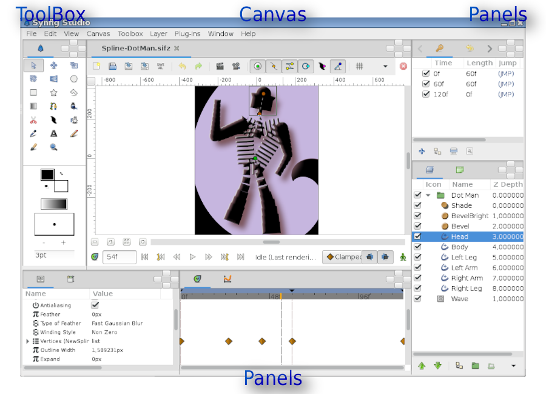
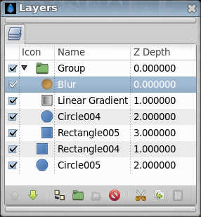

.. _getting_started:

########################
    Getting Started
########################

User interface
--------------

The screenshot below displays Synfig Studio's window layout:

   Default interface layout of Synfig Studio

Synfig Studio main interface components are:

-  `Toolbox <Toolbox>`__ — is the main Synfig Studio window. It contains
   tools and more to create and edit your artwork.
-  `Canvas <Canvas>`__ — displays your artwork and animation.
-  `Panels <Panels>`__ — contain tools and information about certain elements of your
   project. Some panels will allow you to modify those elements.

.. note::
   Synfig Studio can be reset to its default window arrangement (as shown in the screenshot).
   In the ``File`` menu select``Window -> Workspace -> Default``.

The center of the window is the  `Canvas Window <Canvas Window>`__. A new Canvas Window appears each time
Synfig Studio starts. The window represents the `Root
Canvas <Root_Canvas>`__, not that it means much to you at the moment,
but that's OK — we're just trying to show you around. In the upper left
corner of the Canvas Window, you'll see a button with a
`caret <Canvas_Menu_Caret>`__. If you click on this caret button, the
`canvas window menu <Canvas_Menu_Caret>`__ will pop up. If you
right-click in the canvas area and there is no `layer <layer>`__ under
the mouse position, this menu will also appear. So now you know where
the most important canvas menu is. Good.

The other part of the window (on the bottom/top, to the right/left) are
customizable `dock panel <dock panel>`__. Each dock contains a set of `Panels <Panels>`__, arranged horizontally or
vertically. Some panels share the same space inside the dock and you can
switch between them by clicking on their `tabs <panel_tab>`__. You can
rearrange the contents of dock panels as you wish by dragging the panel
tab to where you want it. You can even create a new dock by dragging a
tab out.

If you accidentally close a `panel <panel>`__ (by dragging it out, and
closing the new dock that gets created), no worries. Simply go to the `Main Menu <Main Menu>`__,
select `Window Menu <Window Menu>`__ there and then click on the name of the panel you need.

The most important panels are:

-  `Layers Panel <Layers_Panel>`__ — shows you the hierarchy of the
   layer of your working canvas. It also allows you to manipulate these
   layers.
-  `Parameters Panel <Parameters_Panel>`__ — shows you the parameters of
   the layer currently selected. When multiple layers are selected, only
   the parameters that the selected layers have in common are displayed.
-  `Tool Options Panel <Tool_Options_Panel>`__ — shows you any options
   specific to the currently selected tool.
-  `Navigator <Navigator>`__ — shows a thumbnail image of what the
   currently selected canvas looks like. You can also zoom in and move
   the focus around with this panel.
-  `History Panel <History_Panel>`__ — shows you the history stack for
   the current composition. You can also edit the actions in history.

There are also many other `panels <panel>`__ in Synfig Studio. If you
have no idea what a panel does, simply hold your mouse over its icon and
a tooltip will pop up describing its function.

Under the hood
--------------

   Layers Panel

Synfig Studio, like most every other competent graphics program, breaks
down individual elements of a `canvas <canvas>`__ into
`layers <layer>`__. However, it differs from other programs in two major
ways:

#. An individual layer in Synfig usually represents a single
   “Primitive”. I.e. a single region, an outline of a region, an
   imported image, etc... This allows you to have a great deal of
   flexibility and control. It is not uncommon for a composition to have
   hundreds of layers (organized into a hierarchy for the artist's
   sanity of course).
#. A layer can not only add information on top of the image below it, it
   can also distort and/or modify it in some other way. In this sense,
   Synfig's Layers act much like filters do in Adobe Photoshop or GIMP.
   For example, we have a `Blur Layer <Blur_Layer>`__, `Radial Blur
   Layer <Radial_Blur_Layer>`__, `Spherize Layer <Spherize_Layer>`__,
   `Color Correct Layer <Color_Correct_Layer>`__, `Bevel
   Layer <Bevel_Layer>`__, etc...

Each layer has a set of parameters which determine how it behaves. When
you click on a layer (either in the Canvas Window, or in the illustrated
`Layers Panel <Layers_Panel>`__), you will see its parameters in the
`Parameters Panel <Parameters_Panel>`__.

First steps
-----------

Let's create something fun so that we can play with it!

First, go over to the toolbox and click on the `Circle
Tool <Circle_Tool>`__ (if you don't know which one it is, just mouse
over them until you find the one with the tooltip that says “Circle
Tool”).

When you click on the Circle Tool, you should notice that the `Tool
Options Panel <Tool_Options_Panel>`__ changed. But we'll get to that
later.

With the Circle Tool selected, you can now create circles in the . This
works as you might expect — click on the canvas, drag to change length
of the radius, and release the mouse button when you are done. Go ahead
and create two circles (or more, if you fancy). If you accidentally
release the mouse button before dragging, you end up creating a circle
with 0 radius and it is effectively invisible! No need to worry, you can
easily fix this. In the Parameters Panel, you can change the parameters
of the selected object. If you just made a 0 radius circle, it should be
the current selected object. You can change its radius to some value
other than 0, say 10, and manipulate it to your liking with the handles
later.

.. note::
   Some users might experience the following problem: when you 
   click and drag on the canvas using the Circle Tool, either nothing seems 
   to happen or you end up making insanely huge circles. To fix this go to 
   ``File|Input Devices`` and **disable all the devices** you can find 
   there. If you have an extended input device that you want to use, such 
   as a pressure-sensitive pen, then enable it in this screen. After this 
   change Synfig will work as expected. 

Now go back to the toolbox and
click on the `Transform Tool <Transform_Tool>`__ (the button with the
arrow on it). After you do this, click on one of your circles. You will
see a “`bounding box <bounding_box>`__” (which is kind of useless at
this point in time, but we digress), a green dot at the center, and a
cyan dot on the radius. Those dots are called “`handles <handle>`__”. If
you want to modify the circle, grab a handle and drag it around. Easy!

You can select a `layer <layer>`__ by clicking on it. If you want to
select more than one layer, hold down ``ctrl`` key while you are
clicking — this works in both the Canvas Window and the `Layers
Panel <Layers_Panel>`__. Try it!

You can also select multiple handles. You can do this in several ways.
First, you can hold down ``ctrl`` and individually click the handles
that you want selected, but this can be tedious. However, there is a
much faster method — just create a selection box by clicking the mouse
and dragging it over the handles that you want.

Go ahead, select two circles and select all of their handles. With
several handles selected, moving one handle will move all of them.

.. note::
   Synfig Studio has an autorecovery feature. If it crashes, 
   even if the current file has not been saved, you will not lose more than 
   5 minutes of work. At restart it will automatically prompt to recover 
   the unsaved changes. Unfortunately history isn't recovered yet. 

The `rotate <Rotate_Tool>`__ and `scale <Scale_Tool>`__ tools work much like
the Transform Tool, except in the case where you have multiple handles
selected. It is much easier just to try, than read about it. Select a
few circles, select all of their handles, and try using the rotate and
scale tools.

Note that tools manipulating with handles have options associated with
them. If a particular tool isn't doing what you want, take a look at the
`Tool Options Panel <Tool_Options_Panel>`__ to see available options.

Linking
-------

Now let's try `linking <linking>`__. Suppose we always want these two
circles to be the same size. Select two circles, and then select both of
their radius handles (the cyan dots).

To select multiple handles, either drag a rectangle around them, or
select the first one, then hold the ``ctrl`` key while selecting the
rest. Once you have the two radius handles selected, right click on
either of them and a menu will pop up. Select ``Link``. Boom. The
parameters are linked together. You can prove it to yourself by
selecting just one of the circles and changing its radius — the other
one will change as well. Neat stuff, eh? This is how
`outlines <Outline_Layer>`__ are attached to their
`regions <Region_Layer>`__ — but we're getting ahead of to the chapter.

Linking is a fundamental concept in Synfig. You can create links not
only for handles, but also between parameters as well by selecting
multiple layers, right clicking on the parameter in the Parameters
panel, and selecting ``Link``.

Color selection
---------------

Let's say you want one of the circles to be a different color. If you
look in the toolbox below the tools, you'll see the outline/fill color
selector, the outline width selector, and some other stuff like the
default blend method and gradient. The outline/fill color widget works
exactly as you might expect — you can click on the fill color, and a
modest color chooser will appear. Now you can change the color pretty
easily.

But sometimes you just want to click on a color and go. This is where
the palette editor tab comes in.

Click on the Palette Editor panel tab and have a look — it's the one
with the palette-ish looking icon. Clicking on colors with the left
mouse button will immediately change the default outline color and
clicking with the middle mouse button will change fill color.

That's all great, but we still haven't changed the color of the circle.
There are three ways to do this. The first is to click on the
``Fill Tool`` from the toolbox, and then click on the circle in the
Canvas Window. Boom. Circle changes color. This works with more than
just circles. Also, you can select the circle layer you want to modify,
go to the Parameters panel, right-click on the Color parameter and
select ``Apply Fill Color`` or ``Apply Outline Color`` at you
preference. Or simply double-click on the ``Color`` parameter - a color
selector dialog will show up, and you can just tweak away.

Try playing around with the circles for a bit. Muck around with the
parameters, and see what happens. To get you started, try out to set the
`Feather Parameter <Feather_Parameter>`__ to 5.

Digging deeper
--------------

Of course, so far you just found out how to use the basic features of
Synfig Studio but not how you animate a drawing. This is covered in the
`next section <Doc:Animation_Basics>`__.

.. raw:: mediawiki

   {{Navigation|Category:Manual|Doc:Animation_Basics}}

You can download an archive which contains the project used for wiki illustration
:download:`Interface.sfg <getting_started_dat/Interface.sfg>`
You can download the project used for the illustration of the illustration
:download:`Spline-DotMan.sifz <getting_started_dat/Spline-DotMan.sifz>`

