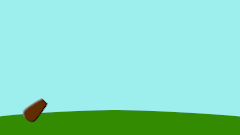

.. _introduction:

########################
    Introduction
########################

As you probably know, animation is the rapid display of a sequence of
images in order to create an illusion of movement. Traditionally 2D
animation is created by drawing each displayed image individually. Those
images are called “frames” and thus such method is called
“frame-by-frame animation”. To create a good illusion of movement you
need to draw many frames, that's why this method requires a lot of time
and resources. 

A traditional frame-by-frame animation, taken from : http://flipily.com

``Synfig Studio`` is an `open-source <https://en.wikipedia.org/wiki/Free_software>`__ 2D vector
animation software. It is designed to produce film-quality animation
with less people and resources.

Synfig Studio is built to eliminate the need to draw each frame
individually. There are two techniques for that:

-  Morphing animation
-  Cutout animation

Morphing
--------

Morphing animation of a rose, by Rore 

**Morphing** is a technique that
takes two images and creates a smooth transition between them. In the
process of morphing, one shape is deformed into another and this
transformation is usually defined by control points.

| In Synfig Studio images are constructed from vector shapes and the
  morphing is done automatically. This allows us to create animations by
  drawing only the key positions at relatively wide time intervals. You
  need only to draw a few frames as needed to create a basic sense of
  motion for the scene, and Synfig Studio will create the in-between
  frames.

Cutout animation
----------------

Cutout animation in Synfig's tutorials

**Cutout animation** is created
by splitting objects into parts and applying some simple transformations
to them (like translation, rotation or scale) at different moments of
time.

| Synfig Studio uses those values to interpolate the motion for
  in-between frames. Cutout animation can be produced from bitmap images
  or vector graphics.

Synthesis and other functionalities
-----------------------------------

In both cases the role of Synfig Studio is to fill the gaps between the
drawn frames (also called “keyframes”) and produce smooth and fluid
animations. This process is called “tweening”.

Although Synfig Studio is not directly intended to draw animation
frame-by-frame, it can be used to bring your hand-drawn frame-by-frame
animation to the film-quality level by converting bitmap data of each
frame into vector format. This process is called “tracing” and usually
done by hand by constructing vector shapes on top of bitmap images. In
the process of construction you can apply a lot of fascinating effects
built into Synfig Studio to achieve a professional look for your
animations.

Whether you do frame-by frame animation or not, Synfig Studio gives you
flexible control over the repeated data, such as colors, outline
characteristics, textures, images and many more, even animation
trajectories and their sets (actions). Reusing repeated data is achieved
via linking. This is a power of Synfig Studio, which is especially
important for big animation projects.

Among the plain linking pieces of artwork data you can also define
relations between them using a set of functions. That allows to create
automatic animation based on the defined laws and bring whole animation
process to the next level.

Parabolic shot in Synfig's tutorials

All those features of Synfig Studio are covered in detail in the
chapters of this manual.

  

